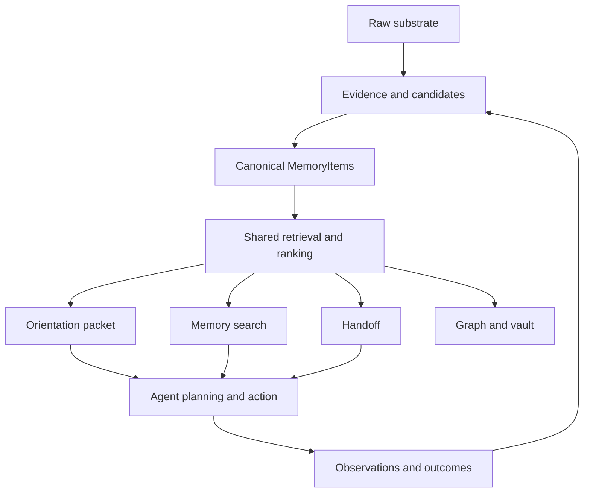
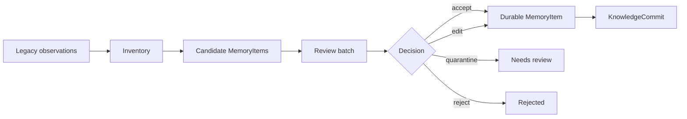

# Engram Brain Harness Architecture

Status: Draft RFC with Brain Loop v1, orient contract, research-method checkpoints, and first
matched dogfood evidence
Date: 2026-05-06
Audience: Engram maintainers, AI-agent harness authors, future contributors
Scope: Define how Engram becomes a brain harness for AI coding agents, and how to prove the design before removing legacy memory paths.

---

## 1. Purpose

Engram is not only a memory database. The target product is a brain harness for AI agents:

- help agents understand current project and task context,
- connect decisions, workflows, preferences, evidence, and prior outcomes,
- support agent thinking during planning and execution,
- preserve continuity across sessions, compaction, and parallel agents,
- make memory trustworthy enough to guide future action.

This RFC defines the architecture needed for that behavior.

The core bet is:

```text
Legacy layers provide raw substrate and evidence.
MemoryItem becomes the canonical cognitive unit for agent-facing memory.
```

This is a bet, not a premise to accept blindly. Engram should prove it through evals before deleting or heavily simplifying legacy components.

`docs/BRAIN_HARNESS_RESEARCH_METHOD.md` defines the research operating model for proving or
rejecting this bet. Dogfood is one experimental instrument under that method, not the entire
confidence story.

---

## 2. Current System Shape

Engram currently has two memory shapes.

### 2.1 Legacy Knowledge Layers

The original system is organized around seven specialized layers:

1. Entity knowledge
2. Session history
3. Document semantic search
4. Tool intelligence
5. Session coordination
6. Knowledge document registry
7. Work management

These layers are useful, but they expose multiple retrieval and write models. That makes agent cognition inconsistent. The agent may get different answers depending on whether it calls entity search, document search, work context, session search, or Memory OS orientation.

### 2.2 Memory OS

Memory OS adds the richer cognitive model:

- `MemoryItem`
- `WriterProvenance`
- `EvidenceRef`
- `KnowledgeCommit`
- `MemoryCursor`
- `orient`
- `changes_since`
- repository topology
- graph traversal
- lint
- rolling handoffs
- obligations
- harness adapters
- generated Markdown vault
- review-gated migration and digest flows

The current gap is not primarily ontology. The core gap is retrieval and lifecycle unification.

Implementation checkpoint, 2026-05-06:

- `orient` is the single frictionless entrypoint for task-boundary context.
- Brain Loop v1 is additive: `orient` returns a nested `brain_loop` projection generated from the
  memory already selected by orientation.
- `orient` surfaces already-open, currently applicable obligations as a compact bounded summary,
  without running obligation detection inside the hot path.
- `orient` filters stale git-status document obligations and suppresses untracked root instruction
  files such as local `AGENTS.md` from the open-obligation summary.
- `docs/ORIENT_CONTRACT.md` defines the current hot-path contract: MemoryItem-based orientation,
  review-needed separation, prompt-specific ranking, bounded obligations, and no graph traversal,
  obligation detection, lint, migration, or raw entity observation lookup in normal orientation.
- Graph traversal, obligation detection, lint, migration, raw entity observation lookup, and
  `changes_since` remain specialist paths until their signal quality and scoped retrieval behavior
  are proven.

Research checkpoint, current through 2026-05-27:

- The first matched same-harness dogfood batch is recorded in
  `docs/BRAIN_HARNESS_DOGFOOD_RUN_2026-05-07.md`.
- `memoryitem_orient` passed 4/4 scored scenarios; the same-harness no-memory controls passed 3/4.
- The clear observed advantage was durable preference recall: `orient` recovered the reviewed
  commit-hygiene preference that repo-only context missed.
- Resume continuity, stale-scope rejection, and decision continuity passed in both arms, so this
  batch does not justify retrieval/ranking code changes or hot-path expansion.
- `bounded_autonomous_followthrough_001` passed both arms but was contaminated by self-referential
  task choice and cross-arm working-tree exposure.
- `bounded_autonomous_followthrough_002` fixed those protocol flaws with isolated worktrees and a
  pre-selected doc-only work slice. Both arms passed; no material `memoryitem_orient` advantage was
  observed.
- `bounded_autonomous_followthrough_003` and `bounded_autonomous_followthrough_004` were
  code-bearing telemetry slices. Both arms passed in both scenarios, but neither showed a material
  `memoryitem_orient` outcome advantage because the prompts carried most decisive context.
- `bounded_autonomous_followthrough_005` was confounded by current-plan supersession: both arms
  completed useful narrow work, but the treatment did not receive the intended target-bearing
  current-plan memory.
- `bounded_autonomous_followthrough_006` was scoreable and added stronger scoped regression
  coverage, but the no-memory arm also passed, so it did not support ranking, hot-path, migration,
  deletion, or broad legacy-simplification changes.
- `bounded_autonomous_followthrough_007` and `bounded_autonomous_followthrough_008` provide narrow
  positive sealed MemoryItem recovery evidence, including one real Claude Code code-bearing task
  whose sanitized controls failed cleanly. They do not prove broad cross-harness benefit.
- Document lifecycle follow-through passed for Codex and the generated Codex adapter, including
  obligation detection, document disposition, same-content suppression, and final doctor cleanup.
- The latest narrow implementation checkpoint fixed mission-class `plan_work` current-plan ranking
  without expanding `orient`, changing migration, adding graph/lint/raw-observation hot-path
  behavior, or deleting legacy layers.
- A follow-up narrow checkpoint extends that same current-plan continuity claim to direct unified
  `search` continuation prompts through deterministic MemoryItem fixtures, while keeping migration
  approval prompts gate-first and leaving the `orient` payload unchanged.
- Native MCP smoke after installing binary hash
  `f5cb5816927b4e4a5b9cb92df560de47e201c2bccdcbfa05eeb25c9d35bcfb35` confirmed the direct
  `search` continuation query returns the active current-plan memory first.
- A native Claude Code CLI smoke then confirmed the same direct `search` behavior in trace
  `019e68ac-678e-7683-a241-08119fc6b03c`, with current-plan memory
  `019e689c-b188-70e2-acfc-2d00f956bd24` as the top result.
- A 2026-05-27 native Claude Code CLI follow-up after installed binary
  `4f3bda71eb441d492ece4b1bb5983993be9cf47802fd10cdb3484f31f7e23f9c`
  confirmed the current continuation surface still works: lean `orient` trace
  `019e68fe-6150-7ab3-9df7-8339e3766c76` kept the packet compact inline and included current-plan
  memory `019e68f9-31b1-7270-9095-4f0be5ffa94b` at position 2; direct `search` trace
  `019e68fe-6417-7590-8331-85ddf3dd4a86` returned that memory first. Claude Bridge could not run
  the same smoke because its project harness exposed only file-read tools, not Engram MCP tools.
- A follow-up direct `search` calibration fixed a lexical false positive where `non-gated`
  continuation wording was classified as a gate query by substring. Live installed trace
  `019e68d4-05b7-79d3-8077-df6e2999482d` returns the active current plan first for the
  non-gated next-slice prompt, while migration-apply gate trace
  `019e68d4-27b7-70e2-bdfe-5c879a97f0c8` still keeps migration/gate context above current-plan
  context.
- Current-plan lifecycle semantics are now aligned across capture, `orient` post-prioritization,
  and direct `search` ranking: only active `decision` and `rule` MemoryItems with the
  `current-plan` tag are managed as current-plan guidance. Non-guidance facts or limitations with
  the tag remain active evidence and are not automatically superseded by
  `memory(action=capture_current_plan)`.
- A 2026-05-27 narrow gate follow-up calibrated explicit migration-apply direct `search` prompts
  against live-shaped distractors. After installing binary
  `fea91cc46549c138a425389394af9c4cdd9d8727eb39137f8afc179a976968eb`, native MCP traces
  `019e698d-b766-7e71-a4da-a8c593f1b191` and `019e698d-b791-7d93-a0d6-542219e3eb6c` returned
  the paused migration review gate first, while regression trace
  `019e698d-b7ae-7a13-b2c5-d58a9898deab` kept the current-plan/M6-gate context prompt
  current-plan-first.
- Claude Code `2.1.152` replicated that boundary through its own Engram MCP connection: traces
  `019e6993-d4da-70a1-b5eb-9185eeb23339` and `019e6993-d891-7ff3-93ef-4bd8ad14d9c7` returned
  the paused gate first for explicit migration-apply prompts, and trace
  `019e6994-8ec9-7343-9198-9298867b9ceb` returned current-plan memory first for the contextual
  M6-gate continuation prompt.
- MCP `memory(action=list)` now honors explicit scope filters before applying `limit`, closing an
  evidence-sampling gap where a project-scoped current-plan list for Engram could return older
  repository-scoped Engram guidance and wrong-project `voice-layer` guidance. This is a specialist
  memory-list fix only; it does not change `orient`, unified `search`, ranking, migration, schema,
  hooks, adapters, or lifecycle status. Native Claude Code `2.1.152` reproduced the same scoped
  list behavior through its own Engram MCP connection with only `mcp__engram__memory` allowed.
- A follow-up read-only harness readiness audit corrected stale documentation: explicit
  `harness(action=doctor)` calls for `claude_code`, `codex`, `gemini_cli`, and `cursor` all
  returned `ready=false`. Claude Code has required generated adapter files installed, but required
  `SessionStart` and `SessionEnd` settings hook registrations are missing; Codex, Gemini CLI, and
  Cursor still have required generated adapter drift. This is configuration evidence only, not an
  adapter or hook write.
- A post-T17 read-only evidence audit found that the telemetry confidence gate is sample-window
  sensitive. Before scoring T18 retrieval traces, `real_session_eval(project=engram, limit=50)` had
  enough trace and feedback volume but feedback across only two intents, so the gate failed. After
  scoring T18 retrieval traces, the current report passes numerically again. The same audit found
  `lint(action=apply_safe, write=false)` has no safe actions, and stale repository-scoped
  current-plan memory `019e5e0a-86b4-73e3-aa9b-ca350e83e915` remains active with repeated
  stale-feedback hits. Lifecycle status changes, hot-path ranking changes, and document-index
  normalization remain gated.
- T19 corrected a real-session eval measurement flaw: feedback is now selected by sampled trace IDs
  instead of by an independent newest-feedback window. This keeps public request parameters, output
  fields, formulas, confidence-gate constants, ranking, `orient`, migration, hooks, adapters, and
  schema/storage/index behavior unchanged, while preventing older traces with newer feedback from
  inflating coverage for a smaller recent trace sample.
- T20 corrected scoped real-session eval sampling: project, scenario, and arm filters are now
  applied before the trace limit for scoped reports, so newer out-of-scope traffic cannot starve an
  in-scope confidence sample. This keeps public request parameters, output fields, formulas,
  ranking, `orient`, migration, lifecycle state, document-index behavior, hooks, adapters,
  schema/storage, and `list_feedback_scoped` behavior unchanged.
- T21 installed-runtime validation confirmed the T19/T20 behavior in the live daemon after
  installing binary hash `0192d24d945b7acb8bdfabe129c56d61a5abf0f7ce8223c854139677a93738ab`.
  The controlled scoped report
  `t21_installed_runtime_eval_20260527_0192d24d / memoryitem_orient / limit=2` returned exactly the
  latest two in-scope traces and only the feedback attached to those sampled traces, excluding newer
  out-of-scope traces and newer feedback on older in-scope traces.
- Native Claude Code `2.1.152` reproduced the same T21 read-only telemetry report through its own
  Engram MCP connection with `mcp__engram__telemetry` allowed. Claude Bridge still exposed only
  file-read tools for the same request, so treat the bridge miss as a tool-exposure limitation.
  The Claude Code result validates the shared MCP telemetry surface for this report shape, not
  hooks, adapters, ranking, migration, or broad Brain Harness product behavior.
- M6 migration remains the high-risk gate: even read-only inventory requires explicit
  user-approved scope, and write apply/deletion requires reviewed candidates, dry-run evidence,
  rollback planning, and explicit approval.

---

## 3. Target Architecture

The target architecture is a layered brain harness.



The legacy layers remain valuable, but their product role changes:

| Current Layer | Target Role |
|---|---|
| Entity knowledge | Entity evidence, scope labels, graph anchors |
| Session history | Raw episodic evidence and distillation source |
| Documents | Evidence and searchable source material |
| Tool intelligence | Workflow evidence and procedural memory source |
| Coordination | Live agent state and conflict signals |
| Knowledge registry | Document source registry and migration input |
| Work management | Project/task scope and work evidence |

The agent-facing memory surface should converge on:

- orientation,
- retrieval,
- evidence inspection,
- capture,
- review and promotion,
- handoff,
- changes since cursor.

---

## 4. Canonical Cognitive Unit

`MemoryItem` should become the canonical unit for agent cognition.

Canonical means:

- orientation selects and ranks MemoryItems,
- search returns MemoryItems first,
- handoffs reference or supersede MemoryItems,
- graph traversal connects MemoryItems to scopes and evidence,
- migration promotes legacy records into MemoryItems,
- evals judge whether MemoryItems improve downstream agent behavior.

Canonical does not mean every raw record must be immediately stored only as a MemoryItem. Raw records can continue to exist as evidence.

```text
Raw record:
  "The agent ran test X and got failure Y."

Candidate MemoryItem:
  "Test X fails when config Y is missing."

Reviewed MemoryItem:
  "Before running Test X in this repo, ensure config Y exists."
```

---

## 5. Memory Trust Classes

The write path should be tiered. A single strict rule would reduce capture rates and make agents avoid memory writes.

### 5.1 Ephemeral Observation

Low-friction memory capture.

- May lack evidence.
- May be agent-observed or inferred.
- Not eligible as strong guidance in orientation.
- Can appear in review queues or low-confidence search.

Use cases:

- working notes,
- session insights,
- first-pass discoveries,
- uncertain observations,
- tool failure notes.

### 5.2 User Preference

User preferences may begin without external evidence because the user statement itself is the authority.

Rules:

- May be active without additional evidence.
- Must carry origin `user_stated` or `user_corrected`.
- Should expose freshness and optional review-after metadata.
- May later be challenged or reconfirmed by an agent.

### 5.3 Candidate Memory

A structured memory proposal.

- Has provenance.
- Usually has evidence.
- Needs review before becoming durable guidance.
- May be produced from session distillation or migration.

### 5.4 Durable Guidance

Memory that can guide future agent action.

Required:

- writer provenance,
- at least one evidence reference,
- status,
- scope,
- confidence or categorical trust label.

Applies to:

- decisions,
- rules,
- limitations,
- workflows,
- project facts,
- repository facts,
- task facts.

### 5.5 Reviewed Guidance

The highest-priority guidance class.

Reviewed guidance is durable guidance that has passed a review decision by one or more participants:

- user,
- current agent,
- future agent,
- importer,
- verifier workflow.

The reviewer must be recorded.

---

## 6. Review Participants

Review is not only human approval.

Engram should support multiple reviewer roles:

| Reviewer | Good For | Caution |
|---|---|---|
| User | Preferences, workflows, final authority | Can be interrupted too often |
| Agent | Source validation, test validation, duplicate detection | Must cite evidence |
| Importer | Legacy migration batches | Should default to review, not active |
| Future agent | Reconfirmation after stale period | Should not silently rewrite high-impact memory |

The review system should store:

- reviewer identity,
- reviewer kind,
- decision,
- rationale,
- evidence inspected,
- timestamp.

---

## 7. Orientation Contract

Orientation should return both compiled context and raw memory.

Compiled context is useful because it reduces cognitive load. Raw memory is necessary because agents need auditability and evidence.

Target response shape:

```json
{
  "project": "Engram",
  "scope": "Engram",
  "context_pack": "...",
  "brain_loop": {
    "compiled_context": "Short scoped narrative for the current task.",
    "top_items": [
      {
        "id": "memory-id",
        "kind": "decision",
        "title": "Use repository topology for project resolution",
        "summary": "...",
        "trust": {
          "status": "active",
          "origin": "user_stated",
          "review_state": "reviewed",
          "evidence_count": 2,
          "freshness": "current"
        },
        "why_relevant": "Active decision matched the orientation scope."
      }
    ],
    "degraded": false
  },
  "active_decisions": [],
  "active_rules": [],
  "preferences": [],
  "limitations": [],
  "review_needed": [],
  "ambiguities": [],
  "recommended_actions": [],
  "memory_cursor": {
    "timestamp": "...",
    "commit_id": "..."
  }
}
```

Brain Loop v1 deliberately does not replace the raw memory arrays. The compiled context reduces
cognitive load; the raw arrays and trust metadata keep the result auditable.

Orientation must be:

- deterministic for the same project/cwd/cursor inputs,
- scope-bounded,
- explicit about ambiguity,
- explicit about freshness and trust,
- fast enough for task boundaries.

---

## 8. Conflict Policy

When two active memories conflict, Engram should not silently prefer one because it is newer.

Default scoring should combine:

```text
winner_score =
  evidence_strength
  + recency
  + source_authority
  + scope_specificity
  - staleness
```

Where:

- evidence strength considers evidence count, evidence type, and evidence freshness,
- recency favors newer information,
- source authority favors user-corrected over agent-inferred,
- scope specificity favors task/repo/project-specific facts over global facts,
- staleness penalizes expired or review-needed items.

If the scores are close, or if both memories are high-impact, orientation should return an ambiguity instead of pretending certainty.

High-impact categories:

- user preferences,
- rules,
- decisions,
- limitations,
- security-sensitive facts,
- workflow constraints.

---

## 9. Retrieval Contract

Search, orientation, and memory listing should not behave like separate brains.

Engram should move toward a shared retrieval layer:

```text
query/scope/cursor
  -> candidate MemoryItems
  -> shared ranking
  -> trust annotation
  -> optional compiled context
```

Unified search should include MemoryItems first.

Legacy records can still be returned, but they should be labeled as:

- raw evidence,
- unmigrated legacy memory,
- document result,
- session event,
- entity observation,
- work observation.

This avoids deleting valuable old data while making the agent-facing cognitive layer coherent.

---

## 10. Latency Budget

Hot-path memory must be predictably fast enough that agents do not avoid it.

Initial targets:

| Operation | p50 | p95 | Hard Timeout | Notes |
|---|---:|---:|---:|---|
| `changes_since` | 5-30 ms | 20-120 ms | 150 ms | Cursor/delta path, should be nearly free |
| `search` | 20-100 ms | 80-300 ms | 250-400 ms | Cheap enough for repeated probing |
| `orient` | 50-150 ms | 150-500 ms | 500-700 ms | Task-boundary operation |

Graceful degradation:

1. Return cached compiled context and top-K MemoryItems.
2. Mark response as partial or degraded.
3. Skip deep evidence traversal.
4. Skip expensive synthesis.
5. Return stale-but-recent context with freshness metadata.
6. Queue reranking, evidence stitching, or summary refresh asynchronously.

Never block `changes_since` on summary recompilation.

---

## 11. Brain Harness Metrics

The system works only if it improves agent behavior.

Primary eval metrics:

1. Task success uplift
2. Amnesia or rediscovery reduction
3. Retrieval usefulness at decision time
4. Preference adherence rate
5. Conflict resolution correctness
6. Session continuity after compaction or restart
7. Memory update acceptance rate
8. Duplicate suppression and consolidation quality
9. Bad-memory containment
10. Latency-adjusted utility

Metrics should be paired. Retrieval precision without task impact is not enough. Fast retrieval of irrelevant memory is not success.

---

## 12. Confidence Experiment

Before deleting or simplifying legacy paths, run a head-to-head experiment.

### 12.1 Experiment Arms

```text
A. No memory
B. Legacy observations/search
C. MemoryItem-based retrieval/orientation
D. Optional hybrid: legacy storage normalized into MemoryItems for retrieval
```

### 12.2 Scenarios

Use multi-session coding workflows:

1. User preference stated in session 1, applied in session 3.
2. Previous failed approach should not be repeated.
3. Decision rationale must shape a later implementation.
4. Stale fact is contradicted by newer source evidence.
5. Agent resumes after compaction using handoff and cursor.
6. Legacy observation migrates into a MemoryItem candidate.
7. Two concurrent agents write memory and later reconcile.

### 12.3 Success Criteria

MemoryItem becomes canonical if it shows:

- better task success than legacy/no-memory,
- fewer repeated context lookups,
- better preference adherence,
- better conflict handling,
- lower duplicate rate,
- acceptable latency,
- migration viability from legacy observations.

### 12.4 First Matched Dogfood Checkpoint

The 2026-05-08 matched same-harness batch provides the first controlled behavioral checkpoint for
Brain Loop v1:

| Arm | Scored scenarios | Task successes | Preference adhered | Bad memory used |
|---|---:|---:|---:|---:|
| `memoryitem_orient` | 4 | 4 | 4 | 0 |
| `no_memory_same_harness` | 4 | 3 | 3 | 0 |

Supported claim: Brain Loop v1 is useful for durable user preference recall in this repository
when the preference has been captured as reviewed active memory.

Unsupported by this batch:

- broad MemoryItem dominance over legacy retrieval,
- retrieval/ranking code changes,
- graph, lint, raw observations, migration, or obligation detection in the normal `orient` path,
- deletion or simplification of legacy layers.

Follow-up checkpoint:

- `bounded_autonomous_followthrough_001` was inconclusive because both arms passed and the protocol
  allowed self-referential work selection plus possible cross-arm contamination.
- `bounded_autonomous_followthrough_002` removed those flaws. Both arms again passed on a narrow
  doc-only contract update, with no material outcome advantage for `memoryitem_orient`.
- `bounded_autonomous_followthrough_003` used a code-bearing scoped telemetry-filtering task. Both
  arms passed and the leaner patch landed, but there was still no material outcome advantage for
  `memoryitem_orient`.
- `bounded_autonomous_followthrough_004` used a code-bearing applied-filter telemetry-reporting
  task. Both arms passed; the curated implementation landed, but the scenario exposed a feedback
  attribution gap.
- `bounded_autonomous_followthrough_005` used an underspecified continuation task. It was
  scoreable but confounded because the target-bearing current-plan memory had been superseded before
  the treatment arm ran.
- `claude_rescue_commit_hygiene_001` with Hot Context IDs produced a clean narrow Claude Code
  validation pass for durable preference recall and structured `used_memory_ids`.

`bounded_autonomous_followthrough_006` used a small code-bearing telemetry attribution-quality
task. Both arms passed, H1 was not supported, and the curated treatment patch was integrated
because it has stronger scoped regression coverage. The result improves measurement of
memory-attribution gaps, but it does not justify ranking, hot-path, migration, deletion, or broad
legacy-simplification changes.

`bounded_autonomous_followthrough_007` and `bounded_autonomous_followthrough_008` then exercised
sealed MemoryItem recovery. BAF007 produced a narrow accepted Codex outcome; BAF008 produced a
real Claude Code treatment pass with sanitized no-memory and static-instruction controls that
failed cleanly. These runs strengthen the sealed-recovery claim, including one real cross-harness
code-bearing task, but they do not justify broad cross-harness claims, hook expansion, M6
write-apply, deletion, ranking changes, or hot-path expansion.

---

## 13. Eval Trace Schema

The confidence experiment needs traces that connect memory retrieval to agent behavior. Storage correctness alone is not enough.

Each eval run should emit a trace record with this shape:

```json
{
  "run_id": "uuid",
  "scenario_id": "preference_applied_later",
  "arm": "memory_item",
  "agent": {
    "harness": "codex",
    "model": "gpt-5.5"
  },
  "task": {
    "project": "engram",
    "prompt": "Add a new API integration following prior preferences.",
    "expected_outcomes": [
      "uses_httpx",
      "does_not_reask_preference"
    ]
  },
  "memory_calls": [
    {
      "tool": "orient",
      "latency_ms": 91,
      "degraded": false,
      "returned_item_ids": ["memory-a", "memory-b"],
      "used_item_ids": ["memory-a"],
      "missing_expected_item_ids": []
    }
  ],
  "outcome": {
    "task_success": true,
    "preference_adhered": true,
    "repeated_context_questions": 0,
    "conflict_resolution_correct": true,
    "bad_memory_used": false
  },
  "review": {
    "judge": "human_or_eval_agent",
    "notes": "Agent used the preference without re-asking."
  }
}
```

Required trace dimensions:

| Field | Purpose |
|---|---|
| `arm` | Compare no-memory, legacy, MemoryItem, and hybrid modes |
| `scenario_id` | Group repeated runs for statistical comparison |
| `memory_calls` | Connect retrieval behavior to later actions |
| `returned_item_ids` | Measure retrieval precision and noise |
| `used_item_ids` | Measure whether memory affected behavior |
| `missing_expected_item_ids` | Detect recall failures |
| `latency_ms` | Track latency-adjusted utility |
| `degraded` | Track graceful degradation quality |
| `outcome` | Tie memory to task-level behavior |

Derived metrics:

- task success rate by arm,
- preference adherence rate by arm,
- retrieval precision at K,
- memory use rate,
- repeated-context question rate,
- bad-memory use rate,
- p50 and p95 latency per memory operation,
- duplicate or stale memory surfaced per run.

### 13.1 Runtime Agent Feedback

The system should also collect lightweight feedback from the agent that used the memory, not only from offline eval judges.

Implemented spike:

- `BrainHarnessTrace` records operation, secondary intent metadata, free-form `scenario_id`
  and `arm`, query/project/session metadata, returned memory IDs, generic result IDs,
  latency, warnings, and timestamp.
- `AgentFeedback` links back to a trace and records used/rejected memory IDs, used/rejected
  generic result IDs, stale or wrong-scope memory IDs, missing context,
  usefulness/correctness/noise scores, task success, preference adherence, repeated context
  questions, bad-memory use, suggested memory changes, and a note.
- `orient` and `search` accept free-form `scenario_id` and `arm` labels and preserve them on
  the real operation trace; `orient`, `search`, and `changes_since` can produce trace IDs.
- The MCP `telemetry` tool can record traces, submit feedback, list records, and aggregate stats by intent.
- `telemetry(action=real_session_eval)` returns a read-only report over persisted traces and
  feedback, including coverage, per-intent quality signals, per-arm outcome rows, scenario
  counts, warnings, and a conservative confidence gate. The gate requires behavioral outcome
  feedback in addition to relevance signals; migration writes still require explicit user
  approval.
- Report coverage semantics are trace-based: `feedback_coverage` means traces with at least one
  linked feedback record divided by traces, and `feedback_records_per_trace` separately exposes
  feedback density when multiple feedback records attach to one trace. Outcome feedback and memory
  attribution also expose trace-level counts so scope correctness, task outcome, and feedback
  presence are not conflated.
- Memory-attribution trace coverage is bounded to distinct eligible traces. A 2026-05-27 live
  report exposed the old denominator mismatch: memory judgments on search traces could be counted
  while search memory results were only stored as generic result IDs, producing an impossible
  `memory_judgment_trace_coverage=1.78`. Search traces now also populate `returned_memory_ids` for
  memory-layer results, and the report denominator includes older traces with explicit memory
  judgments so historical coverage cannot exceed 1.0 without rewriting data.
- A pre-registered 2026-05-27 live feedback batch
  (`live_feedback_coverage_2026_05_27`) submitted feedback for all ten read-only retrieval traces
  and moved project-level feedback coverage to `23/44` (`0.5227272510528564`). The numerical
  confidence gate passed at that checkpoint. A later T18 pre-feedback re-audit showed the current
  sample could fail when feedback spans only two intents; after scoring T18 traces, the report
  passed numerically again. T19 then corrected the report builder to select feedback from the
  sampled trace IDs rather than an independent feedback window. The batch remains weak
  agent-assessed evidence. It exposed a design-preference retrieval failure and stale
  migration/current-plan caveats, not authorization for M6 inventory, write apply, deletion, broad
  ranking changes, hook changes, or `orient` payload expansion.
- Generated harness adapters now instruct agents to preserve `trace_id` values returned by
  `orient` and `search`, then submit `telemetry(action=submit_feedback)` before final response
  with `task_success`, `preference_adhered`, `repeated_context_questions`, `bad_memory_used`, and
  `missing_context` when those outcomes or gaps can be judged. They also instruct agents to include
  `used_memory_ids` for returned memory that materially shaped the answer, implementation, safety
  decision, or plan, and `rejected_memory_ids` for returned memory that was considered but not used.

`intent` should not become a rigid ontology for every possible memory workflow. It remains a
caller-supplied workflow slice. Custom memory experiments should use free-form `scenario_id` and
`arm` labels so users and agents can compare their own strategies without expanding the core
intent vocabulary.

Agent feedback is not ground truth. It should be treated as a weak signal and correlated with:

- user corrections,
- task/test outcomes,
- later memory edits or deletions,
- latency,
- retrieval result sets,
- human or eval-agent review.

Initial intent vocabulary:

| Intent | Use |
|---|---|
| `resume_session` | Reconstruct prior project/session context |
| `answer_question` | Answer a user question |
| `plan_work` | Build an implementation or investigation plan |
| `implement_change` | Modify code/docs |
| `debug_error` | Investigate a failure |
| `verify_decision` | Check whether a prior decision still holds |
| `follow_user_preference` | Apply known user guidance |
| `prepare_handoff` | Create continuation context |
| `review_memory` | Inspect, update, retire, or delete memory |

---

## 14. Migration Strategy

Migration should be review-gated.



Legacy records should not be auto-promoted to active guidance.

Migration should preserve source links so future agents can inspect how the MemoryItem was derived.

---

## 15. MCP Surface Strategy

Do not simply reduce the system to a tiny set of tools. That would make the architecture look cleaner but remove specialist power.

Use tiered exposure.

### 14.1 Always-Visible Lifecycle Tools

- `orient`
- memory search or recall
- capture observation
- promote or review memory
- `changes_since`
- `handoff`
- `obligations`
- `work_context`

### 14.2 Specialist Tools

- vault
- graph
- lint
- digest
- migration
- repo topology
- low-level entity/session/document/work tools

The agent should see the lifecycle path first. Specialist tools should remain available when the task requires them.

---

## 16. Implementation Milestones

### M1: RFC And Trace Schema

- Accept this RFC or revise it.
- Define the trace schema needed for evals and runtime agent feedback.
- Decide exact MemoryItem trust fields surfaced to agents.

Status: initial runtime telemetry spike exists.

### M2: MemoryItem Retrieval

- Add MemoryItems to unified search.
- Create one shared ranking path for search and orient.
- Include trust/freshness metadata in retrieval output.

Status: initial MemoryItem unified-search layer exists. It searches active `MemoryItem` records as `memory` results, supports optional project/cwd scoping, and emits telemetry through MCP search. Ranking is intentionally conservative and should be tuned from feedback data before replacing legacy result ordering.

### M3: Brain Harness Evals

- Add benchmark scenarios for multi-session agent workflows.
- Compare no memory, legacy, and MemoryItem modes.
- Track task success, retrieval usefulness, continuity, and latency.

Status: deterministic confidence scenarios now compare no-memory, legacy, MemoryItem, and
hybrid arms for preference continuity, stale/wrong-scope rejection, and decision continuity. The
eval suite includes a report gate that aggregates quality, task success, bad-memory use, missing
expected context, repeated context questions, and retrieval precision by arm.

The first matched same-harness live batch is also complete. It showed `memoryitem_orient` beating
repo-only no-memory context on durable preference recall, while both arms passed resume continuity,
stale-scope rejection, and decision continuity. This is stronger than the original contaminated
pilot, but it is still narrow: it supports a preference-recall claim, not broad MemoryItem
canonicality or migration/deletion authority.

`docs/BRAIN_HARNESS_RESEARCH_METHOD.md` now defines the research operating model above the
architecture: explicit research questions, competing hypotheses, evidence levels, and decision
gates. Under that method, `docs/BRAIN_HARNESS_DOGFOOD_PROTOCOL.md` is the next live behavioral
instrument: a small read-only corpus preflight plus labeled live scenarios with `scenario_id`,
`arm`, pre-registered success criteria, explicit outcome feedback, and anti-overfit rules.

### M4: Tiered Capture Policy

- Implement per-kind validation in `capture_memory`.
- Require evidence/provenance for durable guidance.
- Keep ephemeral observations low-friction.

Status: initial capture policy exists in `MemoryService::capture_memory`. Active preferences are
allowed without extra evidence only for user-stated/user-corrected origins. Active decisions,
rules, and limitations without evidence are downgraded to `needs_review`; review-origin writes stay
gated unless manually reviewed; and low-friction facts, session insights, and handoffs can still be
captured without evidence.

### M5: Promotion And Retirement

- Implement observation graduation.
- Add supersede/retire paths.
- Route contradictions to review.
- Record reviewer identity and rationale.

Status: initial lifecycle review primitives exist. `MemoryService` can promote `needs_review`
items to active memory with manual-review evidence, reject review candidates while keeping them
auditable, supersede an older item with a reviewed replacement, and archive active memory as the
retirement path. The MCP `memory` tool exposes `promote`, `reject`, and `supersede` actions with
reviewer/rationale fields. It also exposes `promote_observation` for the narrow case where a
keyed entity observation is intentionally graduated into a reviewed `MemoryItem`. This keeps raw
observations out of the orientation hot path while preserving the source observation ID as
`observation` evidence.

### M6: Migration From Legacy Layers

- Inventory legacy observations.
- Generate candidate MemoryItems.
- Export review batches.
- Apply accepted candidates through KnowledgeCommits.
- Start deprecating direct agent-facing use of migrated legacy paths.

Status: initial migration viability gate exists. The executable test covers one legacy project
observation moving through inventory, generated review batch, accepted candidate apply,
KnowledgeCommit creation, active reviewed `MemoryItem` retrieval through `orient`, memory-layer
unified search visibility, and duplicate-safe re-apply behavior. This proves the first legacy
observation path but does not yet justify broad legacy deletion, automatic MemoryItem dominance, or
broad migration write-apply.

The next M6 operational step is intentionally gated. Two defensible paths remain:

1. strengthen M3 with real-session telemetry/eval evidence before any M6 work against current data,
   or
2. run a strictly read-only inventory and review-export against current data as provisional evidence
   gathering.

No migration apply, KnowledgeCommit, vault compile, direct legacy deprecation, or deletion should
run until the confidence gate is explicit and the user approves that write path.

### M7: Tool Tiering

- Keep the full specialist surface.
- Introduce a lifecycle-first agent-facing surface.
- Test whether tool selection improves in agentic evals.

Status: first checkpoint implemented. `orient` now returns `brain_loop` with a bounded compiled
context and top memory signals. Specialist graph, obligation, lint, and change polling tools remain
available but are not part of the normal orientation hot path.

Dogfood checkpoint: a fresh Codex session showed that Brain Loop v1 correctly used active
`MemoryItem` records but did not surface implementation facts that existed only as entity
observations. The chosen fix is write-path curation: promote high-signal keyed observations into
reviewed `MemoryItem` records when they should influence future orientation, rather than making
`orient` retrieve raw observations directly.

Follow-up calibration keeps Brain Loop balanced across memory buckets while letting the bucket with
the highest prompt-specific ranked top item lead the bounded context. This preserves diversity
without burying a reviewed decision behind a generic limitation when the prompt directly asks about
that decision.

Completed hot-path checkpoint: `orient` now surfaces already-open agent obligations as a compact
summary and recommended action. This closes the "what the agent owes" visibility gap without
running obligation detection, graph traversal, or lint inside normal orientation.

Dogfood follow-up: the obligation summary must stay quiet when there is no current action for the
agent. `orient` filters git-status document obligations that no longer match the current worktree
and suppresses untracked root instruction files such as local `AGENTS.md`, while leaving explicit
resolve/skip lifecycle operations in the obligations tool.

Contract checkpoint: `docs/ORIENT_CONTRACT.md` and MCP tests now cover review-gated inferred
memory, prompt-specific reviewed-decision ranking, open-obligation bounds, `has_more`, and stale
obligation suppression. M7 is now blocked on real agent tool-selection evidence, not on additional
hot-path expansion.

---

## 17. Open Questions

1. Is `MemoryItem` the canonical storage unit, or only the canonical retrieval unit?
2. What exact fields define evidence strength?
3. What reviewer roles should be trusted for reviewed guidance?
4. Should compiled orientation context be stored, cached, or generated every time?
5. What qualifies as sufficient M3 confidence: deterministic fixture tests, real multi-session
   traces, or both?
6. Can read-only M6 inventory/review-export proceed as evidence gathering before real behavioral
   M3 proof, or must it wait?
7. What is the first golden eval dataset?
8. How much degraded orientation is acceptable before the agent should ask the user?
9. Which legacy paths can be removed only after migration succeeds?
10. What is the minimum viable contradiction detector?

---

## 18. Near-Term Recommendation

Proceed in this order from the current checkpoint:

1. Keep this RFC and `docs/ORIENT_CONTRACT.md` synchronized with implemented hot-path behavior.
2. Treat the 2026-05-08 matched batch as support for durable preference recall only.
3. Treat BAF002 as a clean but weakly discriminating result: both arms passed a doc-only work slice,
   so it does not justify broad implementation changes.
4. Treat BAF003 as a stronger code-bearing pass for the protocol and scoped telemetry fix, but not
   as evidence for `orient` ranking, hot-path, migration, or legacy-simplification changes.
5. Treat BAF004 as useful telemetry-reporting implementation evidence, but not as a material
   `memoryitem_orient` advantage; it exposed the need to measure attribution quality explicitly.
6. Treat BAF005 as confounded by current-plan supersession; fix the protocol with a pre-arm target
   visibility check before relying on underspecified continuation tasks.
7. Treat post-restart BAF006 live verification as passed only after the installed Engram binary and
   daemon have been refreshed; a Codex restart alone may leave MCP on an older binary.
8. Treat the BAF006 scope-noise follow-up as fixed only for the identified path: scoped `orient`
   now filters recent Memory OS knowledge commits by changed MemoryItem scope. Continue measuring
   wrong-scope feedback before changing ranking or the hot path.
9. Do not treat BAF006 as support for ranking, hot-path, M6 write-apply, deletion, or broad
   legacy-simplification changes.
10. Treat the 2026-05-12 discriminative continuity fixture as benchmark-instrument validation, not
    live behavior evidence: it proves the eval can compare `no_memory`, `static_instructions`, and
    `memory_items` against known target MemoryItems while checking telemetry attribution quality.
11. Treat the first `live_discriminative_continuity_001` run as a protocol-leak finding, not a
    MemoryItem-advantage finding: `memoryitem_orient` passed, `static_instructions` failed cleanly,
    and `no_memory` passed by reading allowed repository fixture context that contained target
    facts.
12. Treat `live_blind_continuity_002` as narrow positive evidence for sealed target-fact recovery:
    both baselines missed the hidden current plan, while `memoryitem_orient` recovered it from
    Engram.
13. Treat the `live_blind_continuity_002` current-plan attribution gap as instrumentation backlog,
    not a blocker for product work. Manual transcript inspection closed the behavioral checkpoint.
14. Treat document lifecycle follow-through as implemented for Codex and the generated Codex
    adapter after the 2026-05-16 dogfood, content-idempotence check, and adapter contract update.
15. Treat the mission-class `plan_work` current-plan ranking fix as a narrow calibration only:
    it supports continuation prompts, not broad ranking quality or `review_memory` behavior.
16. Treat direct unified `search` current-plan ranking as the same narrow continuation-prompt
    calibration, not a broad search-quality claim or migration signal.
17. Treat the `non-gated` continuation wording fix as part of that same narrow prompt-class
    calibration: it fixes a false gate-positive in continuation vocabulary, not broad natural
    language intent understanding.
18. Treat current-plan lifecycle predicate parity as evidence-quality work: it prevents accidental
    supersession of non-guidance facts or limitations, but it does not auto-clean historical
    non-guidance `current-plan` tags or prove broad ranking quality.
19. Keep the next non-gated work to targeted validation, evidence quality, and cross-harness
    replication. Read-only M6 inventory/review-export requires explicit user-approved scope, and
    M6 write apply/deletion requires a separate approval gate.
20. Treat the `live_feedback_coverage_2026_05_27` batch as evidence that feedback capture can pass
    the numerical project gate, not as evidence of product completeness. Its actionable findings
    are narrow: investigate design-preference retrieval, keep rejecting stale current-plan records,
    and reject old migration/export approvals unless they match the current user-approved M6 scope.
21. Treat the T04 design-preference follow-up as a representation/capture repair, not a ranking
    repair: active reviewed preference MemoryItems are searchable for the target query, but legacy
    observations remain substrate until reviewed promotion or migration work is explicitly gated.
22. Treat the T06 lean-`orient` follow-up the same way: active reviewed rule MemoryItems are
    searchable for the lean response-shape and hot-path contract, but that does not expand
    `orient` payload responsibilities or move specialist tools into the normal hot path.
23. Treat the T07 feedback-expectations follow-up the same way: active reviewed rule MemoryItems are
    searchable for telemetry feedback contracts and weak-signal caveats, but doc-only guidance should
    be promoted deliberately when it needs to guide future agent behavior.
24. Treat the T09 stale-current-plan follow-up as lint visibility, not cleanup authority:
    telemetry-backed stale feedback can identify active current-plan guidance that needs review,
    but the rule intentionally has no safe automatic action and does not authorize archival,
    deletion, migration, ranking changes, or hot-path expansion.
25. Treat the T10 old migration/export approval follow-up as generic stale-feedback coverage:
    stale feedback on approval-shaped records is visible through `feedback_stale_active_memory`,
    but Engram does not infer a migration-authorization classifier, invalidate old approvals,
    authorize current M6 work, mutate lifecycle state, or alter retrieval behavior.
26. Treat the T11 startup feedback stabilization as evidence-loop maintenance: exact T07
    `review_memory` retrieval now passes and project feedback coverage is back at the gate threshold,
    but stale migration-completion memory can still surface in implementation-plan searches and is
    only a generic `feedback_stale_active_memory` review signal with `safe_action=none`.
27. Treat the T12 gate-context ranking calibration as a narrow false-positive fix: `current plan`
    / `next step` prompts that mention `M6 gate` as context should retrieve current-plan guidance
    first, while explicit `should`/`proceed`/`apply` migration prompts remain gate-first. Do not use
    this fixture to justify broad ranking weights or migration work.
28. Treat the T13 installed-runtime smoke as a split result: after installing binary
    `62272400960eaaeb2fd7aa44aa13bf6f93abdbc81b5d11bc9106b0bcc82df29b` and restarting the daemon,
    native MCP trace `019e6969-a674-7631-8ffa-b532b8638262` confirmed the exact T12
    current-plan/M6-gate context query. The paired migration-apply traces
    `019e696a-0698-7e20-940a-b0ad23a29994` and
    `019e696a-2540-7172-a473-33f13538d54d` showed that real memory can still rank calibration or
    current-plan records above M6 gate context for explicit apply/proceed prompts. Treat that as a
    separate narrow ranking or capture gap, not as M6 authorization.
29. Treat the T14 explicit migration-apply calibration as a narrow prompt-class fix: actionable
    migration gate evidence now outranks calibration notes, current-plan guidance, broad
    implementation history, reviewed dry-run batch summaries, and old approval history for
    explicit apply/proceed prompts. The installed native MCP traces
    `019e698d-b766-7e71-a4da-a8c593f1b191` and
    `019e698d-b791-7d93-a0d6-542219e3eb6c` prove the observed prompt class, while regression trace
    `019e698d-b7ae-7a13-b2c5-d58a9898deab` preserves current-plan-first behavior for the T12
    context prompt. This does not authorize M6 inventory, write apply, deletion, payload expansion,
    schema changes, hooks, public MCP changes, or broad ranking weights.
30. Treat T15 Claude Code validation as cross-harness evidence for this prompt class only: Claude
    Code `2.1.152` with connected Engram MCP reproduced the explicit gate-first and contextual
    current-plan-first results in traces `019e6993-d4da-70a1-b5eb-9185eeb23339`,
    `019e6993-d891-7ff3-93ef-4bd8ad14d9c7`, and
    `019e6994-8ec9-7343-9198-9298867b9ceb`. It does not validate hooks, adapter writes, migration
    execution, or broad ranking quality.
31. Treat T16 scoped memory-list filtering as evidence-quality hygiene: explicit scope filters on
    `memory(action=list)` now prevent wrong-project current-plan records from contaminating scoped
    sampling. This does not change the Brain Loop hot path, unified search ranking, or memory
    lifecycle cleanup. Native Claude Code reproduced the scoped list result through the shared MCP
    memory tool, which validates this specialist surface in both Codex and Claude Code for the
    observed request shape.
32. Treat T17 harness readiness as a read-only drift audit: current explicit `harness doctor`
    output shows no supported harness is fully ready. Claude Code's required generated adapter
    files are installed, but required settings registrations for `SessionStart` and `SessionEnd`
    are missing; Codex, Gemini CLI, and Cursor have required adapter drift. This corrects stale
    documentation and does not approve adapter writes, hook changes, or settings mutation.
33. Treat T18 as a confidence-gate sensitivity correction, not implementation approval: before
    scoring T18 retrieval traces, the current telemetry sample failed the confidence gate because
    feedback spanned only two intents; after scoring those traces, it passes numerically again with
    `bad_memory_used_count=0`. `lint(action=apply_safe, write=false)` still has no safe actions. Do
    not archive stale memory, change `orient` ranking, or normalize document index records without
    explicit approval.
34. Treat T19 as a real-session eval measurement correction: feedback is anchored to the sampled
    trace set so coverage and confidence cannot be inflated by newer feedback on older traces.
    This does not change public request parameters, confidence formulas, ranking, `orient`, M6
    migration, lifecycle state, hooks, adapters, or schema/storage/index behavior.
35. Treat T20 as scoped eval-sampling hygiene: scoped real-session reports sample the newest traces
    inside the requested project/scenario/arm scope before fetching feedback. This does not change
    public request parameters, formulas, ranking, `orient`, M6 migration, lifecycle state,
    document-index behavior, hooks, adapters, schema/storage, or `list_feedback_scoped` behavior.

Do not begin large deletion, broad legacy simplification, or migration write-apply until the
confidence experiment shows MemoryItems improve agent behavior and migration preserves important
knowledge.
