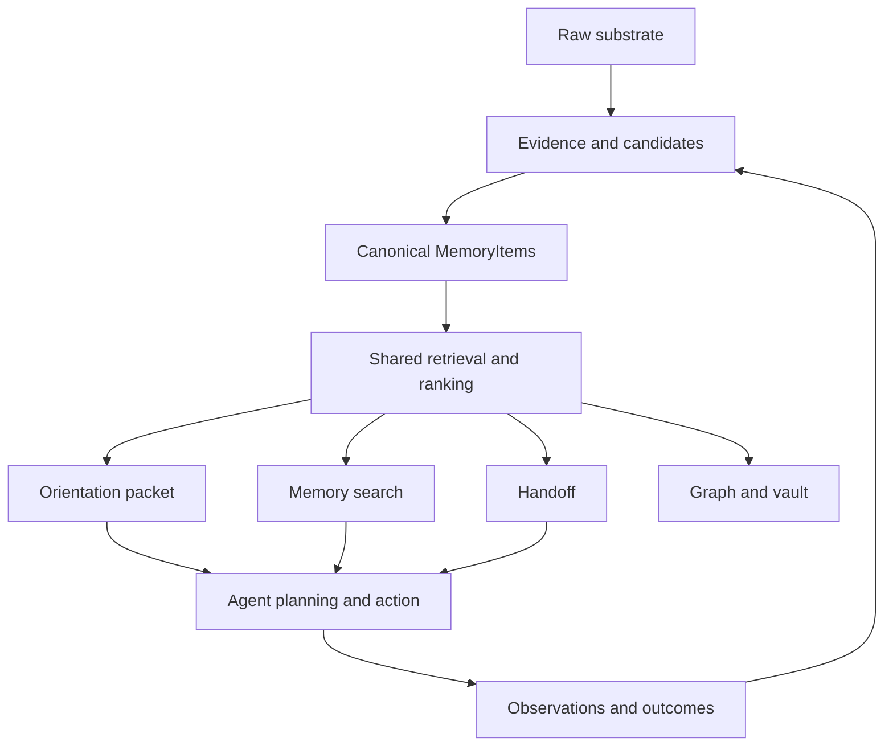
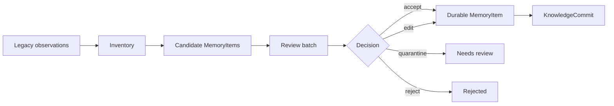

# Engram Brain Harness Architecture

Status: Draft RFC
Date: 2026-05-05
Audience: Engram maintainers, AI-agent harness authors, future contributors
Scope: Define how Engram becomes a brain harness for AI coding agents, and how to prove the design before removing legacy memory paths.

---

## 1. Purpose

Engram is not only a memory database. The target product is a brain harness for AI agents:

- help agents understand current project and task context,
- connect decisions, workflows, preferences, evidence, and prior outcomes,
- support agent thinking during planning and execution,
- preserve continuity across sessions, compaction, and parallel agents,
- make memory trustworthy enough to guide future action.

This RFC defines the architecture needed for that behavior.

The core bet is:

```text
Legacy layers provide raw substrate and evidence.
MemoryItem becomes the canonical cognitive unit for agent-facing memory.
```

This is a bet, not a premise to accept blindly. Engram should prove it through evals before deleting or heavily simplifying legacy components.

---

## 2. Current System Shape

Engram currently has two memory shapes.

### 2.1 Legacy Knowledge Layers

The original system is organized around seven specialized layers:

1. Entity knowledge
2. Session history
3. Document semantic search
4. Tool intelligence
5. Session coordination
6. Knowledge document registry
7. Work management

These layers are useful, but they expose multiple retrieval and write models. That makes agent cognition inconsistent. The agent may get different answers depending on whether it calls entity search, document search, work context, session search, or Memory OS orientation.

### 2.2 Memory OS

Memory OS adds the richer cognitive model:

- `MemoryItem`
- `WriterProvenance`
- `EvidenceRef`
- `KnowledgeCommit`
- `MemoryCursor`
- `orient`
- `changes_since`
- repository topology
- graph traversal
- lint
- rolling handoffs
- obligations
- harness adapters
- generated Markdown vault
- review-gated migration and digest flows

The current gap is not primarily ontology. The core gap is retrieval and lifecycle unification.

---

## 3. Target Architecture

The target architecture is a layered brain harness.



The legacy layers remain valuable, but their product role changes:

| Current Layer | Target Role |
|---|---|
| Entity knowledge | Entity evidence, scope labels, graph anchors |
| Session history | Raw episodic evidence and distillation source |
| Documents | Evidence and searchable source material |
| Tool intelligence | Workflow evidence and procedural memory source |
| Coordination | Live agent state and conflict signals |
| Knowledge registry | Document source registry and migration input |
| Work management | Project/task scope and work evidence |

The agent-facing memory surface should converge on:

- orientation,
- retrieval,
- evidence inspection,
- capture,
- review and promotion,
- handoff,
- changes since cursor.

---

## 4. Canonical Cognitive Unit

`MemoryItem` should become the canonical unit for agent cognition.

Canonical means:

- orientation selects and ranks MemoryItems,
- search returns MemoryItems first,
- handoffs reference or supersede MemoryItems,
- graph traversal connects MemoryItems to scopes and evidence,
- migration promotes legacy records into MemoryItems,
- evals judge whether MemoryItems improve downstream agent behavior.

Canonical does not mean every raw record must be immediately stored only as a MemoryItem. Raw records can continue to exist as evidence.

```text
Raw record:
  "The agent ran test X and got failure Y."

Candidate MemoryItem:
  "Test X fails when config Y is missing."

Reviewed MemoryItem:
  "Before running Test X in this repo, ensure config Y exists."
```

---

## 5. Memory Trust Classes

The write path should be tiered. A single strict rule would reduce capture rates and make agents avoid memory writes.

### 5.1 Ephemeral Observation

Low-friction memory capture.

- May lack evidence.
- May be agent-observed or inferred.
- Not eligible as strong guidance in orientation.
- Can appear in review queues or low-confidence search.

Use cases:

- working notes,
- session insights,
- first-pass discoveries,
- uncertain observations,
- tool failure notes.

### 5.2 User Preference

User preferences may begin without external evidence because the user statement itself is the authority.

Rules:

- May be active without additional evidence.
- Must carry origin `user_stated` or `user_corrected`.
- Should expose freshness and optional review-after metadata.
- May later be challenged or reconfirmed by an agent.

### 5.3 Candidate Memory

A structured memory proposal.

- Has provenance.
- Usually has evidence.
- Needs review before becoming durable guidance.
- May be produced from session distillation or migration.

### 5.4 Durable Guidance

Memory that can guide future agent action.

Required:

- writer provenance,
- at least one evidence reference,
- status,
- scope,
- confidence or categorical trust label.

Applies to:

- decisions,
- rules,
- limitations,
- workflows,
- project facts,
- repository facts,
- task facts.

### 5.5 Reviewed Guidance

The highest-priority guidance class.

Reviewed guidance is durable guidance that has passed a review decision by one or more participants:

- user,
- current agent,
- future agent,
- importer,
- verifier workflow.

The reviewer must be recorded.

---

## 6. Review Participants

Review is not only human approval.

Engram should support multiple reviewer roles:

| Reviewer | Good For | Caution |
|---|---|---|
| User | Preferences, workflows, final authority | Can be interrupted too often |
| Agent | Source validation, test validation, duplicate detection | Must cite evidence |
| Importer | Legacy migration batches | Should default to review, not active |
| Future agent | Reconfirmation after stale period | Should not silently rewrite high-impact memory |

The review system should store:

- reviewer identity,
- reviewer kind,
- decision,
- rationale,
- evidence inspected,
- timestamp.

---

## 7. Orientation Contract

Orientation should return both compiled context and raw memory.

Compiled context is useful because it reduces cognitive load. Raw memory is necessary because agents need auditability and evidence.

Target response shape:

```json
{
  "compiled_context": "Short scoped narrative for the current task.",
  "raw_items": [
    {
      "id": "memory-id",
      "kind": "decision",
      "title": "Use repository topology for project resolution",
      "content": "...",
      "trust": {
        "status": "active",
        "origin": "user_stated",
        "review_state": "reviewed",
        "evidence_count": 2,
        "freshness": "current"
      },
      "evidence": [
        {
          "kind": "file",
          "target": "docs/BRAIN_HARNESS_ARCHITECTURE.md"
        }
      ]
    }
  ],
  "ambiguities": [],
  "recommended_actions": [],
  "cursor": {
    "timestamp": "...",
    "commit_id": "..."
  },
  "degraded": false
}
```

Orientation must be:

- deterministic for the same project/cwd/cursor inputs,
- scope-bounded,
- explicit about ambiguity,
- explicit about freshness and trust,
- fast enough for task boundaries.

---

## 8. Conflict Policy

When two active memories conflict, Engram should not silently prefer one because it is newer.

Default scoring should combine:

```text
winner_score =
  evidence_strength
  + recency
  + source_authority
  + scope_specificity
  - staleness
```

Where:

- evidence strength considers evidence count, evidence type, and evidence freshness,
- recency favors newer information,
- source authority favors user-corrected over agent-inferred,
- scope specificity favors task/repo/project-specific facts over global facts,
- staleness penalizes expired or review-needed items.

If the scores are close, or if both memories are high-impact, orientation should return an ambiguity instead of pretending certainty.

High-impact categories:

- user preferences,
- rules,
- decisions,
- limitations,
- security-sensitive facts,
- workflow constraints.

---

## 9. Retrieval Contract

Search, orientation, and memory listing should not behave like separate brains.

Engram should move toward a shared retrieval layer:

```text
query/scope/cursor
  -> candidate MemoryItems
  -> shared ranking
  -> trust annotation
  -> optional compiled context
```

Unified search should include MemoryItems first.

Legacy records can still be returned, but they should be labeled as:

- raw evidence,
- unmigrated legacy memory,
- document result,
- session event,
- entity observation,
- work observation.

This avoids deleting valuable old data while making the agent-facing cognitive layer coherent.

---

## 10. Latency Budget

Hot-path memory must be predictably fast enough that agents do not avoid it.

Initial targets:

| Operation | p50 | p95 | Hard Timeout | Notes |
|---|---:|---:|---:|---|
| `changes_since` | 5-30 ms | 20-120 ms | 150 ms | Cursor/delta path, should be nearly free |
| `search` | 20-100 ms | 80-300 ms | 250-400 ms | Cheap enough for repeated probing |
| `orient` | 50-150 ms | 150-500 ms | 500-700 ms | Task-boundary operation |

Graceful degradation:

1. Return cached compiled context and top-K MemoryItems.
2. Mark response as partial or degraded.
3. Skip deep evidence traversal.
4. Skip expensive synthesis.
5. Return stale-but-recent context with freshness metadata.
6. Queue reranking, evidence stitching, or summary refresh asynchronously.

Never block `changes_since` on summary recompilation.

---

## 11. Brain Harness Metrics

The system works only if it improves agent behavior.

Primary eval metrics:

1. Task success uplift
2. Amnesia or rediscovery reduction
3. Retrieval usefulness at decision time
4. Preference adherence rate
5. Conflict resolution correctness
6. Session continuity after compaction or restart
7. Memory update acceptance rate
8. Duplicate suppression and consolidation quality
9. Bad-memory containment
10. Latency-adjusted utility

Metrics should be paired. Retrieval precision without task impact is not enough. Fast retrieval of irrelevant memory is not success.

---

## 12. Confidence Experiment

Before deleting or simplifying legacy paths, run a head-to-head experiment.

### 12.1 Experiment Arms

```text
A. No memory
B. Legacy observations/search
C. MemoryItem-based retrieval/orientation
D. Optional hybrid: legacy storage normalized into MemoryItems for retrieval
```

### 12.2 Scenarios

Use multi-session coding workflows:

1. User preference stated in session 1, applied in session 3.
2. Previous failed approach should not be repeated.
3. Decision rationale must shape a later implementation.
4. Stale fact is contradicted by newer source evidence.
5. Agent resumes after compaction using handoff and cursor.
6. Legacy observation migrates into a MemoryItem candidate.
7. Two concurrent agents write memory and later reconcile.

### 12.3 Success Criteria

MemoryItem becomes canonical if it shows:

- better task success than legacy/no-memory,
- fewer repeated context lookups,
- better preference adherence,
- better conflict handling,
- lower duplicate rate,
- acceptable latency,
- migration viability from legacy observations.

---

## 13. Eval Trace Schema

The confidence experiment needs traces that connect memory retrieval to agent behavior. Storage correctness alone is not enough.

Each eval run should emit a trace record with this shape:

```json
{
  "run_id": "uuid",
  "scenario_id": "preference_applied_later",
  "arm": "memory_item",
  "agent": {
    "harness": "codex",
    "model": "gpt-5.5"
  },
  "task": {
    "project": "engram",
    "prompt": "Add a new API integration following prior preferences.",
    "expected_outcomes": [
      "uses_httpx",
      "does_not_reask_preference"
    ]
  },
  "memory_calls": [
    {
      "tool": "orient",
      "latency_ms": 91,
      "degraded": false,
      "returned_item_ids": ["memory-a", "memory-b"],
      "used_item_ids": ["memory-a"],
      "missing_expected_item_ids": []
    }
  ],
  "outcome": {
    "task_success": true,
    "preference_adhered": true,
    "repeated_context_questions": 0,
    "conflict_resolution_correct": true,
    "bad_memory_used": false
  },
  "review": {
    "judge": "human_or_eval_agent",
    "notes": "Agent used the preference without re-asking."
  }
}
```

Required trace dimensions:

| Field | Purpose |
|---|---|
| `arm` | Compare no-memory, legacy, MemoryItem, and hybrid modes |
| `scenario_id` | Group repeated runs for statistical comparison |
| `memory_calls` | Connect retrieval behavior to later actions |
| `returned_item_ids` | Measure retrieval precision and noise |
| `used_item_ids` | Measure whether memory affected behavior |
| `missing_expected_item_ids` | Detect recall failures |
| `latency_ms` | Track latency-adjusted utility |
| `degraded` | Track graceful degradation quality |
| `outcome` | Tie memory to task-level behavior |

Derived metrics:

- task success rate by arm,
- preference adherence rate by arm,
- retrieval precision at K,
- memory use rate,
- repeated-context question rate,
- bad-memory use rate,
- p50 and p95 latency per memory operation,
- duplicate or stale memory surfaced per run.

### 13.1 Runtime Agent Feedback

The system should also collect lightweight feedback from the agent that used the memory, not only from offline eval judges.

Implemented spike:

- `BrainHarnessTrace` records operation, intent, query/project/session metadata, returned memory IDs, generic result IDs, latency, warnings, and timestamp.
- `AgentFeedback` links back to a trace and records used/rejected memory IDs, used/rejected generic result IDs, stale or wrong-scope memory IDs, missing context, usefulness/correctness/noise scores, suggested memory changes, and a note.
- `orient`, `search`, and `changes_since` can produce trace IDs.
- The MCP `telemetry` tool can record traces, submit feedback, list records, and aggregate stats by intent.

Agent feedback is not ground truth. It should be treated as a weak signal and correlated with:

- user corrections,
- task/test outcomes,
- later memory edits or deletions,
- latency,
- retrieval result sets,
- human or eval-agent review.

Initial intent vocabulary:

| Intent | Use |
|---|---|
| `resume_session` | Reconstruct prior project/session context |
| `answer_question` | Answer a user question |
| `plan_work` | Build an implementation or investigation plan |
| `implement_change` | Modify code/docs |
| `debug_error` | Investigate a failure |
| `verify_decision` | Check whether a prior decision still holds |
| `follow_user_preference` | Apply known user guidance |
| `prepare_handoff` | Create continuation context |
| `review_memory` | Inspect, update, retire, or delete memory |

---

## 14. Migration Strategy

Migration should be review-gated.



Legacy records should not be auto-promoted to active guidance.

Migration should preserve source links so future agents can inspect how the MemoryItem was derived.

---

## 15. MCP Surface Strategy

Do not simply reduce the system to a tiny set of tools. That would make the architecture look cleaner but remove specialist power.

Use tiered exposure.

### 14.1 Always-Visible Lifecycle Tools

- `orient`
- memory search or recall
- capture observation
- promote or review memory
- `changes_since`
- `handoff`
- `obligations`
- `work_context`

### 14.2 Specialist Tools

- vault
- graph
- lint
- digest
- migration
- repo topology
- low-level entity/session/document/work tools

The agent should see the lifecycle path first. Specialist tools should remain available when the task requires them.

---

## 16. Implementation Milestones

### M1: RFC And Trace Schema

- Accept this RFC or revise it.
- Define the trace schema needed for evals and runtime agent feedback.
- Decide exact MemoryItem trust fields surfaced to agents.

Status: initial runtime telemetry spike exists.

### M2: MemoryItem Retrieval

- Add MemoryItems to unified search.
- Create one shared ranking path for search and orient.
- Include trust/freshness metadata in retrieval output.

Status: initial MemoryItem unified-search layer exists. It searches active `MemoryItem` records as `memory` results, supports optional project/cwd scoping, and emits telemetry through MCP search. Ranking is intentionally conservative and should be tuned from feedback data before replacing legacy result ordering.

### M3: Brain Harness Evals

- Add benchmark scenarios for multi-session agent workflows.
- Compare no memory, legacy, and MemoryItem modes.
- Track task success, retrieval usefulness, continuity, and latency.

Status: deterministic confidence scenarios now compare no-memory, legacy, MemoryItem, and
hybrid arms for preference continuity, stale/wrong-scope rejection, and decision continuity. The
eval suite includes a report gate that aggregates quality, task success, bad-memory use, missing
expected context, repeated context questions, and retrieval precision by arm.

### M4: Tiered Capture Policy

- Implement per-kind validation in `capture_memory`.
- Require evidence/provenance for durable guidance.
- Keep ephemeral observations low-friction.

Status: initial capture policy exists in `MemoryService::capture_memory`. Active preferences are
allowed without extra evidence only for user-stated/user-corrected origins. Active decisions,
rules, and limitations without evidence are downgraded to `needs_review`; review-origin writes stay
gated unless manually reviewed; and low-friction facts, session insights, and handoffs can still be
captured without evidence.

### M5: Promotion And Retirement

- Implement observation graduation.
- Add supersede/retire paths.
- Route contradictions to review.
- Record reviewer identity and rationale.

### M6: Migration From Legacy Layers

- Inventory legacy observations.
- Generate candidate MemoryItems.
- Export review batches.
- Apply accepted candidates through KnowledgeCommits.
- Start deprecating direct agent-facing use of migrated legacy paths.

### M7: Tool Tiering

- Keep the full specialist surface.
- Introduce a lifecycle-first agent-facing surface.
- Test whether tool selection improves in agentic evals.

---

## 17. Open Questions

1. Is `MemoryItem` the canonical storage unit, or only the canonical retrieval unit?
2. What exact fields define evidence strength?
3. What reviewer roles should be trusted for reviewed guidance?
4. Should compiled orientation context be stored, cached, or generated every time?
5. What is the first golden eval dataset?
6. How much degraded orientation is acceptable before the agent should ask the user?
7. Which legacy paths can be removed only after migration succeeds?
8. What is the minimum viable contradiction detector?

---

## 18. Near-Term Recommendation

Proceed in this order:

1. Finalize this RFC.
2. Expand runtime telemetry from the spike into the acceptance criteria for retrieval work.
3. Build the no-memory vs legacy vs MemoryItem confidence experiment.
4. Add trust metadata to orientation and memory search results.
5. Use feedback/telemetry to tune ranking and decide when MemoryItems can dominate legacy layers.

Do not begin large deletion of legacy layers until the confidence experiment shows MemoryItems improve agent behavior and migration preserves important knowledge.
