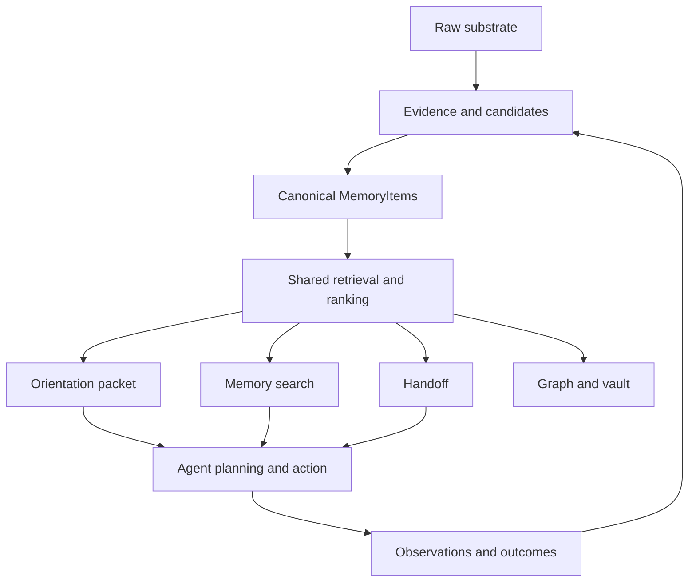
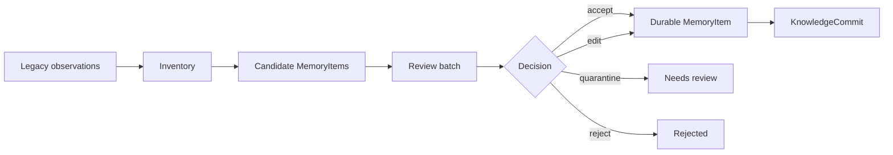

# Engram Brain Harness Architecture

Status: Draft RFC with Brain Loop v1, orient contract, research-method checkpoints, and first
matched dogfood evidence
Date: 2026-05-06
Audience: Engram maintainers, AI-agent harness authors, future contributors
Scope: Define how Engram becomes a brain harness for AI coding agents, and how to prove the design before removing legacy memory paths.

---

## 1. Purpose

Engram is not only a memory database. The target product is a brain harness for AI agents:

- help agents understand current project and task context,
- connect decisions, workflows, preferences, evidence, and prior outcomes,
- support agent thinking during planning and execution,
- preserve continuity across sessions, compaction, and parallel agents,
- make memory trustworthy enough to guide future action.

This RFC defines the architecture needed for that behavior.

The core bet is:

```text
Legacy layers provide raw substrate and evidence.
MemoryItem becomes the canonical cognitive unit for agent-facing memory.
```

This is a bet, not a premise to accept blindly. Engram should prove it through evals before deleting or heavily simplifying legacy components.

`docs/BRAIN_HARNESS_RESEARCH_METHOD.md` defines the research operating model for proving or
rejecting this bet. Dogfood is one experimental instrument under that method, not the entire
confidence story.

---

## 2. Current System Shape

Engram currently has two memory shapes.

### 2.1 Legacy Knowledge Layers

The original system is organized around seven specialized layers:

1. Entity knowledge
2. Session history
3. Document semantic search
4. Tool intelligence
5. Session coordination
6. Knowledge document registry
7. Work management

These layers are useful, but they expose multiple retrieval and write models. That makes agent cognition inconsistent. The agent may get different answers depending on whether it calls entity search, document search, work context, session search, or Memory OS orientation.

### 2.2 Memory OS

Memory OS adds the richer cognitive model:

- `MemoryItem`
- `WriterProvenance`
- `EvidenceRef`
- `KnowledgeCommit`
- `MemoryCursor`
- `orient`
- `changes_since`
- repository topology
- graph traversal
- lint
- rolling handoffs
- obligations
- harness adapters
- generated Markdown vault
- review-gated migration and digest flows

The current gap is not primarily ontology. The core gap is retrieval and lifecycle unification.

Implementation checkpoint, 2026-05-06:

- `orient` is the single frictionless entrypoint for task-boundary context.
- Brain Loop v1 is additive: `orient` returns a nested `brain_loop` projection generated from the
  memory already selected by orientation.
- `orient` surfaces already-open, currently applicable obligations as a compact bounded summary,
  without running obligation detection inside the hot path.
- `orient` filters stale git-status document obligations and suppresses untracked root instruction
  files such as local `AGENTS.md` from the open-obligation summary.
- `docs/ORIENT_CONTRACT.md` defines the current hot-path contract: MemoryItem-based orientation,
  review-needed separation, prompt-specific ranking, bounded obligations, and no graph traversal,
  obligation detection, lint, migration, or raw entity observation lookup in normal orientation.
- Graph traversal, obligation detection, lint, migration, raw entity observation lookup, and
  `changes_since` remain specialist paths until their signal quality and scoped retrieval behavior
  are proven.

Harness and migration checkpoint, current through 2026-06-06:

- Generated local harness adapter readiness is currently validated by read-only
  `harness(action="doctor")` checks for generic, Claude Code, Codex, Gemini CLI, and Cursor:
  all five report `ready=true`.
- This supersedes older harness-readiness checkpoints below that recorded `ready=false`, missing
  Claude hook registrations, generic policy absence, or generated-adapter drift before the T135
  repair.
- The harness claim remains bounded. Lifecycle compliance is still a soft contract; Claude Code
  settings remain split across settings files with a user-owned snippet and extra legacy Engram
  permissions; T179 observed native Claude startup guidance but did not obtain usable `/hooks`
  effective-configuration output; prompt-bearing native Claude behavior remains unproved; and
  external-session joinability remains only partially validated even though direct CLI and
  source-level MCP `ENGRAM_EXTERNAL_SESSION_ID` fallback support now exist, T262/T263 add and
  live-validate a guarded Codex Desktop `CODEX_THREAD_ID` fallback for CLI/MCP trace-producing
  paths, T264 adds a guarded source-level Claude Code `CLAUDE_CODE_SESSION_ID` fallback, and T265
  refreshes installed runtime for that source. T270 prepares a default-deny host-label gate: live
  native Claude Code labeling still needs exact trace evidence, while Gemini host labeling is
  deferred because current evidence has no documented MCP-subprocess session-id contract. T266
  validates current-data vault compilation only in isolated temp output. T267 prepared a fixed-count
  canonical vault gate, T272 marked it historical/non-executable after normal source-count drift,
  T275 prepared a Snapshot A/B successor protocol, and T277 executed that protocol under the
  2026-06-06 standing authorization. Canonical `/Users/yuval.meiri/.engram/vault` was initialized
  and compiled with 2,278 generated files, zero user files, and clean marker/frontmatter scans.
  T278 then applied the current M6 review batch, writing five reviewed project-scoped MemoryItems
  and KnowledgeCommit `019e9bd6-7e8e-7611-8326-1811b3b799a2`, and recompiled the canonical vault to
  2,287 generated files with zero user files and zero skipped files. T279 then archived the exact
  T234/T247/T248 lifecycle targets and recompiled the canonical vault to 2,291 generated files.
  T280 published `yuval.meiri/memory-os-phase0`, set upstream, and opened draft PR `#2`.
  T281 hard-stopped the T255 native Claude prompt-bearing preflight before launch because the
  current Claude target/version is `2.1.163`, not the packet baseline `2.1.161`. T282 prepares a
  docs-only successor packet for Claude `2.1.163` and does not launch native Claude. T283 runs
  that successor preflight and hard-stops before launch because ambient native Claude processes
  make attribution ambiguous. T284 records a read-only deferral of broad residual lifecycle cleanup
  and direct legacy deprecation/deletion after a limit-truncated lint sample. T285 fixes the first
  PR #2 CI failures by replacing Clippy-reported timestamp sorts, collapsing a Rust 1.96-only
  `sessionend` match warning, serializing the CI Test job's build/link work, and adding Test-job
  disk-headroom mitigations after remote run `27058785227` still failed with only 87 MB free disk.
  T286 records the fresh remote CI recheck: run `27059846266` passed Check, Format, Docs, Clippy,
  and Test on the T285 fix head `54c12eb20eefe1f69f162d9151b66868c120a70d`.
  T287 hardens the CI workflow by moving all five `actions/checkout@v4` steps to
  `actions/checkout@v5` after the latest PR CI run warned that checkout v4 uses the deprecated
  Node.js 20 action runtime. T287 requires its own fresh PR CI run on the T287 head and should not
  be treated as PR readiness.
  Future exact-target lifecycle batches and direct legacy behavior proof remain separate. T242
  executed the T233 runtime-refresh gate on 2026-06-04: the observed installed
  binary hash was
  `1059ae2f44bdcddc56ff88f2a1ed441f51459572d24d9b429248e38df1e6e2dc`, daemon status reported
  PID `14310` on port `8765`, and the live project-scoped current-plan list no longer leaked the
  out-of-scope `voice-layer` item. This supersedes the older statement that the installed runtime
  had not been refreshed for the T217/T221/T223 source changes or T225/T227/T229/T232 fixtures,
  but it is point-in-time installed-runtime evidence only. It does not prove native Claude prompt
  behavior, host external-session labeling, lifecycle cleanup, direct legacy deprecation, or broad
  cross-harness behavioral parity. Stale active handoffs remain until a future non-dry-run handoff
  update or explicit lifecycle cleanup.
- T245 read-only lifecycle scoping clarifies the current lifecycle gate without mutating memory:
  the exact T157/T159/T160 Engram archive targets are now `status=archived` and recorded by
  T166/T167/T168, but lifecycle cleanup remains incomplete. Fresh sampled
  `lint(action="run", write=false, limit=20)` still reports wrong-scope and superseded-active
  pressure; the leading representative findings are `dd-source` session-insight items with
  `safe_action=none` and an `ide-mcp-eval` superseded handoff, not those exact Engram targets.
  Because this lint sample is not a full inventory, do not infer that all Engram-scoped lifecycle
  debt is gone. The remaining lifecycle gate is broader exact-target review; no archive or
  `lint apply_safe` action was run.
- T246 read-only lifecycle inventory scoping clarifies that current `lint` is global, priority
  sorted, and limit-truncated, so it cannot prove an exhaustive Engram-scoped lifecycle inventory.
  Project-scoped telemetry-memory listing plus exact search/get/graph identified one unranked
  active candidate for future exact-target review: `019e8291-40aa-71a0-b16b-9ba7b6446cc6`
  (`Post-T76 rolling telemetry gate remains false`). Later T244 telemetry evidence shows the
  rolling gate passed at `2026-06-04T11:14:07.108605Z`, and recent feedback marks the T76 item as
  stale. T246 did not mutate lifecycle state, did not rank all Engram lifecycle debt, and does not
  authorize archive or `lint apply_safe`; any future packet must rerun fresh get/graph/telemetry
  evidence and stay exact-target/default-deny.
- T247 prepares that default-deny exact packet for `019e8291-40aa-71a0-b16b-9ba7b6446cc6`
  without mutating memory. The target is an active project-scoped custom observation, not a
  current-plan item and not graph-superseded. The proposed archive rationale is content staleness:
  it accurately recorded a T76 point-in-time failing telemetry gate on 2026-06-01, while later T244
  evidence recorded a passing gate on 2026-06-04. Sampled global lint did not surface the target
  and must not be treated as target proof. `lint apply_safe` remains out of scope; any future write
  must be direct exact `memory.archive` after fresh get/search-orient/graph/telemetry/git/
  obligations evidence and exact user approval.
- T248 applies the same default-deny lifecycle discipline to the next unpacketized non-M6
  stale-feedback candidate in the bounded sample:
  `019e01f2-0a87-7f73-9b0b-7f2443eac7bb` (`Resume continuity probe uses active MemoryItems
  before ranking changes`). The item was valid probe guidance on 2026-05-07 and helped the
  Stage 2 dogfood rerun pass, but later current-plan retrieval fixes and current T247 plan state
  make it historical rather than current next-action guidance. T248 does not archive it, run
  `lint apply_safe`, or claim exhaustive lifecycle inventory; T234 and T247 already cover their
  exact stale targets and are not duplicated.
- T249 reconciles the completion matrix after T248. It records that current-plan `orient`,
  obligations, installed-runtime baseline, doctor-level adapter readiness, and sampled telemetry
  are currently healthy within their bounded evidence, while M6, broad lifecycle cleanup, and full
  native Claude/harness behavior remain incomplete or blocked. T249 is docs-only and does not
  mutate lifecycle state, M6, ranking, `orient`, runtime, harness, schema/storage/index,
  document-index behavior, or user-owned files.
- T250 adds a docs-only M6 human-disposition worksheet compiled from existing committed reports
  T209/T210/T123/T124/T169/T121. It lists candidates 0001-0012 with report-derived labels,
  provenance, caveats, and explicit pending human-input fields, while preserving T210 as the
  then-authoritative gate before the 2026-06-06 standing authorization and T278 execution:
  all generated files were undecided, `ready_to_apply=false`, and 0012 needed explicit handling.
  T250 does not inspect or edit the generated review workspace, run M6 commands, make candidate
  choices, or imply migration readiness.
- T251 records historical post-T250 lifecycle visibility evidence: the then-pending T247 target
  `019e8291-40aa-71a0-b16b-9ba7b6446cc6` and T248 target
  `019e01f2-0a87-7f73-9b0b-7f2443eac7bb` were both active and visible, and fresh sampled
  lint reports feedback-stale findings for both with `safe_action=none`. T251 does not archive
  either item, run `lint apply_safe`, create a new packet, or change ranking/`orient`; it keeps
  lifecycle cleanup incomplete until exact packet approvals are executed or explicitly deferred.
  T279 later executes these exact archives.
- T252 reconciles the user's broad "continue without stopping for approval" instruction with the
  then-pending default-deny lifecycle packets. AI Council and Claude Bridge agreed that broad workflow
  permission applies to ordinary Engram repo/docs/code work, not exact MemoryItem archive writes.
  At T252, T234/T247/T248 stayed pending until exact packet wording was provided after fresh
  pre-write checks; no lifecycle archive or `lint apply_safe` ran then. This boundary is
  historical after the later 2026-06-06 standing authorization and T279 execution.
- T253 reconciles the matrix after the T252 telemetry intent-coverage catch-up. The latest
  20-trace rolling eval reports `feedback_coverage=0.8999999761581421`,
  `distinct_intent_count=4`, `task_failure_count=0`, `bad_memory_used_count=0`,
  `wrong_scope_memory_count=0`, `missing_context_count=0`, and
  `confidence_gate.passed=true`. This strengthens current operational confidence, but remains
  sampled agent-assessed telemetry; it does not complete M6, lifecycle cleanup, full native-Claude
  behavior, or branch synchronization.
- T254 scopes the native-Claude/harness parity gap without running native Claude or editing
  hooks/settings. Fresh read-only doctor checks still report `ready=true` for all five supported
  harnesses, but source inspection confirms that readiness checks installed/generated adapter and
  settings presence rather than Claude Code runtime `/hooks` behavior. T170 metadata/help,
  T179 startup guidance, and T197 cleanup/SessionEnd side-effect evidence remain bounded: effective
  hook visibility, prompt-bearing native Claude behavior, host-label adoption, lifecycle cleanup,
  M6, and branch synchronization are still open. Any next live native-Claude packet must be exact
  and default-deny, including pre-authorized cleanup if EOF hangs.
- T255 prepares that next default-deny live packet for one prompt-bearing native Claude
  MCP-`orient` validation. It has not been executed. The packet authorizes no `/hooks` command,
  hook/settings edit, harness install, lifecycle cleanup, M6 action, branch reconciliation, or
  fallback retry; it exists only so a future exact approval can run one bounded native prompt with
  preflight/postflight snapshots and pre-authorized process-group SIGINT cleanup if EOF hangs.
- T256 reconciles the startup-facing completion matrix after T255. AI Council and Claude Bridge
  agreed the matrix must label T255 as prepared-not-executed, telemetry as sampled healthy rather
  than exhaustive validation, and the goal as still incomplete on separate M6, lifecycle,
  prompt-bearing native Claude, effective-hook, host-label, branch-sync, and worktree-state gates.
  T256 is docs-only; it does not execute native Claude, mutate lifecycle or M6 state, reconcile
  branches, edit harness files, or change retrieval/runtime behavior.
- T257 corrects the telemetry wording after post-T256 feedback shifted the rolling 20-trace
  window. The latest 20-trace window has 95% feedback coverage and clean outcome counters but fails
  the confidence gate because only two intents have feedback; the 50-trace window still passes at
  94% coverage across four intents. Treat telemetry as sampled and window-sensitive, not exhaustive
  completion proof.
- T258 records read-only branch synchronization evidence. The current branch has no upstream
  configured; local `main` and local `origin/main` are both the merge-base
  `1d944f0af45e27661050586c9aa8e9189772ecc9`; local ahead/behind checks show `0 476`
  against both refs; and `git log HEAD..main` is empty. T258 does not fetch, push, pull, rebase,
  merge, or set upstream. The next branch-sync step is explicit branch-sync approval for
  remote-freshness fetch and recheck before any publication or reconciliation.
- T259 executes that remote-freshness recheck only. `git fetch origin` moves `origin/main` to
  `e6697eee18530bc64f64ae94b6fd6006c24c7423`; the branch still has no upstream;
  `origin/main...HEAD` is now `2 372`; merge-base is
  `50de8e0eb7aed64b943322e8331d993e8ed39e53`; and read-only `git merge-tree` predicts
  telemetry conflicts in `engram-index/src/telemetry.rs` and
  `engram-tests/tests/telemetry_tests.rs`. T259 does not publish, push, pull, rebase, merge, or
  set upstream. The next branch-sync step is a dedicated reconciliation plan.
- T260 records that dedicated branch reconciliation plan. Source inspection shows current HEAD
  already contains the upstream applied-filter concept as a deeper implementation: repo-scoped
  trace queries, feedback-by-sampled-trace selection, applied filters in reports, MCP project
  passthrough, and broader telemetry tests. The next implementation should use a regular merge of
  `origin/main` into this branch, not a 372-commit rebase or broad `-s ours`, preserve current
  telemetry semantics where they subsume upstream, inspect auto-merged core/MCP field-chain
  semantics, and validate with telemetry tests plus workspace checks before any push/upstream/PR.
- T261 executes that local branch reconciliation. `origin/main` at
  `e6697eee18530bc64f64ae94b6fd6006c24c7423` was merged into
  `yuval.meiri/memory-os-phase0` with a regular no-ff merge; conflicts were limited to
  `engram-index/src/telemetry.rs` and `engram-tests/tests/telemetry_tests.rs` and were resolved by
  preserving the branch's richer telemetry implementation where it subsumed upstream `711c736`.
  Validation passed: format, telemetry integration tests, full `engram-tests`, workspace check,
  focused MCP env-fallback tests, full clippy, conflict-marker check, and `git diff --check`.
  The only source edit beyond merge resolution was a test-only switch from a standard mutex to a
  Tokio mutex for runtime-env fallback tests. T261 does not push, set upstream, publish a PR, or
  change harness, lifecycle, M6, native-Claude, ranking/`orient`, public MCP, schema/storage/index,
  document-index, runtime, deletion, rollback, force-kill, legacy, or user-owned-file state.
- T262 adds a guarded source-level Codex Desktop host-label fallback. Existing explicit
  `external_session_id` values still win, `ENGRAM_EXTERNAL_SESSION_ID` remains second, and
  `CODEX_THREAD_ID` is used only when a Codex host marker is present and the thread ID is a short
  safe token, producing `codex://threads/{id}`. Validation caught and fixed a feedback-inheritance
  regression: `telemetry(submit_feedback)` now uses only an explicit feedback label and otherwise
  lets `TelemetryService` inherit the trace label. T262 passes focused CLI/MCP resolver tests, full
  telemetry integration, format, `cargo check -p engram-cli`, clippy, and `git diff --check`. It
  does not refresh runtime, edit hooks/settings/adapters, change public MCP/schema/storage/index/
  document-index behavior, mutate lifecycle/M6, run native Claude, push, set upstream, delete,
  rollback, or touch user-owned files.
- T263 refreshes the installed runtime for T262 and validates it live in Codex Desktop. The
  installed binary hash is `186feb4ab1e962733772773af3e1e9ca400cf52c6ebe7f92188e4eb2e17a0339`;
  the daemon restarted on port `8765` as PID `70816`; live `orient` trace
  `019e9316-093a-7242-b910-753f672a04b5` recorded
  `external_session_id=codex://threads/019e683b-1560-7361-b535-53b012e04aa5`; and feedback
  `019e9316-30b1-7941-a119-77a326d532ab`, submitted without an explicit label, inherited the same
  trace label. The 20-trace rolling eval then passed with one externally labeled trace/feedback,
  clean outcomes, and no wrong-scope or missing-context counts. T263 does not prove Claude/Gemini
  labels, native Claude behavior, effective hooks, lifecycle cleanup, M6, remote publication,
  deletion, rollback, or user-owned-file changes.
- T264 adds a guarded source-level Claude Code host-label fallback. Existing explicit labels and
  `ENGRAM_EXTERNAL_SESSION_ID` still win, then `CLAUDE_CODE_SESSION_ID` is used as
  `claude-code://sessions/{id}` only when `CLAUDECODE=1` and the ID is a short safe token, and
  then the guarded Codex fallback runs. This ordering prevents Claude-spawned MCP/CLI work from
  being mislabeled by inherited Codex env. Focused MCP/CLI resolver tests pass. T264 does not
  refresh runtime, run native Claude, prove Gemini labels, edit hooks/settings/adapters, change
  public MCP/schema/storage/index/document-index behavior, mutate lifecycle/M6, push, delete,
  rollback, or touch user-owned files.
- T265 refreshes the installed runtime for T264. The installed binary hash is
  `cb814e3f1a3c55b33d47ce15d4058e054cb7864c2303b94e06e98183f6584ea4`; the daemon restarted on
  port `8765` as PID `25189`; installed CLI help now advertises
  `ENGRAM_EXTERNAL_SESSION_ID`, guarded `CLAUDE_CODE_SESSION_ID`, then guarded `CODEX_THREAD_ID`;
  live `orient` trace `019e964a-1aca-7a63-8549-04c39c491fc0` recorded the expected Codex label;
  feedback `019e964a-3cfb-7de3-9b0d-c1671ebd489b` inherited that label; and a simulated
  Claude+inherited-Codex installed-CLI smoke completed on a temp data dir with trace
  `019e964a-9283-7c32-b6db-84d02633a2a7`. The simulated CLI packet does not expose the stored
  external-session label, so T265 still does not prove live native Claude Code or Gemini labels,
  native Claude behavior, effective hooks, lifecycle cleanup, M6, remote publication, deletion,
  rollback, or user-owned-file changes.
- T266 validates the generated Markdown vault compile path for current Memory OS data in isolated
  temp output only. `/Users/yuval.meiri/.engram/vault` status before and after remained
  `exists=false`, `initialized=false`, `total_file_count=0`, while
  `/private/tmp/engram-t266-vault-smoke-20260605` initialized and compiled 2,245 generated files
  from 1,585 MemoryItems, 536 KnowledgeCommits, 9 repositories, 32 entities, and 79 projects.
  Sampled vault index, current-plan item, and `engram` project pages had frontmatter and the Engram
  generated marker; direct scans found no generated file missing the marker or frontmatter. This is
  compileability evidence, not canonical vault initialization, M6 migration completion, lifecycle
  cleanup, durable user-facing vault readiness, deletion, or remote publication.
- T267 prepares the canonical vault approval gate without executing it. The future exact approval
  is scoped to a one-time init+compile of `/Users/yuval.meiri/.engram/vault` only after preflight
  confirms the target path is absent or an empty non-symlink directory, source counts match the
  T266 baseline, expected generated output remains 2,245 files, no elevated privileges are needed,
  and tracked git status is clean except known user-owned `AGENTS.md`. It forbids M6, lifecycle,
  deletion/cleanup/rollback, schema/storage/index/document-index/public MCP/ranking/`orient`
  changes, native Claude, Claude Bridge writes, harness install/settings/hooks/adapters, remote
  publication, and user-owned-file edits. T267 is docs-only and does not initialize the canonical
  vault.
- T268 diagnoses the `git pull` reconciliation hint without running pull/merge/rebase/push or
  setting Git config. After a fresh `git fetch origin`, `origin/main` is the merge-base and an
  ancestor of `HEAD`; `HEAD...origin/main` is `382 0`; the current branch has no upstream and no
  same-named remote branch; local `main` is behind `origin/main` by 107 commits but is also an
  ancestor of `HEAD`. Therefore no local merge/rebase is needed for repo-local Brain Harness work;
  the remaining branch gate is remote publication/upstream/PR policy.
- T269 prepares, but does not execute, the effective-hook visibility revalidation gate. It converts
  the T172/T179/T197/T254 lessons into a stricter future packet: the only future hook-visibility
  observation channel is the captured native Claude PTY transcript after one `/hooks` command,
  passing output must visibly show the effective hook configuration for the required Engram hook
  classes, inconclusive output is a failed measurement rather than permission for more input, and
  the T197 process-group `SIGINT` cleanup path is pre-authorized if EOF or the session hangs. T269
  does not run native Claude, T255 prompt-bearing validation, M6, lifecycle archive/apply_safe,
  canonical vault writes, branch publication, hook/settings edits, or ranking/`orient` changes.
- T270 prepares, but does not execute, the remaining host external-session label gate. It defines
  future exact live native Claude Code proof criteria for stored
  `claude-code://sessions/{id}` trace labels and feedback inheritance, and records Gemini CLI host
  labeling as deferred/default-deny until a documented MCP-subprocess session-id contract exists.
  T270 does not run native Claude or Gemini, combine with T255/T269 without exact dual-scope
  approval, implement guessed Gemini env labels, edit harness files, mutate lifecycle/M6/vault
  state, publish branches, or change ranking/`orient`.
- T271 prepares, but does not execute, branch publication/upstream policy. Fresh post-T270 branch
  evidence shows `origin/main` is still the merge-base and an ancestor of `HEAD`, `HEAD...origin/main`
  is `385 0`, no same-named remote branch exists, and the local branch still has no upstream. The
  future default operation is only `git push --set-upstream origin HEAD:refs/heads/yuval.meiri/memory-os-phase0`;
  PR creation remains a separate exact approval.
- T272 records canonical-vault count drift without execution. Fresh read-only status still shows
  `/Users/yuval.meiri/.engram/vault` absent and uninitialized, but live source counts are now
  1,591 MemoryItems, 542 KnowledgeCommits, and 2,257 expected generated files, compared with
  T267's fixed T266 baseline of 1,585, 536, and 2,245. The drift is explained by normal
  current-plan captures from T266 through T271. T267 remains immutable historical evidence, but it
  is not an executable packet under current counts; future canonical vault execution needs a fresh
  exact successor packet or approval that explicitly supersedes T267 and captures live counts
  immediately before execution.
- T273 refreshes the branch-publication and `git pull` hint evidence after T272 without mutating
  Git state. After a fresh fetch, `HEAD` is `534796d9f5a7e59d364e4075cfb7b45df5811a4c`,
  `origin/main` is still the merge-base and an ancestor of `HEAD`, `HEAD...origin/main` is
  `387 0`, no same-named remote branch exists, no upstream is configured, and no pull policy is
  configured. The repeated pull hint remains a signal to avoid bare `git pull`, not a reason to
  merge or rebase. The branch gate is still optional remote publication/upstream policy.
- T274 refreshes lifecycle target visibility after T273 without mutating Memory OS state, before
  T279 execution. Fresh
  `memory(get)` confirms the T234 migration-completion target
  `019dd3fe-ec94-7122-af04-1f35b839387f`, T247 telemetry target
  `019e8291-40aa-71a0-b16b-9ba7b6446cc6`, and T248 resume-probe target
  `019e01f2-0a87-7f73-9b0b-7f2443eac7bb` were active immediately before T279. Direct lifecycle search
  returned T273 current-plan guidance first and the M6 gate second, but all three stale targets
  still appeared in the top memory results. Fresh global lint was dominated by unrelated
  superseded-active safe-action and open-obligation findings, so broad `lint apply_safe` remains
  the wrong operation. Lifecycle cleanup remains incomplete until exact T234/T247/T248 execution
  or explicit deferral. T279 later executes these three exact archives under the newer standing
  authorization.
- T275 prepares a successor canonical-vault approval packet without executing it. T267 remains
  historical but non-executable under current counts after T272/T275 drift. Fresh T275 read-only
  canonical status still shows `/Users/yuval.meiri/.engram/vault` absent and uninitialized, with
  live counts now at `1599` MemoryItems, `546` KnowledgeCommits, `9` repositories, `32` entities,
  `79` projects, and `2269` expected generated files. T275 replaces fixed future counts with a
  two-phase snapshot-and-lock protocol: future execution must present live Snapshot A, obtain exact
  approval for that snapshot, re-read matching Snapshot B immediately before writes, and hard-stop
  on any drift or path ambiguity. It does not initialize or compile the vault.
- T276 refreshes the recurring pull-hint branch evidence after T275 without executing any branch
  mutation. After `git fetch origin`, `origin/main` is still the merge-base and an ancestor of
  `HEAD`, `HEAD...origin/main` is `390 0`, no same-named fetched remote branch exists, the current
  branch has no upstream, and no pull policy is configured. The pull hint still does not justify
  `git pull`, merge, rebase, pull-policy configuration, push, upstream setup, or PR creation. The
  remaining branch gate is still exact T271A-style remote publication/upstream, with PR creation as
  a separate gate.
- T277 executes the T275 canonical-vault Snapshot A/B protocol under the 2026-06-06 standing
  authorization. Snapshot A and B matched at 1,605 MemoryItems, 549 KnowledgeCommits, 9
  repositories, 32 entities, 79 projects, and 2,278 expected generated files. Canonical
  `/Users/yuval.meiri/.engram/vault` was absent/non-symlink before execution, then `vault init`
  created the expected skeleton and `vault compile` produced 2,278 generated files with zero skipped
  files and zero user files. Marker/frontmatter scans passed. This closes only the initial
  canonical generated-vault init/compile gate; future vault update policy remains separate.
- Rolling telemetry recovered after the T243 resumed-session audit. T243 initially observed 26%
  feedback coverage, then 46% after scoring material retrieval traces, which was still below the
  50% gate. T244 scored two additional assessable traces and
  `telemetry(action="real_session_eval", project="engram", limit=50)` generated at
  `2026-06-04T11:14:07.108605Z` reported 52% feedback coverage with
  `confidence_gate.passed=true`, `task_failure_count=0`, `bad_memory_used_count=0`,
  `wrong_scope_memory_count=0`, and `missing_context_count=0`. This is a rolling operational
  signal, not proof of M6, lifecycle, harness, runtime, or hot-path completion.
- T278 closes the current M6 generated review-batch disposition/apply gate. Candidate files
  0001-0012 now have one disposition each; five project-scoped candidates were written as active
  reviewed MemoryItems, three broad/superseded candidates were quarantined, and four stale/low-value
  candidates were rejected. Direct legacy deprecation and broad legacy simplification remain
  separate evidence-gated work.
- T279 archives the three exact stale lifecycle targets prepared by T234/T247/T248 after fresh
  post-T278 evidence. The T234 archive reason is rewritten around current T277/T278 facts rather
  than the old pre-T278 `ready_to_apply=false` payload. The T247 archive is supported by fresh
  passing telemetry, and the T248 archive is supported by current-plan retrieval superseding the
  May 7 probe. KnowledgeCommit `019e9be1-67ff-7e92-a87e-f92667fa3582` records the batch, and the
  canonical vault refreshes to 2,291 generated files. At T279, broad lifecycle inventory or
  deferral, native Claude/effective hooks/host labels, the remote branch gate, and direct legacy
  deprecation remained separate gates; T280 later closes the initial remote branch gate.
- T280 closes initial branch publication/upstream/PR. Fresh preflight showed
  `HEAD=5b5e4bb92acf71a0f419e434b4725b6d47fe37fc`, `origin/main` as an ancestor,
  `HEAD...origin/main` as `394 0`, no upstream, no same-named remote branch, and only user-owned
  root `AGENTS.md` untracked. The branch now tracks `origin/yuval.meiri/memory-os-phase0`, and
  draft PR `https://github.com/ymeiri/engram/pull/2` is open.
- T281 attempts only the T255 read-only preflight and does not launch native Claude. It resolves
  `/Users/yuval.meiri/.local/bin/claude` to
  `/Users/yuval.meiri/.local/share/claude/versions/2.1.163`, observes
  `2.1.163 (Claude Code)`, and stops because T255 hard-stops on anything other than baseline
  `2.1.161`. Prompt-bearing native Claude therefore remains open behind a successor packet or
  explicit deferral.
- T282 prepares that successor packet for Claude `2.1.163` as docs-only work. It preserves T255's
  prompt-bearing MCP-`orient` scope, keeps T269 effective-hook visibility and T270 host-label proof
  separate, requires future fresh preflight/path/version/hash/process/monitoring evidence, and
  explicitly rejects behavioral-equivalence claims between `2.1.161` and `2.1.163` until a future
  transcript proves the narrow prompt-bearing subclaim.
- T283 attempts the T282 successor preflight but does not launch native Claude. The path, version,
  hash, branch, harness, daemon, obligations, telemetry, and monitored-config checks were recorded,
  but live native Claude processes on `ttys001` and `ttys005` made attribution ambiguous under the
  T282 contract.
- T284 checks residual lifecycle/direct-legacy pressure read-only. A fresh lint sample returned 50
  superseded-active warnings, but because it was global and limit-truncated, T284 defers broad
  lifecycle cleanup and direct legacy deprecation/deletion instead of archiving or deleting data.
- T285 fixes the first PR #2 CI failures. Clippy failed on three `unnecessary_sort_by` findings in
  `engram-store/src/repos/memory.rs`, then the first pushed fix surfaced a Rust 1.96-only
  `collapsible_match` warning in `engram-index/src/harness.rs`; Test failed with `rust-lld` signal
  7 bus errors while linking integration-test binaries. Remote run `27058785227` proved the Clippy
  fix but still failed Test while linking `engram-mcp` after the runner reported only 87 MB free
  disk. The fix uses `sort_by_key`, a match guard, CI Test as
  `cargo test --all-targets --jobs 1`, and Test-job disk/debug/cache-target reductions, with local
  Clippy and serialized test validation passing before the CI-specific disk follow-up.
- T286 closes that remote CI recheck for the T285 fix head. Run `27059846266` completed
  successfully on `54c12eb20eefe1f69f162d9151b66868c120a70d`; Check, Format, Docs, Clippy, and
  Test all passed. PR readiness/review follow-up remains separate.
- T287 hardens PR CI action runtime usage after run `27061750059` surfaced GitHub annotations for
  `actions/checkout@v4` using Node.js 20. All five checkout steps now use `actions/checkout@v5`.
  This is CI maintenance only; it does not close PR readiness, native-Claude, effective-hook,
  host-label, lifecycle, or direct-legacy gates, and it requires a fresh CI run on the T287 head.

Research checkpoint, current through 2026-05-27:

- The first matched same-harness dogfood batch is recorded in
  `docs/BRAIN_HARNESS_DOGFOOD_RUN_2026-05-07.md`.
- `memoryitem_orient` passed 4/4 scored scenarios; the same-harness no-memory controls passed 3/4.
- The clear observed advantage was durable preference recall: `orient` recovered the reviewed
  commit-hygiene preference that repo-only context missed.
- Resume continuity, stale-scope rejection, and decision continuity passed in both arms, so this
  batch does not justify retrieval/ranking code changes or hot-path expansion.
- `bounded_autonomous_followthrough_001` passed both arms but was contaminated by self-referential
  task choice and cross-arm working-tree exposure.
- `bounded_autonomous_followthrough_002` fixed those protocol flaws with isolated worktrees and a
  pre-selected doc-only work slice. Both arms passed; no material `memoryitem_orient` advantage was
  observed.
- `bounded_autonomous_followthrough_003` and `bounded_autonomous_followthrough_004` were
  code-bearing telemetry slices. Both arms passed in both scenarios, but neither showed a material
  `memoryitem_orient` outcome advantage because the prompts carried most decisive context.
- `bounded_autonomous_followthrough_005` was confounded by current-plan supersession: both arms
  completed useful narrow work, but the treatment did not receive the intended target-bearing
  current-plan memory.
- `bounded_autonomous_followthrough_006` was scoreable and added stronger scoped regression
  coverage, but the no-memory arm also passed, so it did not support ranking, hot-path, migration,
  deletion, or broad legacy-simplification changes.
- `bounded_autonomous_followthrough_007` and `bounded_autonomous_followthrough_008` provide narrow
  positive sealed MemoryItem recovery evidence, including one real Claude Code code-bearing task
  whose sanitized controls failed cleanly. They do not prove broad cross-harness benefit.
- Document lifecycle follow-through passed for Codex and the generated Codex adapter, including
  obligation detection, document disposition, same-content suppression, and final doctor cleanup.
- The latest narrow implementation checkpoint fixed mission-class `plan_work` current-plan ranking
  without expanding `orient`, changing migration, adding graph/lint/raw-observation hot-path
  behavior, or deleting legacy layers.
- A follow-up narrow checkpoint extends that same current-plan continuity claim to direct unified
  `search` continuation prompts through deterministic MemoryItem fixtures, while keeping migration
  approval prompts gate-first and leaving the `orient` payload unchanged.
- Native MCP smoke after installing binary hash
  `f5cb5816927b4e4a5b9cb92df560de47e201c2bccdcbfa05eeb25c9d35bcfb35` confirmed the direct
  `search` continuation query returns the active current-plan memory first.
- T87/T88 continuity follow-up found that `handoff(get)` gives the active rolling handoff, but
  direct search can still surface superseded active handoff MemoryItems. T88 records a docs-only
  approval packet for one exact archive target; no lifecycle write, ranking change, or `orient`
  expansion has been run.
- T89 tightened the `orient` to `changes_since` loop without changing cursor semantics:
  `changes_since` remains timestamp-based, but a commit-id-only MCP call now tells agents to pass
  `memory_cursor.timestamp` and optionally `memory_cursor.commit_id`.
- T90 applies the same cursor guidance to the CLI `engram memory changes-since` path: CLI help and
  invalid timestamp errors now point at `memory_cursor.timestamp`, while `--commit-id` remains
  optional context.
- T91 found a follow-on resume continuity drift: lean `orient` and direct `search` recovered T90,
  but `handoff(get)` still stopped at T87/T86 context. The rolling handoff was refreshed to
  `019e8316-ebd1-7220-b18e-f0d33110131a`; this is handoff maintenance only, not lifecycle archive,
  ranking, `orient`, M6, document-index, schema/storage/index, public MCP, or harness work.
- T92 improves read-only lint visibility for the same stale-handoff pressure: actionable
  superseded-active findings now outrank generic stale-feedback noise while stale current-plan
  feedback remains first. No lifecycle archive or `apply_safe` action was run.
- T93 validates that T92 is active in the installed MCP runtime: after installing binary hash
  `e54aed9a4830cc53822100930d63541bf51d06b3f27c2844e6090bfe01f5379a` and restarting the daemon on
  port `8765`, live MCP lint returned stale current-plan feedback first and safe-action
  superseded-active findings before generic stale-feedback rows. No `apply_safe`, lifecycle,
  migration, document-index, ranking, `orient`, public MCP, schema/storage/index, or harness action
  was run.
- T94 applies the T91 continuity rule after T93: lean `orient`, direct `search`, docs, git, and
  `changes_since` recovered T93, but `handoff(get)` still stopped at T90/T91. The rolling handoff
  was refreshed to `019e8352-a610-7f92-859f-f9d74b026ba7`; this is handoff maintenance only, not
  lifecycle archive, ranking, `orient`, M6, document-index, schema/storage/index, public MCP, or
  harness work.
- T99 records a docs-only approval packet for the T96 handoff superseded by T98:
  `019e835e-81c2-7562-897a-e42c0fe8dc08`. No archive, lint safe-action, migration, document-index,
  ranking, `orient`, schema/storage/index, public MCP, or harness write was run.
- T100 applies the T91/T94/T96/T98 continuity rule after T99: `handoff(get)` still stopped at
  T97/T98 context, while lean `orient`, direct `search`, docs, git, and `changes_since` recovered
  T99. The rolling handoff was refreshed to `019e8378-b2f0-7260-a887-4abdf6c0e4e2`; this is
  handoff maintenance only, not lifecycle archive, lint safe-action, ranking, `orient`, M6,
  document-index, schema/storage/index, public MCP, or harness work.
- T101 records a docs-only approval packet for the T98 handoff superseded by T100:
  `019e836a-435a-75e1-8702-ced8eabe85cc`. No archive, lint safe-action, migration,
  document-index, ranking, `orient`, schema/storage/index, public MCP, or harness write was run.
- T102 applies the T91/T94/T96/T98/T100 continuity rule after T101: `handoff(get)` still stopped at
  T99/T100 context, while lean `orient`, direct `search`, docs, git, and `changes_since` recovered
  T101. The rolling handoff was refreshed to `019e8381-5e35-78d2-b4f9-7ef949fc6e6b`; this is
  handoff maintenance only, not lifecycle archive, lint safe-action, ranking, `orient`, M6,
  document-index, schema/storage/index, public MCP, or harness work.
- T103 records a docs-only approval packet for the T100 handoff superseded by T102:
  `019e8378-b2f0-7260-a887-4abdf6c0e4e2`. No archive, lint safe-action, migration,
  document-index, ranking, `orient`, schema/storage/index, public MCP, or harness write was run.
- T104 applies the T91/T94/T96/T98/T100/T102 continuity rule after T103 and a Claude Bridge
  side-effect: `handoff(get)` returned low-information Claude session-end handoff
  `019e8388-2744-79d3-b91a-61bde6da34d5`, while lean `orient`, direct `search`, docs, git, and
  current-plan memory recovered T103. The rolling handoff was refreshed to
  `019e838b-6b25-7011-8b4b-b4cc61dc450f`; this is handoff maintenance only, not lifecycle archive,
  lint safe-action, ranking, `orient`, M6, document-index, schema/storage/index, public MCP, or
  harness work.
- A native Claude Code CLI smoke then confirmed the same direct `search` behavior in trace
  `019e68ac-678e-7683-a241-08119fc6b03c`, with current-plan memory
  `019e689c-b188-70e2-acfc-2d00f956bd24` as the top result.
- A 2026-05-27 native Claude Code CLI follow-up after installed binary
  `4f3bda71eb441d492ece4b1bb5983993be9cf47802fd10cdb3484f31f7e23f9c`
  confirmed the current continuation surface still works: lean `orient` trace
  `019e68fe-6150-7ab3-9df7-8339e3766c76` kept the packet compact inline and included current-plan
  memory `019e68f9-31b1-7270-9095-4f0be5ffa94b` at position 2; direct `search` trace
  `019e68fe-6417-7590-8331-85ddf3dd4a86` returned that memory first. Claude Bridge could not run
  the same smoke because its project harness exposed only file-read tools, not Engram MCP tools.
- A follow-up direct `search` calibration fixed a lexical false positive where `non-gated`
  continuation wording was classified as a gate query by substring. Live installed trace
  `019e68d4-05b7-79d3-8077-df6e2999482d` returns the active current plan first for the
  non-gated next-slice prompt, while migration-apply gate trace
  `019e68d4-27b7-70e2-bdfe-5c879a97f0c8` still keeps migration/gate context above current-plan
  context.
- Current-plan lifecycle semantics are now aligned across capture, `orient` post-prioritization,
  and direct `search` ranking: only active `decision` and `rule` MemoryItems with the
  `current-plan` tag are managed as current-plan guidance. Non-guidance facts or limitations with
  the tag remain active evidence and are not automatically superseded by
  `memory(action=capture_current_plan)`.
- A 2026-05-27 narrow gate follow-up calibrated explicit migration-apply direct `search` prompts
  against live-shaped distractors. After installing binary
  `fea91cc46549c138a425389394af9c4cdd9d8727eb39137f8afc179a976968eb`, native MCP traces
  `019e698d-b766-7e71-a4da-a8c593f1b191` and `019e698d-b791-7d93-a0d6-542219e3eb6c` returned
  the paused migration review gate first, while regression trace
  `019e698d-b7ae-7a13-b2c5-d58a9898deab` kept the current-plan/M6-gate context prompt
  current-plan-first.
- Claude Code `2.1.152` replicated that boundary through its own Engram MCP connection: traces
  `019e6993-d4da-70a1-b5eb-9185eeb23339` and `019e6993-d891-7ff3-93ef-4bd8ad14d9c7` returned
  the paused gate first for explicit migration-apply prompts, and trace
  `019e6994-8ec9-7343-9198-9298867b9ceb` returned current-plan memory first for the contextual
  M6-gate continuation prompt.
- A later installed-runtime repair closed the live mixed current-plan/M6 direct-search gap for the
  exact `current plan next non-gated Brain Harness feedback confidence M6 gate` prompt class. T43
  Codex trace `019e7d1c-b20a-7c52-b8af-e6d82439988c` returned the current plan first and the
  active M6 gate second; pure continuation trace `019e7d1e-29ad-7540-bcfc-d28131851091` did not
  promote the M6 gate. T44 Claude Code trace `019e7d21-cec2-7c60-b570-40bb6b79574e` reproduced
  that mixed-query order, while explicit M6 and pure continuation controls also passed. T45 then
  prepared a pending approval packet for exactly one inventory-only M6 scoping run. No M6
  inventory, review export, apply, deletion, lifecycle mutation, schema/storage/index change,
  public MCP change, ranking or `orient` change, or harness/hook change was authorized or run.
- T46 refreshed harness readiness evidence with read-only `harness(action="doctor")` and
  `harness(action="status")` checks. Generic, Claude Code, Codex, Gemini CLI, and Cursor all
  returned `ready=false`: generic policy is missing, Claude Code lacks required `SessionStart` and
  `SessionEnd` settings registrations, and Codex/Gemini/Cursor generated adapters remain drifted.
  This is configuration evidence only, not authorization to install adapters, edit settings, or
  register hooks.
- T47 prepared a pending approval packet for exact local harness repair writes derived from
  read-only `harness(action="install", write=false, ...)` dry-runs. The packet asks for approval
  only; it does not install adapters, edit settings, adopt user-owned files, rewrite hooks, run M6,
  mutate lifecycle state, change schema/storage/index state, change public MCP behavior, change
  ranking, or expand `orient`.
- T48 prepared a pending approval packet for one stale current-plan lifecycle write. Read-only
  `orient`, `search`, scoped current-plan listing, `memory(action="get")`, and
  `lint(action="run", write=false)` evidence show the old repository-scoped current-plan memory
  `019e5e0a-86b4-73e3-aa9b-ca350e83e915` remains active below the latest T47 project plan and has
  129 recent stale-feedback records with `safe_action=none`. The packet asks for approval only; it
  does not archive the memory, mutate other memories, run M6, execute harness writes, change
  schema/storage/index state, change public MCP behavior, change ranking, or expand `orient`.
- T49 audited pending-approval retrieval without changing code. Direct `search` surfaced the
  active M6 gate, harness-write gate, and T48 lifecycle packet for explicit approval-gate prompts.
  Lean `orient` surfaced the latest current-plan memory first, whose full content names T45, T47,
  and T48 as pending approvals, but it did not individually surface M6 and harness-write gate
  memories. Treat this as a partial result and keep approval-audit behavior out of the `orient`
  hot path unless a later approved prompt-class slice justifies a narrow change.
- T50 replicated the post-T49 pending-approval continuation shape in Claude Code through the
  read-only Engram MCP path. Lean `orient` trace `019e7d48-6e97-7513-96af-f49d5a61bfc5`
  surfaced the T49 current plan first, harness-write gate second, and M6 gate third; direct
  `search` trace `019e7d48-905b-75c2-9d5b-e9cb657024c9` returned M6 first and harness-write
  second. This is narrow cross-harness retrieval evidence only, not approval for migration,
  lifecycle writes, harness writes, ranking changes, or `orient` expansion.
- T51 rechecked the T48 archive packet after T49/T50 current-plan supersession. Fresh read-only
  evidence showed the active project current plan is now T50
  `019e7d4b-f526-7141-809d-035a7003a2ed`, while the stale repository-scoped target
  `019e5e0a-86b4-73e3-aa9b-ca350e83e915` remains active and lint reports 139 stale-feedback
  records with `safe_action=none`. Because T48 hard-coded T47 as the active successor and used a
  stale 129-record archive reason, T48 is no longer executable as written. T51 is a drift report
  only, not a refreshed approval packet or authorization for lifecycle writes, M6, harness writes,
  ranking changes, or `orient` expansion.
- T52 refreshed the stale current-plan evidence and converted the next step into a resolution
  request rather than an archive-only approval packet. Fresh read-only evidence showed T51
  `019e7d55-b103-70b3-a023-6398e96d6430` is now the active project-scoped current plan, target
  `019e5e0a-86b4-73e3-aa9b-ca350e83e915` is still the only active repository-scoped current-plan
  item for `/Users/yuval.meiri/projects/engram`, and lint reports 142 stale-feedback records with
  `safe_action=none`. AI Council and Claude Bridge critique found the scope-gap risk material, so
  T52 asks the user to choose archive-only, replacement-then-archive, or scope-correction/merge.
  It does not authorize lifecycle writes, create a replacement, run M6, write harness adapters,
  edit settings, register hooks, change schema/storage/index state, change public MCP behavior,
  change ranking, or expand `orient`.
- T53 replicated the post-T52 current-plan retrieval shape in Claude Code through the read-only
  Engram MCP path. Claude Bridge ran with only `orient`, `search`, and `obligations` allowed.
  Lean `orient` trace `019e7d60-64af-76d3-948f-5dd6068aa3d8` and direct `search` trace
  `019e7d60-67e9-71d0-a421-f3364d4a5131` both surfaced T52 current-plan memory
  `019e7d5d-c450-7171-9fdb-8d1a5e745b0b` first. The stale repository-scoped current-plan target
  remained visible below T52 and was treated as pending-decision evidence only. This is read-only
  parity evidence only, not approval for lifecycle writes, replacement memory, M6, harness writes,
  ranking changes, or `orient` expansion.
- T73 later refreshed that stale repository-scoped current-plan evidence after T72. T72 current
  plan `019e826e-e059-7e10-8ee3-facf9b470bfb` still ranks first for the tested continuation
  prompt, but target `019e5e0a-86b4-73e3-aa9b-ca350e83e915` remains the only active
  repository-scoped current-plan item for `/Users/yuval.meiri/projects/engram` and lint now reports
  228 recent stale-feedback records with `safe_action=none`. This keeps T52 as a user decision
  request, not approval for archive, replacement, scope correction, lifecycle writes, ranking,
  migration, harness, schema/storage/index, public MCP, document-index, or `orient` changes.
- T74 replicated the post-T73 current-plan shape in Claude Code through Claude Bridge with
  `write=false`, no Bash allowance, and only read-only Engram retrieval/obligation tools allowed.
  Codex traces `019e8277-3c03-7f62-8bfe-cc6a79f48212` and
  `019e8277-484c-7df1-a977-1e303a41d333`, plus Claude traces
  `019e8278-671d-7d02-8a04-fe0a17d31de6` and
  `019e8278-6bd4-73f3-8973-8ea0d3ec24bc`, all returned T73 current-plan memory first for the
  tested path. The stale repository-scoped target remained lower-ranked but noisy, and Claude's
  synthetic design/source obligations required cleanup after the run.
- T75 refreshed rolling telemetry after T74 feedback/current-plan capture. The sampled project
  report retained zero task failures and zero bad-memory-used records, and external-session
  labeling improved to `36/50`, but the confidence gate failed because only `plan_work` had
  feedback in the sampled window. Evidence-loop completion therefore remains unproven.
- T77 reran the pre-registered organic non-plan scoring audit after T76 fixed intent-filtered trace
  listing. Fixed windows for `follow_user_preference` and `verify_decision` returned only
  retrieval-only assessable older-unseen traces and zero `ASSESSABLE_TASK_OUTCOME` traces, so no
  scoring feedback was submitted and no final `real_session_eval` was run. Existing organic
  non-plan trace bodies can support retrieval spot checks, but not honest historical outcome
  scoring by themselves.
- T78 then ran a prospective controlled observable-task audit over four genuine current-work
  tasks, using only existing `orient`, `search`, telemetry, repo state, and transcript-visible
  outcomes. All four pre-registered non-`plan_work` tasks were `ASSESSABLE_TASK_OUTCOME`, feedback
  was submitted for each, and the single diagnostic `real_session_eval` passed numerically
  (`feedback_coverage=0.60`, `task_failure_count=0`, `bad_memory_used_count=0`). This shows that
  prospective task design can create honest non-plan outcome feedback today, but it does not prove
  broad historical organic coverage or authorize gated work.
- T79 pre-registered the same observable-task pattern for Claude Bridge, then ran one read-only
  project-harness call with no Bash and only `mcp__engram__orient` plus `mcp__engram__search`
  allowed. Claude Bridge reported both allowed tools as unavailable, so all three tasks were
  `HARNESS_INCONCLUSIVE` with zero Engram trace IDs. No feedback or diagnostic confidence report
  was submitted. This is a tool-exposure caveat for Claude Bridge, not evidence against the
  Engram retrieval surfaces.
- T80 records the outcome-link design boundary exposed by T77/T78/T79. Real-session
  `AgentFeedback` remains weak agent-reported telemetry: it has task outcome fields, but no
  judgment source or evidence pointer. Controlled outcome evidence should stay separate and
  independently judged, following the existing `brain_harness_eval.rs` model. T80 does not change
  schema, storage, public MCP requests, ranking, harnesses, migration, lifecycle state, document
  indexing, or `orient`.
- T81 samples the latest 20 project feedback rows as a proxy for outcome-evidence field
  population. Every row had notes and positive outcome fields, but no non-empty
  `missing_context`; only the four T78 rows had explicit `ASSESSABLE_TASK_OUTCOME` labels, and no
  row included a structured transcript, commit, test, user-review, or controlled-outcome artifact
  pointer. This supports keeping real-session telemetry weak until a controlled artifact pilot or
  larger proxy audit justifies implementation.
- T82 creates that first controlled artifact pilot as a document-only immutable snapshot. It links
  five trace/feedback rows to durable evidence refs, evidence strength, T80 outcome classes,
  confounds, and pending reviewer agreement. The shape helps distinguish transcript-visible T78
  outcomes from a positive but weak T79 startup self-report, but it remains agent-authored evidence
  and does not justify storage, public MCP, schema, harness, ranking, lifecycle, migration,
  document-index, or `orient` changes.
- T83 adds a read-only Claude Bridge second-reader review of the T82 artifact. Claude agreed with
  all five T82 classes and explicitly kept the weak T79 startup row as `SELF_REPORTED_OUTCOME`.
  It also flagged T82-4 as the weakest positive row because staging-discipline evidence was
  preserved only in an authored doc summary, not raw git-status output. This strengthens the
  artifact shape while adding a future evidence-quality requirement for raw terminal/test/status
  evidence when such subclaims matter.
- T84 codifies that requirement in the research method instead of running a standalone raw-output
  demonstration. A future controlled artifact row that depends on git status, staged diff, test
  output, or command output should preserve scoped raw output with interpretation and limitations,
  or keep the subclaim indirect. Copied terminal output remains author-captured evidence, not
  independent proof.
- T85 rechecked the Claude Bridge project-harness Engram tool-exposure caveat from T79. In one
  pre-registered `write=false`, no-Bash run with only `mcp__engram__orient` and
  `mcp__engram__search` allowed, Claude Bridge again reported `No such tool available` for both
  tools and produced no Engram trace IDs. Treat this as project-harness exposure evidence only,
  not as evidence against native Claude Code MCP behavior or Engram retrieval quality.
- T86 refreshed the rolling project handoff after finding the active handoff was a low-information
  Claude Code session-end note. The new handoff records T85, current-plan memory
  `019e82ee-dd81-7ba0-8f97-1933965f6d8e`, exact T69/T70 approval phrases, and the default-deny
  boundaries. Treat this as continuity repair only, not migration, indexing, lifecycle, harness,
  ranking, schema/storage/index, public MCP, or `orient` approval.
- T87 clarified resume source precedence. Current Engram `orient`, direct search, and
  `handoff(get)` recover T86/T69/T70 context, while `/Users/yuval.meiri/notes/engram/handoff.md`
  is stale 2026-04-17 open-source launch context. Older handoff MemoryItems may still appear lower
  in direct search, so future agents should prefer `handoff(get)` and latest current-plan memory
  over conflicting handoff search results.
- MCP `memory(action=list)` now honors explicit scope filters before applying `limit`, closing an
  evidence-sampling gap where a project-scoped current-plan list for Engram could return older
  repository-scoped Engram guidance and wrong-project `voice-layer` guidance. This is a specialist
  memory-list fix only; it does not change `orient`, unified `search`, ranking, migration, schema,
  hooks, adapters, or lifecycle status. Native Claude Code `2.1.152` reproduced the same scoped
  list behavior through its own Engram MCP connection with only `mcp__engram__memory` allowed.
- A follow-up read-only harness readiness audit corrected stale documentation: explicit
  `harness(action=doctor)` calls for `claude_code`, `codex`, `gemini_cli`, and `cursor` all
  returned `ready=false`. Claude Code has required generated adapter files installed, but required
  `SessionStart` and `SessionEnd` settings hook registrations are missing; Codex, Gemini CLI, and
  Cursor still have required generated adapter drift. This is configuration evidence only, not an
  adapter or hook write.
- A post-T17 read-only evidence audit found that the telemetry confidence gate is sample-window
  sensitive. Before scoring T18 retrieval traces, `real_session_eval(project=engram, limit=50)` had
  enough trace and feedback volume but feedback across only two intents, so the gate failed. After
  scoring T18 retrieval traces, the current report passes numerically again. The same audit found
  `lint(action=apply_safe, write=false)` has no safe actions, and stale repository-scoped
  current-plan memory `019e5e0a-86b4-73e3-aa9b-ca350e83e915` remains active with repeated
  stale-feedback hits. Lifecycle status changes, hot-path ranking changes, and document-index
  normalization remain gated.
- T19 corrected a real-session eval measurement flaw: feedback is now selected by sampled trace IDs
  instead of by an independent newest-feedback window. This keeps public request parameters, output
  fields, formulas, confidence-gate constants, ranking, `orient`, migration, hooks, adapters, and
  schema/storage/index behavior unchanged, while preventing older traces with newer feedback from
  inflating coverage for a smaller recent trace sample.
- T20 corrected scoped real-session eval sampling: project, scenario, and arm filters are now
  applied before the trace limit for scoped reports, so newer out-of-scope traffic cannot starve an
  in-scope confidence sample. This keeps public request parameters, output fields, formulas,
  ranking, `orient`, migration, lifecycle state, document-index behavior, hooks, adapters,
  schema/storage, and `list_feedback_scoped` behavior unchanged.
- T21 installed-runtime validation confirmed the T19/T20 behavior in the live daemon after
  installing binary hash `0192d24d945b7acb8bdfabe129c56d61a5abf0f7ce8223c854139677a93738ab`.
  The controlled scoped report
  `t21_installed_runtime_eval_20260527_0192d24d / memoryitem_orient / limit=2` returned exactly the
  latest two in-scope traces and only the feedback attached to those sampled traces, excluding newer
  out-of-scope traces and newer feedback on older in-scope traces.
- Native Claude Code `2.1.152` reproduced the same T21 read-only telemetry report through its own
  Engram MCP connection with `mcp__engram__telemetry` allowed. Claude Bridge still exposed only
  file-read tools for the same request, so treat the bridge miss as a tool-exposure limitation.
  The Claude Code result validates the shared MCP telemetry surface for this report shape, not
  hooks, adapters, ranking, migration, or broad Brain Harness product behavior.
- T23 through T25 re-audited the completion matrix and rolling feedback window. Current-plan
  retrieval stayed current-plan-first for the startup prompt class, while broad architecture and
  implementation-plan searches could still surface stale repository-scoped or historical migration
  memories below current guidance. The telemetry confidence gate stayed useful as an operational
  signal but remained sample-window sensitive.
- T26 and T27 narrowed obligation noise from safety-gate wording and untracked root instruction
  files, then validated the fix in the installed daemon. The slice changed only obligation signal
  quality; it did not change ranking, migration, lifecycle state, hooks, adapters, schema/storage,
  public MCP request shape, telemetry formulas, or the `orient` payload.
- T28 replicated that obligation behavior through Claude Code for the same MCP request shape, with
  a harness caveat: synthetic prompts containing obligation trigger phrases can create startup
  obligations even when the requested validation calls are dry-run. Future smokes should run
  obligation doctor and close synthetic artifacts.
- T29 audited the completion gate after T27/T28. Current-plan retrieval and obligations were clean
  for the observed continuation surface, `real_session_eval(project=engram, limit=50)` passed
  numerically with `bad_memory_used_count=0`, but `external_session_trace_count=0` in the latest
  sampled window and all supported harnesses still reported `ready=false`.
- T30/T31 synchronized the architecture and research-method docs through T29 evidence, then
  reconfirmed the same live-state shape: current-plan retrieval stayed current for the observed
  continuation prompt, stale historical guidance remained lower-ranked review noise, the evidence
  loop stayed sample-window sensitive, and all supported harnesses still reported `ready=false`.
- T32 changed only private lint finding priority before truncation so feedback-stale current-plan
  and wrong-scope feedback findings are visible under normal limits. The installed daemon returned
  `feedback_stale_current_plan` first for stale repository-scoped current-plan memory
  `019e5e0a-86b4-73e3-aa9b-ca350e83e915`, with `safe_action=none`.
- T33 replicated that T32 lint-ordering result through Claude Code's Engram MCP path via Claude
  Bridge. The smoke created one synthetic design-context obligation, which was resolved after the
  already-required startup docs were read; this is a harness-smoke caveat, not broad readiness.
- T34 startup live-state sampling kept current-plan retrieval usable, with the active current plan
  first for both lean `orient` and direct current-plan search. The live lint report still surfaced
  the same stale current-plan finding first, now with 87 recent stale-feedback records, and
  `obligations(action=doctor)` remained clean. After scoring the T34 startup traces,
  `real_session_eval(project=engram, limit=50)` had `feedback_trace_count=47`,
  `feedback_coverage=0.9399999976158142`, `bad_memory_used_count=0`,
  and `external_session_trace_count=0`, but the conservative confidence gate failed because
  feedback covered only two intents. Treat that as rolling-window evidence, not approval for M6.
- T35 pre-registered three read-only evidence-quality checks before running them. The M6
  `verify_decision` case passed and the `review_memory` stale-plan case weakly passed, but lean
  `orient(intent=prepare_handoff)` failed its fixed criteria: it preserved current-plan continuity
  while omitting explicit M6/harness-write gates and returning stale repository-scoped
  current-plan guidance without a caveat. The rolling confidence gate then passed numerically
  (`feedback_trace_count=48`, `feedback_coverage=0.9599999785423279`,
  `distinct_intent_count=5`, `bad_memory_used_count=0`, `task_failure_count=1` after scoring the
  T35 startup traces), but the per-case handoff failure is stronger evidence than the aggregate
  gate pass.
- T38 repaired that fixed `prepare_handoff` orientation gap narrowly: handoff orientation now
  presents one latest applicable current-plan item across matching project/repository scopes, pins
  it in Brain Loop, and leaves explicit M6/harness-write gate items to normal scoped selection. It
  does not expand the payload, synthesize approval gates, mutate lifecycle state, or authorize M6 or
  harness writes.
- T39 completed installed-runtime validation for that handoff path. The installed daemon now treats
  exact `approval gate` wording as gate intent and live Codex/Claude Code traces surface current
  plan plus the active M6 and harness-write gate MemoryItems while keeping stale repository
  current-plan guidance out of lean candidates. This is prompt-class validation and capture repair,
  not migration, lifecycle cleanup, payload expansion, or harness-write approval.
- M6 migration remains the high-risk gate: even read-only inventory requires explicit
  user-approved scope, and write apply/deletion requires reviewed candidates, dry-run evidence,
  rollback planning, and explicit approval.

---

## 3. Target Architecture

The target architecture is a layered brain harness.



The legacy layers remain valuable, but their product role changes:

| Current Layer | Target Role |
|---|---|
| Entity knowledge | Entity evidence, scope labels, graph anchors |
| Session history | Raw episodic evidence and distillation source |
| Documents | Evidence and searchable source material |
| Tool intelligence | Workflow evidence and procedural memory source |
| Coordination | Live agent state and conflict signals |
| Knowledge registry | Document source registry and migration input |
| Work management | Project/task scope and work evidence |

The agent-facing memory surface should converge on:

- orientation,
- retrieval,
- evidence inspection,
- capture,
- review and promotion,
- handoff,
- changes since cursor.

---

## 4. Canonical Cognitive Unit

`MemoryItem` should become the canonical unit for agent cognition.

Canonical means:

- orientation selects and ranks MemoryItems,
- search returns MemoryItems first,
- handoffs reference or supersede MemoryItems,
- graph traversal connects MemoryItems to scopes and evidence,
- migration promotes legacy records into MemoryItems,
- evals judge whether MemoryItems improve downstream agent behavior.

Canonical does not mean every raw record must be immediately stored only as a MemoryItem. Raw records can continue to exist as evidence.

```text
Raw record:
  "The agent ran test X and got failure Y."

Candidate MemoryItem:
  "Test X fails when config Y is missing."

Reviewed MemoryItem:
  "Before running Test X in this repo, ensure config Y exists."
```

---

## 5. Memory Trust Classes

The write path should be tiered. A single strict rule would reduce capture rates and make agents avoid memory writes.

### 5.1 Ephemeral Observation

Low-friction memory capture.

- May lack evidence.
- May be agent-observed or inferred.
- Not eligible as strong guidance in orientation.
- Can appear in review queues or low-confidence search.

Use cases:

- working notes,
- session insights,
- first-pass discoveries,
- uncertain observations,
- tool failure notes.

### 5.2 User Preference

User preferences may begin without external evidence because the user statement itself is the authority.

Rules:

- May be active without additional evidence.
- Must carry origin `user_stated` or `user_corrected`.
- Should expose freshness and optional review-after metadata.
- May later be challenged or reconfirmed by an agent.

### 5.3 Candidate Memory

A structured memory proposal.

- Has provenance.
- Usually has evidence.
- Needs review before becoming durable guidance.
- May be produced from session distillation or migration.

### 5.4 Durable Guidance

Memory that can guide future agent action.

Required:

- writer provenance,
- at least one evidence reference,
- status,
- scope,
- confidence or categorical trust label.

Applies to:

- decisions,
- rules,
- limitations,
- workflows,
- project facts,
- repository facts,
- task facts.

### 5.5 Reviewed Guidance

The highest-priority guidance class.

Reviewed guidance is durable guidance that has passed a review decision by one or more participants:

- user,
- current agent,
- future agent,
- importer,
- verifier workflow.

The reviewer must be recorded.

---

## 6. Review Participants

Review is not only human approval.

Engram should support multiple reviewer roles:

| Reviewer | Good For | Caution |
|---|---|---|
| User | Preferences, workflows, final authority | Can be interrupted too often |
| Agent | Source validation, test validation, duplicate detection | Must cite evidence |
| Importer | Legacy migration batches | Should default to review, not active |
| Future agent | Reconfirmation after stale period | Should not silently rewrite high-impact memory |

The review system should store:

- reviewer identity,
- reviewer kind,
- decision,
- rationale,
- evidence inspected,
- timestamp.

---

## 7. Orientation Contract

Orientation should return both compiled context and raw memory.

Compiled context is useful because it reduces cognitive load. Raw memory is necessary because agents need auditability and evidence.

Target response shape:

```json
{
  "project": "Engram",
  "scope": "Engram",
  "context_pack": "...",
  "brain_loop": {
    "compiled_context": "Short scoped narrative for the current task.",
    "top_items": [
      {
        "id": "memory-id",
        "kind": "decision",
        "title": "Use repository topology for project resolution",
        "summary": "...",
        "trust": {
          "status": "active",
          "origin": "user_stated",
          "review_state": "reviewed",
          "evidence_count": 2,
          "freshness": "current"
        },
        "why_relevant": "Active decision matched the orientation scope."
      }
    ],
    "degraded": false
  },
  "active_decisions": [],
  "active_rules": [],
  "preferences": [],
  "limitations": [],
  "review_needed": [],
  "ambiguities": [],
  "recommended_actions": [],
  "memory_cursor": {
    "timestamp": "...",
    "commit_id": "..."
  }
}
```

Brain Loop v1 deliberately does not replace the raw memory arrays. The compiled context reduces
cognitive load; the raw arrays and trust metadata keep the result auditable.

Orientation must be:

- deterministic for the same project/cwd/cursor inputs,
- scope-bounded,
- explicit about ambiguity,
- explicit about freshness and trust,
- fast enough for task boundaries.

---

## 8. Conflict Policy

When two active memories conflict, Engram should not silently prefer one because it is newer.

Default scoring should combine:

```text
winner_score =
  evidence_strength
  + recency
  + source_authority
  + scope_specificity
  - staleness
```

Where:

- evidence strength considers evidence count, evidence type, and evidence freshness,
- recency favors newer information,
- source authority favors user-corrected over agent-inferred,
- scope specificity favors task/repo/project-specific facts over global facts,
- staleness penalizes expired or review-needed items.

If the scores are close, or if both memories are high-impact, orientation should return an ambiguity instead of pretending certainty.

High-impact categories:

- user preferences,
- rules,
- decisions,
- limitations,
- security-sensitive facts,
- workflow constraints.

---

## 9. Retrieval Contract

Search, orientation, and memory listing should not behave like separate brains.

Engram should move toward a shared retrieval layer:

```text
query/scope/cursor
  -> candidate MemoryItems
  -> shared ranking
  -> trust annotation
  -> optional compiled context
```

Unified search should include MemoryItems first.

Legacy records can still be returned, but they should be labeled as:

- raw evidence,
- unmigrated legacy memory,
- document result,
- session event,
- entity observation,
- work observation.

This avoids deleting valuable old data while making the agent-facing cognitive layer coherent.

---

## 10. Latency Budget

Hot-path memory must be predictably fast enough that agents do not avoid it.

Initial targets:

| Operation | p50 | p95 | Hard Timeout | Notes |
|---|---:|---:|---:|---|
| `changes_since` | 5-30 ms | 20-120 ms | 150 ms | Cursor/delta path, should be nearly free |
| `search` | 20-100 ms | 80-300 ms | 250-400 ms | Cheap enough for repeated probing |
| `orient` | 50-150 ms | 150-500 ms | 500-700 ms | Task-boundary operation |

Graceful degradation:

1. Return cached compiled context and top-K MemoryItems.
2. Mark response as partial or degraded.
3. Skip deep evidence traversal.
4. Skip expensive synthesis.
5. Return stale-but-recent context with freshness metadata.
6. Queue reranking, evidence stitching, or summary refresh asynchronously.

Never block `changes_since` on summary recompilation.

---

## 11. Brain Harness Metrics

The system works only if it improves agent behavior.

Primary eval metrics:

1. Task success uplift
2. Amnesia or rediscovery reduction
3. Retrieval usefulness at decision time
4. Preference adherence rate
5. Conflict resolution correctness
6. Session continuity after compaction or restart
7. Memory update acceptance rate
8. Duplicate suppression and consolidation quality
9. Bad-memory containment
10. Latency-adjusted utility

Metrics should be paired. Retrieval precision without task impact is not enough. Fast retrieval of irrelevant memory is not success.

---

## 12. Confidence Experiment

Before deleting or simplifying legacy paths, run a head-to-head experiment.

### 12.1 Experiment Arms

```text
A. No memory
B. Legacy observations/search
C. MemoryItem-based retrieval/orientation
D. Optional hybrid: legacy storage normalized into MemoryItems for retrieval
```

### 12.2 Scenarios

Use multi-session coding workflows:

1. User preference stated in session 1, applied in session 3.
2. Previous failed approach should not be repeated.
3. Decision rationale must shape a later implementation.
4. Stale fact is contradicted by newer source evidence.
5. Agent resumes after compaction using handoff and cursor.
6. Legacy observation migrates into a MemoryItem candidate.
7. Two concurrent agents write memory and later reconcile.

### 12.3 Success Criteria

MemoryItem becomes canonical if it shows:

- better task success than legacy/no-memory,
- fewer repeated context lookups,
- better preference adherence,
- better conflict handling,
- lower duplicate rate,
- acceptable latency,
- migration viability from legacy observations.

### 12.4 First Matched Dogfood Checkpoint

The 2026-05-08 matched same-harness batch provides the first controlled behavioral checkpoint for
Brain Loop v1:

| Arm | Scored scenarios | Task successes | Preference adhered | Bad memory used |
|---|---:|---:|---:|---:|
| `memoryitem_orient` | 4 | 4 | 4 | 0 |
| `no_memory_same_harness` | 4 | 3 | 3 | 0 |

Supported claim: Brain Loop v1 is useful for durable user preference recall in this repository
when the preference has been captured as reviewed active memory.

Unsupported by this batch:

- broad MemoryItem dominance over legacy retrieval,
- retrieval/ranking code changes,
- graph, lint, raw observations, migration, or obligation detection in the normal `orient` path,
- deletion or simplification of legacy layers.

Follow-up checkpoint:

- `bounded_autonomous_followthrough_001` was inconclusive because both arms passed and the protocol
  allowed self-referential work selection plus possible cross-arm contamination.
- `bounded_autonomous_followthrough_002` removed those flaws. Both arms again passed on a narrow
  doc-only contract update, with no material outcome advantage for `memoryitem_orient`.
- `bounded_autonomous_followthrough_003` used a code-bearing scoped telemetry-filtering task. Both
  arms passed and the leaner patch landed, but there was still no material outcome advantage for
  `memoryitem_orient`.
- `bounded_autonomous_followthrough_004` used a code-bearing applied-filter telemetry-reporting
  task. Both arms passed; the curated implementation landed, but the scenario exposed a feedback
  attribution gap.
- `bounded_autonomous_followthrough_005` used an underspecified continuation task. It was
  scoreable but confounded because the target-bearing current-plan memory had been superseded before
  the treatment arm ran.
- `claude_rescue_commit_hygiene_001` with Hot Context IDs produced a clean narrow Claude Code
  validation pass for durable preference recall and structured `used_memory_ids`.

`bounded_autonomous_followthrough_006` used a small code-bearing telemetry attribution-quality
task. Both arms passed, H1 was not supported, and the curated treatment patch was integrated
because it has stronger scoped regression coverage. The result improves measurement of
memory-attribution gaps, but it does not justify ranking, hot-path, migration, deletion, or broad
legacy-simplification changes.

`bounded_autonomous_followthrough_007` and `bounded_autonomous_followthrough_008` then exercised
sealed MemoryItem recovery. BAF007 produced a narrow accepted Codex outcome; BAF008 produced a
real Claude Code treatment pass with sanitized no-memory and static-instruction controls that
failed cleanly. These runs strengthen the sealed-recovery claim, including one real cross-harness
code-bearing task, but they do not justify broad cross-harness claims, hook expansion, M6
write-apply, deletion, ranking changes, or hot-path expansion.

---

## 13. Eval Trace Schema

The confidence experiment needs traces that connect memory retrieval to agent behavior. Storage correctness alone is not enough.

Each eval run should emit a trace record with this shape:

```json
{
  "run_id": "uuid",
  "scenario_id": "preference_applied_later",
  "arm": "memory_item",
  "agent": {
    "harness": "codex",
    "model": "gpt-5.5"
  },
  "task": {
    "project": "engram",
    "prompt": "Add a new API integration following prior preferences.",
    "expected_outcomes": [
      "uses_httpx",
      "does_not_reask_preference"
    ]
  },
  "memory_calls": [
    {
      "tool": "orient",
      "latency_ms": 91,
      "degraded": false,
      "returned_item_ids": ["memory-a", "memory-b"],
      "used_item_ids": ["memory-a"],
      "missing_expected_item_ids": []
    }
  ],
  "outcome": {
    "task_success": true,
    "preference_adhered": true,
    "repeated_context_questions": 0,
    "conflict_resolution_correct": true,
    "bad_memory_used": false
  },
  "review": {
    "judge": "human_or_eval_agent",
    "notes": "Agent used the preference without re-asking."
  }
}
```

Required trace dimensions:

| Field | Purpose |
|---|---|
| `arm` | Compare no-memory, legacy, MemoryItem, and hybrid modes |
| `scenario_id` | Group repeated runs for statistical comparison |
| `memory_calls` | Connect retrieval behavior to later actions |
| `returned_item_ids` | Measure retrieval precision and noise |
| `used_item_ids` | Measure whether memory affected behavior |
| `missing_expected_item_ids` | Detect recall failures |
| `latency_ms` | Track latency-adjusted utility |
| `degraded` | Track graceful degradation quality |
| `outcome` | Tie memory to task-level behavior |

Derived metrics:

- task success rate by arm,
- preference adherence rate by arm,
- retrieval precision at K,
- memory use rate,
- repeated-context question rate,
- bad-memory use rate,
- p50 and p95 latency per memory operation,
- duplicate or stale memory surfaced per run.

### 13.1 Runtime Agent Feedback

The system should also collect lightweight feedback from the agent that used the memory, not only from offline eval judges.

Implemented spike:

- `BrainHarnessTrace` records operation, secondary intent metadata, free-form `scenario_id`
  and `arm`, query/project/session metadata, returned memory IDs, generic result IDs,
  latency, warnings, and timestamp.
- `AgentFeedback` links back to a trace and records used/rejected memory IDs, used/rejected
  generic result IDs, stale or wrong-scope memory IDs, missing context,
  usefulness/correctness/noise scores, task success, preference adherence, repeated context
  questions, bad-memory use, suggested memory changes, and a note.
- `orient` and `search` accept free-form `scenario_id` and `arm` labels and preserve them on
  the real operation trace; `orient`, `search`, and `changes_since` can produce trace IDs.
- The MCP `telemetry` tool can record traces, submit feedback, list records, and aggregate stats by intent.
- `telemetry(action=real_session_eval)` returns a read-only report over persisted traces and
  feedback, including coverage, per-intent quality signals, per-arm outcome rows, scenario
  counts, warnings, and a conservative confidence gate. The gate requires behavioral outcome
  feedback in addition to relevance signals; migration writes still require explicit user
  approval.
- Report coverage semantics are trace-based: `feedback_coverage` means traces with at least one
  linked feedback record divided by traces, and `feedback_records_per_trace` separately exposes
  feedback density when multiple feedback records attach to one trace. Outcome feedback and memory
  attribution also expose trace-level counts so scope correctness, task outcome, and feedback
  presence are not conflated.
- Memory-attribution trace coverage is bounded to distinct eligible traces. A 2026-05-27 live
  report exposed the old denominator mismatch: memory judgments on search traces could be counted
  while search memory results were only stored as generic result IDs, producing an impossible
  `memory_judgment_trace_coverage=1.78`. Search traces now also populate `returned_memory_ids` for
  memory-layer results, and the report denominator includes older traces with explicit memory
  judgments so historical coverage cannot exceed 1.0 without rewriting data.
- A pre-registered 2026-05-27 live feedback batch
  (`live_feedback_coverage_2026_05_27`) submitted feedback for all ten read-only retrieval traces
  and moved project-level feedback coverage to `23/44` (`0.5227272510528564`). The numerical
  confidence gate passed at that checkpoint. A later T18 pre-feedback re-audit showed the current
  sample could fail when feedback spans only two intents; after scoring T18 traces, the report
  passed numerically again. T19 then corrected the report builder to select feedback from the
  sampled trace IDs rather than an independent feedback window. The batch remains weak
  agent-assessed evidence. It exposed a design-preference retrieval failure and stale
  migration/current-plan caveats, not authorization for M6 inventory, write apply, deletion, broad
  ranking changes, hook changes, or `orient` payload expansion.
- Generated harness adapters now instruct agents to preserve `trace_id` values returned by
  `orient` and `search`, then submit `telemetry(action=submit_feedback)` before final response
  with `task_success`, `preference_adhered`, `repeated_context_questions`, `bad_memory_used`, and
  `missing_context` when those outcomes or gaps can be judged. They also instruct agents to include
  `used_memory_ids` for returned memory that materially shaped the answer, implementation, safety
  decision, or plan, and `rejected_memory_ids` for returned memory that was considered but not used.

`intent` should not become a rigid ontology for every possible memory workflow. It remains a
caller-supplied workflow slice. Custom memory experiments should use free-form `scenario_id` and
`arm` labels so users and agents can compare their own strategies without expanding the core
intent vocabulary.

Agent feedback is not ground truth. It should be treated as a weak signal and correlated with:

- user corrections,
- task/test outcomes,
- later memory edits or deletions,
- latency,
- retrieval result sets,
- human or eval-agent review.

Initial intent vocabulary:

| Intent | Use |
|---|---|
| `resume_session` | Reconstruct prior project/session context |
| `answer_question` | Answer a user question |
| `plan_work` | Build an implementation or investigation plan |
| `implement_change` | Modify code/docs |
| `debug_error` | Investigate a failure |
| `verify_decision` | Check whether a prior decision still holds |
| `follow_user_preference` | Apply known user guidance |
| `prepare_handoff` | Create continuation context |
| `review_memory` | Inspect, update, retire, or delete memory |

---

## 14. Migration Strategy

Migration should be review-gated.



Legacy records should not be auto-promoted to active guidance.

Migration should preserve source links so future agents can inspect how the MemoryItem was derived.

---

## 15. MCP Surface Strategy

Do not simply reduce the system to a tiny set of tools. That would make the architecture look cleaner but remove specialist power.

Use tiered exposure.

### 14.1 Always-Visible Lifecycle Tools

- `orient`
- memory search or recall
- capture observation
- promote or review memory
- `changes_since`
- `handoff`
- `obligations`
- `work_context`

### 14.2 Specialist Tools

- vault
- graph
- lint
- digest
- migration
- repo topology
- low-level entity/session/document/work tools

The agent should see the lifecycle path first. Specialist tools should remain available when the task requires them.

---

## 16. Implementation Milestones

### M1: RFC And Trace Schema

- Accept this RFC or revise it.
- Define the trace schema needed for evals and runtime agent feedback.
- Decide exact MemoryItem trust fields surfaced to agents.

Status: initial runtime telemetry spike exists.

### M2: MemoryItem Retrieval

- Add MemoryItems to unified search.
- Create one shared ranking path for search and orient.
- Include trust/freshness metadata in retrieval output.

Status: initial MemoryItem unified-search layer exists. It searches active `MemoryItem` records as `memory` results, supports optional project/cwd scoping, and emits telemetry through MCP search. Ranking is intentionally conservative and should be tuned from feedback data before replacing legacy result ordering.

### M3: Brain Harness Evals

- Add benchmark scenarios for multi-session agent workflows.
- Compare no memory, legacy, and MemoryItem modes.
- Track task success, retrieval usefulness, continuity, and latency.

Status: deterministic confidence scenarios now compare no-memory, legacy, MemoryItem, and
hybrid arms for preference continuity, stale/wrong-scope rejection, and decision continuity. The
eval suite includes a report gate that aggregates quality, task success, bad-memory use, missing
expected context, repeated context questions, and retrieval precision by arm.

The first matched same-harness live batch is also complete. It showed `memoryitem_orient` beating
repo-only no-memory context on durable preference recall, while both arms passed resume continuity,
stale-scope rejection, and decision continuity. This is stronger than the original contaminated
pilot, but it is still narrow: it supports a preference-recall claim, not broad MemoryItem
canonicality or migration/deletion authority.

`docs/BRAIN_HARNESS_RESEARCH_METHOD.md` now defines the research operating model above the
architecture: explicit research questions, competing hypotheses, evidence levels, and decision
gates. Under that method, `docs/BRAIN_HARNESS_DOGFOOD_PROTOCOL.md` is the next live behavioral
instrument: a small read-only corpus preflight plus labeled live scenarios with `scenario_id`,
`arm`, pre-registered success criteria, explicit outcome feedback, and anti-overfit rules.

### M4: Tiered Capture Policy

- Implement per-kind validation in `capture_memory`.
- Require evidence/provenance for durable guidance.
- Keep ephemeral observations low-friction.

Status: initial capture policy exists in `MemoryService::capture_memory`. Active preferences are
allowed without extra evidence only for user-stated/user-corrected origins. Active decisions,
rules, and limitations without evidence are downgraded to `needs_review`; review-origin writes stay
gated unless manually reviewed; and low-friction facts, session insights, and handoffs can still be
captured without evidence.

### M5: Promotion And Retirement

- Implement observation graduation.
- Add supersede/retire paths.
- Route contradictions to review.
- Record reviewer identity and rationale.

Status: initial lifecycle review primitives exist. `MemoryService` can promote `needs_review`
items to active memory with manual-review evidence, reject review candidates while keeping them
auditable, supersede an older item with a reviewed replacement, and archive active memory as the
retirement path. The MCP `memory` tool exposes `promote`, `reject`, and `supersede` actions with
reviewer/rationale fields. It also exposes `promote_observation` for the narrow case where a
keyed entity observation is intentionally graduated into a reviewed `MemoryItem`. This keeps raw
observations out of the orientation hot path while preserving the source observation ID as
`observation` evidence.

### M6: Migration From Legacy Layers

- Inventory legacy observations.
- Generate candidate MemoryItems.
- Export review batches.
- Apply accepted candidates through KnowledgeCommits.
- Start deprecating direct agent-facing use of migrated legacy paths.

Status: the initial migration viability gate exists, and the current-data read-only evidence path
has advanced through inventory, review export, candidate inspection, and status validation. The
executable test still proves the first legacy project-observation path through generated review
batch, accepted candidate apply, KnowledgeCommit creation, active reviewed `MemoryItem` retrieval
through `orient`, memory-layer unified search visibility, and duplicate-safe re-apply behavior. It
does not justify broad legacy deletion, automatic MemoryItem dominance, or broad migration
write-apply.

Current-data M6 state, current through 2026-06-06:

- T58 inventory found 11 candidates.
- T68 review export wrote the generated review workspace and surfaced 12 generated files because
  `0012-skip-plan.md` appeared as count-drift provenance.
- T123, T124, and T169 inspected generated candidate files 0001-0011 without decisions.
- T209 validated the snapshot and read-only status path; at that checkpoint all 12 generated files
  were undecided and `ready_to_apply=false`.
- T210/T250 defined a human-disposition gate before the 2026-06-06 standing authorization. T278
  supersedes that blocker for the current generated batch after AI Council recall/broadcast, source
  parser inspection, live review-root preflight, status validation, and dry-run apply.
- T278 records exactly one disposition per generated file: 3 accepted, 2 accepted with edits,
  3 quarantined, and 4 rejected. Actual apply writes the five project-scoped accepted candidates
  into active reviewed MemoryItems and creates KnowledgeCommit
  `019e9bd6-7e8e-7611-8326-1811b3b799a2`.
- Post-apply status remains ready and idempotent with `planned_count=0`, `duplicate_count=5`, and
  only expected already-migrated duplicate warnings for the five accepted sources. Search traces
  `019e9bd6-c2c6-7ff1-bd37-2f5a57f20ca1` and
  `019e9bd6-cceb-7ba1-8b56-2e35ab0abd92` retrieve the edited migrated memories with reviewed
  active `project:engram` metadata.

No direct legacy deprecation, broad legacy deletion, lifecycle cleanup, or ranking/orient migration
promotion is implied by T278. Those require separate evidence-backed slices after the current
review-batch apply.

### M7: Tool Tiering

- Keep the full specialist surface.
- Introduce a lifecycle-first agent-facing surface.
- Test whether tool selection improves in agentic evals.

Status: first checkpoint implemented. `orient` now returns `brain_loop` with a bounded compiled
context and top memory signals. Specialist graph, obligation, lint, and change polling tools remain
available but are not part of the normal orientation hot path.

Dogfood checkpoint: a fresh Codex session showed that Brain Loop v1 correctly used active
`MemoryItem` records but did not surface implementation facts that existed only as entity
observations. The chosen fix is write-path curation: promote high-signal keyed observations into
reviewed `MemoryItem` records when they should influence future orientation, rather than making
`orient` retrieve raw observations directly.

Follow-up calibration keeps Brain Loop balanced across memory buckets while letting the bucket with
the highest prompt-specific ranked top item lead the bounded context. This preserves diversity
without burying a reviewed decision behind a generic limitation when the prompt directly asks about
that decision.

Completed hot-path checkpoint: `orient` now surfaces already-open agent obligations as a compact
summary and recommended action. This closes the "what the agent owes" visibility gap without
running obligation detection, graph traversal, or lint inside normal orientation.

Dogfood follow-up: the obligation summary must stay quiet when there is no current action for the
agent. `orient` filters git-status document obligations that no longer match the current worktree
and suppresses untracked root instruction files such as local `AGENTS.md`, while leaving explicit
resolve/skip lifecycle operations in the obligations tool.

Contract checkpoint: `docs/ORIENT_CONTRACT.md` and MCP tests now cover review-gated inferred
memory, prompt-specific reviewed-decision ranking, open-obligation bounds, `has_more`, and stale
obligation suppression. M7 is now blocked on real agent tool-selection evidence, not on additional
hot-path expansion.

---

## 17. Open Questions

1. Is `MemoryItem` the canonical storage unit, or only the canonical retrieval unit?
2. What exact fields define evidence strength?
3. What reviewer roles should be trusted for reviewed guidance?
4. Should compiled orientation context be stored, cached, or generated every time?
5. What qualifies as sufficient M3 confidence: deterministic fixture tests, real multi-session
   traces, or both?
6. Can read-only M6 inventory/review-export proceed as evidence gathering before real behavioral
   M3 proof, or must it wait?
7. What is the first golden eval dataset?
8. How much degraded orientation is acceptable before the agent should ask the user?
9. Which legacy paths can be removed only after migration succeeds?
10. What is the minimum viable contradiction detector?

---

## 18. Near-Term Recommendation

Proceed in this order from the current checkpoint:

1. Keep this RFC and `docs/ORIENT_CONTRACT.md` synchronized with implemented hot-path behavior.
2. Treat the 2026-05-08 matched batch as support for durable preference recall only.
3. Treat BAF002 as a clean but weakly discriminating result: both arms passed a doc-only work slice,
   so it does not justify broad implementation changes.
4. Treat BAF003 as a stronger code-bearing pass for the protocol and scoped telemetry fix, but not
   as evidence for `orient` ranking, hot-path, migration, or legacy-simplification changes.
5. Treat BAF004 as useful telemetry-reporting implementation evidence, but not as a material
   `memoryitem_orient` advantage; it exposed the need to measure attribution quality explicitly.
6. Treat BAF005 as confounded by current-plan supersession; fix the protocol with a pre-arm target
   visibility check before relying on underspecified continuation tasks.
7. Treat post-restart BAF006 live verification as passed only after the installed Engram binary and
   daemon have been refreshed; a Codex restart alone may leave MCP on an older binary.
8. Treat the BAF006 scope-noise follow-up as fixed only for the identified path: scoped `orient`
   now filters recent Memory OS knowledge commits by changed MemoryItem scope. Continue measuring
   wrong-scope feedback before changing ranking or the hot path.
9. Do not treat BAF006 as support for ranking, hot-path, M6 write-apply, deletion, or broad
   legacy-simplification changes.
10. Treat the 2026-05-12 discriminative continuity fixture as benchmark-instrument validation, not
    live behavior evidence: it proves the eval can compare `no_memory`, `static_instructions`, and
    `memory_items` against known target MemoryItems while checking telemetry attribution quality.
11. Treat the first `live_discriminative_continuity_001` run as a protocol-leak finding, not a
    MemoryItem-advantage finding: `memoryitem_orient` passed, `static_instructions` failed cleanly,
    and `no_memory` passed by reading allowed repository fixture context that contained target
    facts.
12. Treat `live_blind_continuity_002` as narrow positive evidence for sealed target-fact recovery:
    both baselines missed the hidden current plan, while `memoryitem_orient` recovered it from
    Engram.
13. Treat the `live_blind_continuity_002` current-plan attribution gap as instrumentation backlog,
    not a blocker for product work. Manual transcript inspection closed the behavioral checkpoint.
14. Treat document lifecycle follow-through as implemented for Codex and the generated Codex
    adapter after the 2026-05-16 dogfood, content-idempotence check, and adapter contract update.
15. Treat the mission-class `plan_work` current-plan ranking fix as a narrow calibration only:
    it supports continuation prompts, not broad ranking quality or `review_memory` behavior.
16. Treat direct unified `search` current-plan ranking as the same narrow continuation-prompt
    calibration, not a broad search-quality claim or migration signal.
17. Treat the `non-gated` continuation wording fix as part of that same narrow prompt-class
    calibration: it fixes a false gate-positive in continuation vocabulary, not broad natural
    language intent understanding.
18. Treat current-plan lifecycle predicate parity as evidence-quality work: it prevents accidental
    supersession of non-guidance facts or limitations, but it does not auto-clean historical
    non-guidance `current-plan` tags or prove broad ranking quality.
19. Keep the next non-gated work to targeted validation, evidence quality, and cross-harness
    replication. Read-only M6 inventory/review-export requires explicit user-approved scope, and
    M6 write apply/deletion requires a separate approval gate.
20. Treat the `live_feedback_coverage_2026_05_27` batch as evidence that feedback capture can pass
    the numerical project gate, not as evidence of product completeness. Its actionable findings
    are narrow: investigate design-preference retrieval, keep rejecting stale current-plan records,
    and reject old migration/export approvals unless they match the current user-approved M6 scope.
21. Treat the T04 design-preference follow-up as a representation/capture repair, not a ranking
    repair: active reviewed preference MemoryItems are searchable for the target query, but legacy
    observations remain substrate until reviewed promotion or migration work is explicitly gated.
22. Treat the T06 lean-`orient` follow-up the same way: active reviewed rule MemoryItems are
    searchable for the lean response-shape and hot-path contract, but that does not expand
    `orient` payload responsibilities or move specialist tools into the normal hot path.
23. Treat the T07 feedback-expectations follow-up the same way: active reviewed rule MemoryItems are
    searchable for telemetry feedback contracts and weak-signal caveats, but doc-only guidance should
    be promoted deliberately when it needs to guide future agent behavior.
24. Treat the T09 stale-current-plan follow-up as lint visibility, not cleanup authority:
    telemetry-backed stale feedback can identify active current-plan guidance that needs review,
    but the rule intentionally has no safe automatic action and does not authorize archival,
    deletion, migration, ranking changes, or hot-path expansion.
25. Treat the T10 old migration/export approval follow-up as generic stale-feedback coverage:
    stale feedback on approval-shaped records is visible through `feedback_stale_active_memory`,
    but Engram does not infer a migration-authorization classifier, invalidate old approvals,
    authorize current M6 work, mutate lifecycle state, or alter retrieval behavior.
26. Treat the T11 startup feedback stabilization as evidence-loop maintenance: exact T07
    `review_memory` retrieval now passes and project feedback coverage is back at the gate threshold,
    but stale migration-completion memory can still surface in implementation-plan searches and is
    only a generic `feedback_stale_active_memory` review signal with `safe_action=none`.
27. Treat the T12 gate-context ranking calibration as a narrow false-positive fix: `current plan`
    / `next step` prompts that mention `M6 gate` as context should retrieve current-plan guidance
    first, while explicit `should`/`proceed`/`apply` migration prompts remain gate-first. Do not use
    this fixture to justify broad ranking weights or migration work.
28. Treat the T13 installed-runtime smoke as a split result: after installing binary
    `62272400960eaaeb2fd7aa44aa13bf6f93abdbc81b5d11bc9106b0bcc82df29b` and restarting the daemon,
    native MCP trace `019e6969-a674-7631-8ffa-b532b8638262` confirmed the exact T12
    current-plan/M6-gate context query. The paired migration-apply traces
    `019e696a-0698-7e20-940a-b0ad23a29994` and
    `019e696a-2540-7172-a473-33f13538d54d` showed that real memory can still rank calibration or
    current-plan records above M6 gate context for explicit apply/proceed prompts. Treat that as a
    separate narrow ranking or capture gap, not as M6 authorization.
29. Treat the T14 explicit migration-apply calibration as a narrow prompt-class fix: actionable
    migration gate evidence now outranks calibration notes, current-plan guidance, broad
    implementation history, reviewed dry-run batch summaries, and old approval history for
    explicit apply/proceed prompts. The installed native MCP traces
    `019e698d-b766-7e71-a4da-a8c593f1b191` and
    `019e698d-b791-7d93-a0d6-542219e3eb6c` prove the observed prompt class, while regression trace
    `019e698d-b7ae-7a13-b2c5-d58a9898deab` preserves current-plan-first behavior for the T12
    context prompt. This does not authorize M6 inventory, write apply, deletion, payload expansion,
    schema changes, hooks, public MCP changes, or broad ranking weights.
30. Treat T15 Claude Code validation as cross-harness evidence for this prompt class only: Claude
    Code `2.1.152` with connected Engram MCP reproduced the explicit gate-first and contextual
    current-plan-first results in traces `019e6993-d4da-70a1-b5eb-9185eeb23339`,
    `019e6993-d891-7ff3-93ef-4bd8ad14d9c7`, and
    `019e6994-8ec9-7343-9198-9298867b9ceb`. It does not validate hooks, adapter writes, migration
    execution, or broad ranking quality.
31. Treat T16 scoped memory-list filtering as evidence-quality hygiene: explicit scope filters on
    `memory(action=list)` now prevent wrong-project current-plan records from contaminating scoped
    sampling. This does not change the Brain Loop hot path, unified search ranking, or memory
    lifecycle cleanup. Native Claude Code reproduced the scoped list result through the shared MCP
    memory tool, which validates this specialist surface in both Codex and Claude Code for the
    observed request shape.
32. Treat T17 harness readiness as a read-only drift audit: current explicit `harness doctor`
    output shows no supported harness is fully ready. Claude Code's required generated adapter
    files are installed, but required settings registrations for `SessionStart` and `SessionEnd`
    are missing; Codex, Gemini CLI, and Cursor have required adapter drift. This corrects stale
    documentation and does not approve adapter writes, hook changes, or settings mutation.
33. Treat T18 as a confidence-gate sensitivity correction, not implementation approval: before
    scoring T18 retrieval traces, the current telemetry sample failed the confidence gate because
    feedback spanned only two intents; after scoring those traces, it passes numerically again with
    `bad_memory_used_count=0`. `lint(action=apply_safe, write=false)` still has no safe actions. Do
    not archive stale memory, change `orient` ranking, or normalize document index records without
    explicit approval.
34. Treat T19 as a real-session eval measurement correction: feedback is anchored to the sampled
    trace set so coverage and confidence cannot be inflated by newer feedback on older traces.
    This does not change public request parameters, confidence formulas, ranking, `orient`, M6
    migration, lifecycle state, hooks, adapters, or schema/storage/index behavior.
35. Treat T20 as scoped eval-sampling hygiene: scoped real-session reports sample the newest traces
    inside the requested project/scenario/arm scope before fetching feedback. This does not change
    public request parameters, formulas, ranking, `orient`, M6 migration, lifecycle state,
    document-index behavior, hooks, adapters, schema/storage, or `list_feedback_scoped` behavior.
36. Treat T21/T22 installed-runtime and native Claude Code telemetry parity as validation of one
    read-only telemetry report surface. It does not validate hooks, adapters, ranking, migration, or
    broad Brain Harness behavior.
37. Treat T23/T24/T25 matrix and rolling-window audits as status calibration: current-plan retrieval
    stayed validated for the observed continuation class, stale historical guidance remained
    lower-ranked lifecycle noise, and the confidence gate remained sample-window sensitive.
38. Treat T26/T27 obligation-noise suppression as obligation signal-quality work only. The installed
    daemon now suppresses the observed false positives while preserving explicit failed-tool
    recovery, but the slice does not authorize lifecycle writes, hook/adapter writes, M6 work,
    ranking changes, public MCP changes, telemetry formula changes, schema/storage changes, or
    `orient` expansion.
39. Treat T28 as Claude Code parity for one shared `obligations` request shape, not broad harness
    readiness. Synthetic validation prompts can themselves create startup obligations, so follow-up
    smokes should run `obligations(action=doctor)` and resolve or skip synthetic artifacts.
40. Treat T29 as a completion-gate audit, not product completion. Current-plan retrieval and the
    obligation surface are clean for the observed shape, while evidence-loop joinability remains
    partial because the latest sampled traces had no external session labels.
41. Keep the next major product gates explicit: M6 read-only inventory/review-export needs approved
    scope, M6 write apply/deletion/legacy simplification needs reviewed candidates plus explicit
    approval, and harness adapter or hook repair needs separate approval before writing settings or
    generated adapters.
42. Treat T30/T31 as documentation and live-state synchronization only. They keep the governing
    docs aligned with T29 evidence and reconfirm the same gates, but they do not add implementation
    evidence or authorize migration, lifecycle, ranking, hook, adapter, schema/storage, public MCP,
    telemetry formula, or `orient` payload changes.
43. Treat T32/T33 as lint evidence-visibility and cross-harness parity for one shared MCP lint
    report shape. They make stale-current-plan review signals easier to see in Codex and Claude
    Code, but `safe_action=none` remains intentional and no lifecycle cleanup is implied.
44. Treat the T34 live telemetry result as a reminder that the confidence gate is a rolling
    operational signal. Feedback coverage and bad-memory containment can look healthy while the
    gate still fails on intent diversity; that failure blocks migration confidence rather than
    requiring ranking or hot-path changes.
45. Treat the T35 evidence-quality audit as a warning against aggregate-gate overclaiming:
    fixed-case scoring found a lean `orient(intent=prepare_handoff)` gap even though the rolling
    confidence gate passed numerically afterward. Do not change `orient`, lifecycle state, ranking,
    migration, hooks, adapters, public MCP shape, telemetry formulas, or schema/storage without the
    relevant approval gate.
46. Keep non-gated work limited to targeted validation, evidence-quality fixes, cross-harness
    replication, and documentation synchronization until the user explicitly approves either M6
    scope or harness adapter/hook writes.
47. Treat T39 as installed-runtime evidence for one handoff prompt class: exact `approval gate`
    wording now retrieves active M6 and harness-write gate MemoryItems in Codex and Claude Code,
    but this does not make `orient` a generated handoff, approval-audit tool, lifecycle-cleanup
    mechanism, or migration/harness-write authorization path.
48. Treat T43 as a direct-search prompt-class repair only: for the exact mixed
    current-plan/M6-gate prompt class, direct unified `search` now keeps current-plan guidance first
    while surfacing already-ranked active M6 gate context in usable top-k. This was implemented as a
    search-only ranker repair, not an `orient` payload expansion or broad ranking change.
49. Treat T44 as Claude Code parity for the T43 repaired prompt class only: Claude Code reproduced
    the mixed query, explicit M6 negative control, and pure continuation control through Engram MCP.
    This does not prove broad ranking quality, harness readiness, or M6 approval.
50. Treat T45 as an approval-packet step, not an M6 step. It prepares a pending user decision for
    one bounded inventory-only `memory(action="migration_inventory", ...)` call and a Markdown
    report. Review export, apply, deletion, lifecycle mutation, schema/storage/index changes,
    public MCP changes, ranking or `orient` changes, and harness adapter/hook writes remain
    unapproved.
51. Treat T46 as a read-only harness readiness evidence refresh. It reconfirms all checked harness
    surfaces report `ready=false`; it does not authorize adapter installation, settings edits, hook
    registration, M6 work, lifecycle mutation, schema/storage/index changes, public MCP changes,
    ranking changes, or `orient` payload changes.
52. Treat T47 as an approval-packet step, not a harness repair step. It prepares a pending user
    decision for exact dry-run-derived local harness writes and keeps missing, conditional, or
    ambiguous approval default-deny. The packet does not authorize user-owned adoption,
    `settings.json` edits, hook rewrites, M6 work, lifecycle mutation, schema/storage/index
    changes, public MCP changes, ranking changes, or `orient` payload changes.
53. Treat T48 as an approval-packet step, not a lifecycle cleanup step. It prepares a pending user
    decision for exactly one archive action on stale repository-scoped current-plan memory
    `019e5e0a-86b4-73e3-aa9b-ca350e83e915`, contingent on fresh read-only evidence. The packet
    does not authorize that archive by itself, other lifecycle writes, M6 work, harness writes,
    schema/storage/index changes, public MCP changes, ranking changes, or `orient` payload changes.
54. Treat T54 as rolling telemetry calibration, not a completion gate. The current project sample
    still passes numerically with no bad-memory-used evidence, but coverage is `31/50`, one task
    failure remains, stale-memory feedback is active, and external session labels are sparse. This
    supports the evidence-loop row as partially validated only and does not authorize migration,
    lifecycle, harness, ranking, schema/storage/index, public MCP, or `orient` changes.
55. Treat T55 as Claude Code parity for the post-T54 continuation prompt only. Claude Bridge's
    project harness exposed only file tools and produced no scoreable Engram MCP result; the
    personal-harness rerun with only read-only Engram `orient`, `search`, and `obligations` tools
    returned T54 current-plan memory first in lean `orient` and direct `search`. This validates the
    narrow cross-harness retrieval shape and preserves the same approval gates for migration,
    lifecycle, harness, ranking, schema/storage/index, public MCP, and `orient` changes.
56. Treat T56 as a post-feedback telemetry audit, not a completion signal. The rolling report
    improved feedback coverage to `33/50` and external-session trace labeling to `23/50`, but one
    task failure remains and stale-memory judgments increased to `31`. This supports evidence-loop
    progress while preserving all approval gates for migration, lifecycle, harness, ranking,
    schema/storage/index, public MCP, and `orient` changes.
57. Treat T57 as Claude Code parity for the post-T56 continuation prompt plus a broader-search
    visibility caveat. Claude Code returned T56 first in lean `orient` and exact continuation
    `search`; the broader implementation-plan query kept T56 rank 2 behind historical non-gated
    calibration in both Codex and Claude Code. This validates narrow continuity, not broad ranking
    quality, and preserves all approval gates for migration, lifecycle, harness, ranking,
    schema/storage/index, public MCP, and `orient` changes.
58. Treat T58 as approved inventory evidence, not migration approval. The bounded
    inventory-only run scanned 115 sources, returned 11 candidates, was not truncated, and wrote no
    Memory OS records. Review export, apply, deletion, lifecycle mutation, schema/storage/index
    changes, public MCP changes, ranking changes, `orient` changes, and harness adapter/hook
    changes remain separately gated.
59. Treat T59 as a review-export approval packet, not a review-export step. It proposes exactly
    one `memory(action="migration_review_export", ...)` call with the T58
    `exclude_reviewed_path`, a fixed review path, a path-existence preflight, and count-drift stop
    conditions. It does not authorize the export by itself, candidate decisions, write apply,
    deletion, lifecycle mutation, schema/storage/index changes, public MCP changes, ranking
    changes, `orient` changes, or harness adapter/hook changes.
60. Treat T60 as evidence that the T59/default-deny retrieval boundary holds, with a separate
    harness write caveat. Codex and Claude Code both surfaced T59 and did not claim
    `migration_review_export` was approved, but broad continuation search still surfaced older
    calibration/history near current guidance. Also, Claude Bridge `write=false` still triggered
    existing Claude Code session-end rolling handoff MemoryItem writes. Do not treat `write=false`
    Claude Bridge runs as no-write proof unless handoff behavior is controlled or explicitly
    accepted. This does not authorize handoff cleanup, hook changes, ranking changes, `orient`
    expansion, or M6 review export/apply.
61. Treat T61 as a narrow direct-search false-positive repair: `what should happen next` is
    continuation/current-plan wording, not approval-gate intent. Explicit modal action prompts such
    as `should we run migration_review_export` still preserve gate-first behavior. This does not
    authorize broad ranking changes, `orient` expansion, M6 review export/apply, lifecycle writes,
    schema/storage/index changes, public MCP changes, or harness adapter/hook changes. The Claude
    Bridge critique retry also repeated the no-write handoff confound.
62. Treat T62 as installed-runtime validation for T61, not a new approval. After installing binary
    hash `25715d5c2334a423dfdf73d8fc3868037ffe9c1a180f8a3df9926c6727d1464f` and restarting
    the daemon, Codex and Claude Code both returned T61 first for exact continuation search and
    lean `orient`; explicit `should we run migration_review_export` prompts still kept migration
    gate evidence first. Claude Bridge `write=false` again wrote duplicate rolling handoffs, so
    no-write parity remains unproven and no handoff cleanup, hook change, or adapter change is
    authorized.
63. Treat T63 as scoped telemetry drill-down hygiene, not a new approval. Scoped
    `telemetry(action="list_feedback", project/scenario/arm, limit=N)` now filters matching traces
    before limiting feedback, matching scoped `real_session_eval` behavior. Installed binary hash
    `fd7287ef6186d77532c20486034f95729b89e00c043e6ef94aa870bc873846da` reproduced the behavior
    in a live MCP smoke. This does not authorize migration, lifecycle, ranking, `orient`,
    schema/storage/index, public MCP, or harness adapter/hook changes.
64. Treat T64 as a read-only continuity and visibility audit. T63 current-plan memory now appears
    first for Codex lean `orient`, broad current-plan search, and exact continuation search, but
    explicit `migration_review_export` prompts do not surface the T59 approval packet itself in top
    memory results. The active M6 gate still preserves default-deny behavior, and the T59 document
    remains the source of truth. This does not authorize review export, migration apply, lifecycle
    writes, ranking changes, `orient` changes, schema/storage/index changes, public MCP changes, or
    harness adapter/hook changes.
65. Treat T65 as an approval packet, not an index write. It asks whether to run a bounded
    document-index visibility repair for exactly the T58, T59, and T64 evidence docs so the
    authoritative T59 review-export packet can be recovered through document search. It does not
    run indexing, create a parallel T59 MemoryItem, run M6 review export/apply, mutate lifecycle
    state, change schema/storage or document-index behavior, change public MCP behavior, change
    ranking, expand `orient`, or write harness adapters/hooks.
66. Treat T66 as a source-only preflight for T65 executability. It confirms that the existing MCP
    `docs(action="index", path=...)` surface can target a single file, while directory paths remain
    broader because they call directory indexing and the default pipeline is recursive. T66 did not
    run `docs(action="index")`, `docs(action="plan")`, CLI target-file indexing, M6 actions,
    lifecycle writes, schema/storage or document-index behavior changes, public MCP changes,
    ranking changes, `orient` changes, or harness adapter/hook writes. If T65 is approved, prefer
    three exact file-path MCP index calls against the running daemon, not a directory path or CLI
    write path.
67. Treat T67 as the approved T65 exact-file document-index result, not M6 approval. The three MCP
    index calls targeted only the T58, T59, and T64 report files and produced 11, 9, and 8 chunks
    respectively. T59 document-search visibility is now useful for title, filename-stem, and
    explicit review-export prompts, but absolute-path semantic search remains weak. This did not
    create a T59 MemoryItem, run review export/apply, mutate lifecycle state, change ranking,
    expand `orient`, change schema/storage or document-index behavior, change public MCP behavior,
    or write harness adapters/hooks.
68. Treat T68 as an approved review-export execution that stopped on its own guardrail. The exact
    T59 `memory(action="migration_review_export", ...)` call wrote
    `/Users/yuval.meiri/.engram/reviews/2026-05-31-t58-m6-review-export`, but the inventory
    returned 12 candidates instead of the 11 expected from T58 because one `skip` candidate was
    included. No apply, candidate decision, lifecycle mutation, schema/storage/index behavior
    change, public MCP change, ranking change, `orient` change, or harness write followed. Further
    M6 progress requires a new user decision on the count drift.
69. Treat T69 as a decision packet, not inspection approval. AI Council and Claude Bridge agreed
    that the ambiguous `i approve` reply after T68 is not a safe approval chain for further M6
    action. The next recommended slice is exact read-only inspection of only the written T68 export
    snapshot's `index.md` and `candidates/0012-skip-plan.md`, but that requires a reply naming T69
    and both files. T69 does not inspect candidate contents, rerun export, run apply, status, or
    prioritize, mutate lifecycle state, change schema/storage/index behavior, change public MCP
    behavior, change ranking, expand `orient`, or write harness adapters/hooks.
70. Treat T70 as a document-visibility approval packet, not index execution or migration approval.
    Read-only document-search probes did not surface T68 or T69 in top results and still surfaced
    stale T59 pre-export chunks. Source inspection shows exact-file `docs(action="index")` reuses
    an existing document source and replaces chunks for that source. T70 asks for explicit approval
    to index exactly T59, T68, and T69, while leaving the T69 count-drift inspection gate unchanged.
    After exact approval, Codex indexed exactly those three files and recorded chunk counts
    T59=9, T68=8, T69=9. T68 and T69 exact-title visibility improved, while T59 exact-title search
    remained noisy, so repo files and more specific filename/scope queries remain authoritative
    before M6 decisions. The execution remains document visibility only and does not authorize M6
    candidate inspection, status/prioritize/apply/rerun, deletion, lifecycle mutation, ranking,
    `orient`, public MCP/schema/storage/index changes, document-index behavior changes, or harness
    writes.
    It does not inspect review-export files, run review apply, decide candidates, mutate lifecycle
    state, change schema/storage/index behavior, change public MCP behavior, change ranking, expand
    `orient`, or write harness adapters/hooks.
71. Treat T71 as a read-only harness evidence refresh, not harness repair. Generic, Claude Code,
    Codex, Gemini CLI, and Cursor still report `ready=false`; generic policy is missing, Claude
    settings still lack required `SessionStart` and `SessionEnd` registrations, and Codex/Gemini
    CLI/Cursor generated adapters remain drifted. T47 remains the pending write gate. This does not
    authorize adapter installation, settings edits, hook registration, migration, lifecycle,
    schema/storage/index, public MCP, ranking, `orient`, or document-index changes.
72. Treat T72 as rolling telemetry calibration, not a completion gate. The current project sample
    passes numerically with `feedback_trace_count=32`, `feedback_coverage=0.6399999856948853`,
    `memory_judgment_coverage=1.0`, `task_failure_count=0`, and `bad_memory_used_count=0`, but it
    remains partial because stale-memory feedback, one wrong-scope judgment, narrow intent
    diversity, and sparse external-session labels remain. This does not authorize migration,
    lifecycle, harness, ranking, schema/storage/index, public MCP, document-index, or `orient`
    changes.
73. Treat T73 as a stale-current-plan lifecycle evidence refresh, not a lifecycle action. The stale
    repository-scoped current-plan target `019e5e0a-86b4-73e3-aa9b-ca350e83e915` remains active,
    remains the only active repository-scoped current-plan item for this checkout, and now has 228
    stale-feedback records with `safe_action=none`; T72 current-plan memory still ranks first for
    the tested continuation prompt. T52 still requires an explicit user option and exact write
    approval before archive, replacement, or scope correction. This does not authorize migration,
    lifecycle writes, ranking, schema/storage/index, public MCP, document-index, harness, or
    `orient` changes.
74. Treat T74 as cross-harness retrieval evidence only. Codex and Claude Code both return T73
    current-plan memory first for the tested post-T73 continuation/search path, while the stale
    repository-scoped current-plan target remains lower-ranked noise. Claude Bridge may open
    synthetic design/source obligations for validation prompts; close them explicitly after the
    run. This does not authorize lifecycle writes, migration, ranking, schema/storage/index, public
    MCP, document-index, harness, or `orient` changes.
75. Treat T75 as rolling telemetry calibration, not a completion gate. The current project sample
    has zero task failures, zero bad-memory-used records, zero wrong-scope judgments, and improved
    external-session labeling (`36/50`), but the confidence gate fails because feedback covers only
    one intent. This does not authorize lifecycle writes, migration, ranking, schema/storage/index,
    public MCP, document-index, harness, or `orient` changes.
76. Treat T76 as telemetry instrumentation hygiene, not confidence evidence. The pre-registered
    organic non-plan audit stopped before trace scoring because `list_traces` accepted `intent` but
    did not apply it. The approved implementation slice wires that existing field through trace
    listing and tests the behavior. Post-commit live validation installed the fixed binary,
    restarted the daemon, and confirmed intent-filtered trace lists for `follow_user_preference`
    and `verify_decision`; because validation opened trace bodies, those traces must not be reused
    as blind organic scoring evidence. T76 does not submit non-plan feedback, approve migration,
    lifecycle writes, harness writes, ranking changes, schema/storage/index changes,
    document-index actions, `orient` expansion, or new public MCP request parameters.
77. Treat T77 as negative evidence about historical organic scoring, not as a product-completion
    signal. The pre-registered fixed windows for `follow_user_preference` and `verify_decision`
    produced 30 older-unseen retrieval-only assessable traces but zero task-outcome assessable
    traces. Because neither intent met the floor of three `ASSESSABLE_TASK_OUTCOME` traces, no
    scoring feedback was submitted and no final `real_session_eval` was run. This does not
    authorize migration, lifecycle writes, harness writes, ranking changes, schema/storage/index
    changes, document-index actions, public MCP changes, or `orient` expansion.
78. Treat T78 as prospective evidence-quality progress, not broad confidence proof. Four genuine
    current-work tasks across `verify_decision` and `follow_user_preference` were pre-registered
    before execution and all became `ASSESSABLE_TASK_OUTCOME` traces with feedback. The follow-up
    `real_session_eval` passed numerically, but the sample was intentionally selected for
    transcript-visible outcomes. This does not authorize migration, lifecycle writes, harness
    writes, ranking changes, schema/storage/index changes, document-index actions, public MCP
    changes, or `orient` expansion.
79. Treat T79 as a Claude Bridge tool-exposure caveat. The pre-registered project-harness run used
    `write=false`, no Bash, and only `mcp__engram__orient` plus `mcp__engram__search`, but Claude
    Bridge reported both allowed tools as unavailable. The run produced no Engram trace IDs, no
    task-outcome feedback, and no diagnostic `real_session_eval`. It does not invalidate the T78
    Codex evidence and does not authorize migration, lifecycle writes, harness writes, ranking
    changes, schema/storage/index changes, document-index actions, public MCP changes, or `orient`
    expansion.
80. Treat T80 as an outcome-evidence interpretation decision, not an implementation approval.
    Existing `AgentFeedback` task outcome fields are weak self-report unless paired with
    transcript-visible or independently judged evidence. Future controlled outcome links should be
    separate from real-session telemetry and follow the existing controlled-eval judgment model.
    Do not add `outcome_evidence` fields, schema/storage, public MCP, harness, ranking, lifecycle,
    migration, document-index, or `orient` changes until a proxy audit or pilot justifies them and
    the user explicitly approves the implementation scope.
81. Treat T81 as weak-population evidence against immediate schema/API work. The latest 20
    feedback rows all had notes and positive task outcome fields, but zero rows had durable
    outcome artifact pointers and only the four pre-registered T78 rows had explicit
    `ASSESSABLE_TASK_OUTCOME` labels. The next evidence step should be a larger read-only audit or
    a controlled document-artifact pilot, not storage/public MCP changes.
82. Treat T82 as a doc-only artifact-format pilot, not implementation approval. The five-row
    snapshot shows that trace ID, feedback ID, durable evidence refs, evidence strength, outcome
    class, confounds, and reviewer agreement are useful fields, including for rejecting a positive
    self-report as insufficient outcome evidence. Because the rows are still agent-authored and
    reviewer agreement is pending, do not add schema/storage, public MCP, harness, ranking,
    lifecycle, migration, document-index, or `orient` changes from this result alone.
83. Treat T83 as second-reader artifact validation, not production readiness. Claude Bridge agreed
    with all five T82 classes and confirmed T82-5 should remain `SELF_REPORTED_OUTCOME`, but it
    also identified that future rows depending on git status, staged diffs, test output, or other
    terminal evidence should preserve raw durable output instead of relying on authored summaries.
    This does not authorize schema/storage, public MCP, harness, ranking, lifecycle, migration,
    document-index, or `orient` changes.
84. Treat T84 as a research-method refinement, not a terminal-output pilot or implementation
    approval. The method now requires exact scoped command/output preservation only when a
    controlled artifact row genuinely depends on terminal state, and requires limitations that the
    output is author-captured rather than independent proof. Do not create automation, hooks,
    schemas, public MCP surfaces, ranking changes, lifecycle changes, migration actions,
    document-index changes, or `orient` changes from this rule.
85. Treat T85 as stable Claude Bridge project-harness exposure evidence only. A single
    pre-registered `write=false`, no-Bash run allowed only `mcp__engram__orient` and
    `mcp__engram__search`, and Claude Bridge reported `No such tool available` for both tools.
    The run produced no Engram trace IDs and does not authorize migration, lifecycle writes,
    document indexing, harness writes, ranking changes, schema/storage/index changes, public MCP
    changes, or `orient` expansion.
86. Treat T86 as rolling handoff continuity repair only. The previous active handoff
    `019e82ec-b571-7830-b8f2-661da91585e7` was a low-information Claude Code session-end handoff.
    The refreshed handoff `019e82f3-53bc-7a83-9e39-cfdb29b06c44` records T85, current-plan memory,
    and exact T69/T70 approval gates. It does not approve migration inspection/apply/deletion,
    lifecycle writes, document indexing, harness writes, ranking changes, schema/storage/index
    changes, public MCP changes, or `orient` expansion.
87. Treat T87 as resume-source precedence repair only. The local markdown handoff at
    `/Users/yuval.meiri/notes/engram/handoff.md` is stale open-source launch context from
    2026-04-17 and must not override Engram `orient`, current-plan memory, repo docs, or
    `handoff(get)`. The refreshed handoff `019e82f8-cada-7c31-b073-18ac41986b1e` records that
    rule. It does not approve migration inspection/apply/deletion, lifecycle writes, document
    indexing, harness writes, ranking changes, schema/storage/index changes, public MCP changes,
    or `orient` expansion.
88. Treat T88 as an approval packet only. It freezes exact archive target
    `019e82f3-53bc-7a83-9e39-cfdb29b06c44`, but no archive or lifecycle cleanup is authorized
    until the exact T88 approval phrase is provided.
89. Treat T89 as an MCP cursor-ergonomics repair only. `changes_since` remains timestamp-based;
    commit IDs are optional context, not replacements for `memory_cursor.timestamp`.
90. Treat T90 as a CLI cursor-ergonomics repair only. `engram memory changes-since` now points users
    at `memory_cursor.timestamp` and optional `memory_cursor.commit_id` without changing flag shape
    or cursor semantics.
91. Treat T91 as rolling handoff freshness repair only. The active handoff was updated to
    `019e8316-ebd1-7220-b18e-f0d33110131a` because `handoff(get)` lagged the T90 current plan.
    This does not archive old handoffs, inspect T69 files, run T70 indexing, run M6, mutate
    lifecycle state, change ranking, expand `orient`, change public MCP/schema/storage/index
    behavior, change document-index behavior, or write harness adapters/hooks.
92. Treat T92 as lint report visibility only. Safe-action superseded-active findings now surface
    before generic stale-feedback rows, but this does not authorize `lint(action="apply_safe")`,
    archive old handoffs, inspect T69 files, run T70 indexing, run M6, mutate lifecycle state,
    change retrieval ranking, expand `orient`, change public MCP/schema/storage/index behavior,
    change document-index behavior, or write harness adapters/hooks.
93. Treat T93 as installed-runtime validation only. It refreshes the local Engram binary and daemon
    so the live MCP lint report matches T92 source behavior, but it does not authorize
    `lint(action="apply_safe")`, archive old handoffs, inspect T69 files, run T70 indexing, run M6,
    mutate lifecycle state, change retrieval ranking, expand `orient`, change public
    MCP/schema/storage/index behavior, change document-index behavior, or write harness
    adapters/hooks.
94. Treat T94 as rolling handoff freshness repair only. The active handoff was updated to
    `019e8352-a610-7f92-859f-f9d74b026ba7` because `handoff(get)` lagged the T93 current plan.
    This does not archive old handoffs, inspect T69 files, run T70 indexing, run M6, mutate
    lifecycle state, change ranking, expand `orient`, change public MCP/schema/storage/index
    behavior, change document-index behavior, or write harness adapters/hooks.
95. Treat T95 as an approval packet only. It freezes exact archive target
    `019e8316-ebd1-7220-b18e-f0d33110131a`, but no archive or lifecycle cleanup is authorized
    until the exact T95 approval phrase is provided.
96. Treat T96 as rolling handoff freshness repair only. The active handoff was updated to
    `019e835e-81c2-7562-897a-e42c0fe8dc08` because `handoff(get)` lagged the T95 current plan.
    This does not archive old handoffs, inspect T69 files, run T70 indexing, run M6, mutate
    lifecycle state, change ranking, expand `orient`, change public MCP/schema/storage/index
    behavior, change document-index behavior, or write harness adapters/hooks.
97. Treat T97 as an approval packet only. It freezes exact archive target
    `019e8352-a610-7f92-859f-f9d74b026ba7`, but no archive or lifecycle cleanup is authorized
    until the exact T97 approval phrase is provided.
98. Treat T98 as rolling handoff freshness repair only. The active handoff was updated to
    `019e836a-435a-75e1-8702-ced8eabe85cc` because `handoff(get)` lagged the T97 current plan.
    This does not archive old handoffs, inspect T69 files, run T70 indexing, run M6, mutate
    lifecycle state, change ranking, expand `orient`, change public MCP/schema/storage/index
    behavior, change document-index behavior, or write harness adapters/hooks.
99. Treat T99 as an approval packet only. It freezes exact archive target
    `019e835e-81c2-7562-897a-e42c0fe8dc08`, but no archive, lifecycle cleanup, or lint safe-action
    is authorized until the exact T99 approval phrase is provided.
100. Treat T100 as rolling handoff freshness repair only. The active handoff was updated to
     `019e8378-b2f0-7260-a887-4abdf6c0e4e2` because `handoff(get)` lagged the T99 current plan.
     This does not archive old handoffs, inspect T69 files, run T70 indexing, run M6, mutate
     lifecycle state, change ranking, expand `orient`, change public MCP/schema/storage/index
     behavior, change document-index behavior, or write harness adapters/hooks.
101. Treat T101 as an approval packet only. It freezes exact archive target
     `019e836a-435a-75e1-8702-ced8eabe85cc`, but no archive, lifecycle cleanup, or lint safe-action
     is authorized until the exact T101 approval phrase is provided.
102. Treat T102 as rolling handoff freshness repair only. The active handoff was updated to
     `019e8381-5e35-78d2-b4f9-7ef949fc6e6b` because `handoff(get)` lagged the T101 current plan.
     This does not archive old handoffs, inspect T69 files, run T70 indexing, run M6, mutate
     lifecycle state, change ranking, expand `orient`, change public MCP/schema/storage/index
     behavior, change document-index behavior, or write harness adapters/hooks.
103. Treat T103 as an approval packet only. It freezes exact archive target
     `019e8378-b2f0-7260-a887-4abdf6c0e4e2`, but no archive, lifecycle cleanup, or lint safe-action
     is authorized until the exact T103 approval phrase is provided.
104. Treat T104 as rolling handoff freshness repair only. The active handoff was updated to
     `019e838b-6b25-7011-8b4b-b4cc61dc450f` because `handoff(get)` had been overwritten by a
     low-information Claude Code session-end handoff after T103. This does not archive old
     handoffs, inspect T69 files, run T70 indexing, run M6, mutate lifecycle state, change ranking,
     expand `orient`, change public MCP/schema/storage/index behavior, change document-index
     behavior, or write harness adapters/hooks.
105. Treat T105 as a read-only completion-matrix audit only. It records the post-T104 state from
     live `orient`, direct search, `changes_since`, `handoff(get)`, obligations, repo docs, stale
     local markdown handoff inspection, and git status. It does not archive old handoffs, inspect
     T69 files, run T70 indexing, run M6, mutate lifecycle state, change ranking, expand `orient`,
     change public MCP/schema/storage/index behavior, change document-index behavior, or write
     harness adapters/hooks.
106. Treat T106 as a read-only harness readiness drift recheck only. It reconfirms `ready=false`
     for generic, Claude Code, Codex, Gemini CLI, and Cursor after T71/T105, and records that T47
     remains the exact harness-write gate. It does not install adapters, edit hooks/settings, adopt
     user-owned harness files, archive lifecycle records, inspect T69 files, run T70 indexing, run
     M6, mutate lifecycle state, change ranking, expand `orient`, change public
     MCP/schema/storage/index behavior, or change document-index behavior.
107. Treat T107 as a narrow direct `search` current-plan phrase calibration only. It adds
     `what should happen next` / `what should we do next` wording to existing current-plan
     guidance detection, validates that broad next-step prompts return the active current-plan
     memory first, and preserves tested migration-gate behavior. It does not change `orient`,
     score weights, lifecycle state, migration, document indexing, harness adapters/hooks/settings,
     public MCP shape, schema, or storage behavior.
108. Treat T108 as a read-only stale current-plan evidence snapshot only. It freezes exact target
     `019e5e0a-86b4-73e3-aa9b-ca350e83e915`, records fresh get/list/search/orient/lint evidence,
     and keeps `safe_action=none` as the default-deny lifecycle boundary. It does not archive,
     apply, delete, scope-correct, run `lint(action="apply_safe")`, change ranking, expand
     `orient`, index documents, inspect M6 files, mutate lifecycle state, change public
     MCP/schema/storage/index behavior, change document-index behavior, or write harness
     adapters/hooks.
109. Treat T109 as a docs-only telemetry confidence audit. It records the current
     `real_session_eval(project=engram, limit=50)` failure, source-read report semantics, and the
     AI Council / Claude Bridge disagreement about calibration traces. T109 intentionally does not
     generate calibration traces because doing so could game the confidence gate unless they are
     structurally excluded from decision-grade metrics. It does not change telemetry code, ranking,
     `orient`, lifecycle state, M6 state, document indexing, public MCP/schema/storage/index
     behavior, document-index behavior, or harness adapters/hooks.
110. Treat T110 as executable measurement evidence, not telemetry behavior change. It adds
     `real_session_eval_default_sample_can_mask_recent_window_failure` to prove the current larger
     default `real_session_eval` sample can pass while an explicit recent `limit=50` window fails.
     AI Council split on changing the default immediately, and Claude Bridge timed out, so T110
     preserves behavior and records the safer docs/test overlap. It does not generate calibration
     traces, change confidence formulas, change public MCP request parameters, change ranking,
     expand `orient`, mutate lifecycle state, run M6, index documents, or write harness
     adapters/hooks.
111. Treat T111 as paused until the project owner chooses an eval-design direction. The candidate
     was a contextual recommendation string on the existing `real_session_eval` report when callers
     use the broad default sample, but the required model critique materially disagreed about
     whether public advisory text should change. No T111 code or docs behavior changed.
112. Treat T112 as a docs-only recommendation-surface audit. It records that repo-local code uses
     `RealSessionEvalReport.recommendations` as serialized advisory text and tests only targeted
     substrings, with no repo-local automated control-flow consumer found. This narrows one risk
     but does not approve adding the T111 string, changing report contents, altering confidence
     formulas, changing public MCP request parameters, running M6, mutating lifecycle state,
     indexing documents, changing ranking, expanding `orient`, or writing harness adapters/hooks.
113. Treat T113 as read-only startup retrieval validation after T112. Fresh Codex lean `orient`,
     direct searches, handoff, obligations, lint, repo docs, and git checks recovered the T112
     current-plan memory and exact T111 gate context while keeping stale current-plan lifecycle,
     T69, T70, T47, M6, ranking, `orient`, public MCP, schema/storage/index, document-index, and
     harness-write gates closed.
114. Treat T114 as test-only current-plan noise coverage. The fixture reproduces the live
     post-T113 direct-search shape where the latest project-scoped current-plan MemoryItem must
     outrank stale repository-scoped current-plan guidance and a Claude-Code-authored
     `Claude Code user-stated instruction` rule that live feedback marked wrong-scope. It asserts
     relative order only and does not change ranking, lifecycle, `orient`, public MCP,
     schema/storage/index, document-index behavior, M6 state, document indexing, harness adapters,
     or hooks.
115. Treat T115 as read-only document-search visibility evidence. T59 remains recoverable from the
     earlier T67 exact-file indexing, but T68, T69, T70, T113, and T114 are absent from the tested
     top-five document-search results, and the document index still reports 2012 orphan chunks out
     of 4114 total chunks. This keeps repo-file reads/current-plan memory authoritative for recent
     Brain Harness evidence and does not approve document indexing, orphan cleanup, reindex,
     lifecycle mutation, M6 inspection/apply, ranking, `orient`, public MCP, schema/storage/index,
     document-index behavior, or harness work. Do not silently broaden T70 beyond its exact
     T59/T68/T69 scope.
116. Treat T116 as a docs-only approval-scope audit. The historical T65 exact-file indexing approval
     is already completed by T67 and cannot authorize the pending T70 write. A generic approval does
     not satisfy the exact T70, T69, T111, lifecycle, M6, or harness gates. T116 records the live
     startup matrix and keeps the next write gate at the exact phrase
     `Approve T70: index exact files T59, T68, and T69.` It does not run document indexing, inspect
     M6 files, mutate lifecycle state, change ranking, expand `orient`, change public
     MCP/schema/storage/index or document-index behavior, or write harness adapters/hooks.
117. Treat T117 as a docs-only Claude parity audit. Claude Bridge personal-harness read-only probes
     recovered the T116 current-plan memory first through `orient` and direct search, while the
     project harness still lacked Engram MCP tool exposure. Exact T70 phrase retrieval remains
     noisy, and document search still does not surface recent T70/T116 gate packets. T117 does not
     run document indexing, inspect M6 files, mutate lifecycle state, change ranking, expand
     `orient`, change public MCP/schema/storage/index or document-index behavior, or write harness
     adapters/hooks.
118. Treat T118 as a narrow direct `search` ranking calibration for exact approval-command prompts
     only. The accepted shape is scoped `Approve T<number>:` retrieval that promotes only matching
     active Decision/Rule MemoryItems tagged `current-plan`, with deterministic fixtures and
     migration-gate regressions. T118 is retrieval-side evidence, not execution approval, and does
     not change `orient`, document indexing, lifecycle state, M6 state, public MCP
     parameters/response shape, schema/storage/index behavior, document-index behavior, or harness
     adapters/hooks.
119. Treat T119 as an active-runtime gap audit, not another ranking change. If exact T70 search
     still ranks old handoffs first after the active current-plan includes the literal approval
     command, assume the in-thread MCP runtime may be stale until a fresh binary can attach to the
     live store. Do not kill or restart Engram processes without an explicit maintenance decision;
     record the gap and keep T70, T69, M6, lifecycle, public MCP/schema/storage/index,
     document-index, and harness gates closed.
120. Treat T120 as approved runtime-refresh validation for T118, not a new ranking or migration
     step. After replacing `/Users/yuval.meiri/.local/bin/engram` with the current source hash
     `ff7e2994cf5f49ba0d7d276cf9e2e71acb587d9947e6695832cb4e085ef5a726` and restarting the
     daemon from PID `1236` to PID `85557`, active MCP search trace
     `019e8724-de63-7003-8d57-db2a05a53525` returned current-plan memory
     `019e8506-1b1e-7da0-9a21-96f098765a43` first for
     `Approve T70: index exact files T59, T68, and T69.` Migration controls
     `019e8725-7fdf-76f1-8ae0-8a73419760c5` and
     `019e8725-8016-7bb1-aff4-9da9c827384d` still returned default-deny M6 gate evidence first.
     After scoring T120 traces, `real_session_eval(project=engram, limit=50)` passed numerically
     with `feedback_coverage=0.5400000214576721`, three intents with feedback, and no bad memory
     used, but still reports `requires_user_approval=true`. This closes the immediate
     stale-runtime caveat for T118 in Codex MCP, but it does not authorize T70 indexing, T69
     inspection, M6 actions, lifecycle mutation, public
     MCP/schema/storage/index changes, document-index behavior changes, `orient` expansion, broad
     ranking work, or harness writes.
121. Treat T121 as approved read-only execution of T69. The only inspected files were the written
     T68 export snapshot's `index.md` and `candidates/0012-skip-plan.md`. The T68 count drift is
     explained by one generated `skip` candidate from a `session_event` plan source, leaving 9
     review plus 2 quarantine candidates as the review-actionable M6 queue. This closes the T69
     inspection gate but does not authorize T70 indexing, candidate decisions, M6 apply, rerun or
     prioritize, deletion, lifecycle mutation, public MCP/schema/storage/index changes,
     document-index behavior changes, `orient` expansion, ranking work, or harness writes.
122. Treat T122 as a docs-only M6 candidate-review approval packet. It may list candidate filenames
     from the already-approved T69 `index.md`, but it does not read candidate files or run
     migration status/prioritize/apply/rerun. The recommended next gate is T123, a first-batch
     read-only inspection of candidate files 0001-0004 from the written T68 snapshot only. Keep
     remaining review candidates, quarantine candidates, T70 indexing, status/prioritize, apply,
     deletion, lifecycle mutation, public MCP/schema/storage/index changes, document-index
     behavior changes, `orient` expansion, ranking work, and harness writes behind separate exact
     approval gates.
123. Treat T123 as approved read-only inspection evidence only. Codex read only candidate files
     0001-0004 from the written T68 M6 review-export snapshot. All four are project-observation
     `review` candidates from May 24 dogfood/Claude Code validation work, and no candidate
     decisions were made. Candidate 0004's Claude Code readiness wording conflicts with later
     readiness audits and must be treated as time-bound or stale before any acceptance decision.
     T123 does not authorize quarantine inspection, status/prioritize/apply/rerun, active memory
     writes, deletion, lifecycle mutation, public MCP/schema/storage/index changes, document-index
     behavior changes, `orient` expansion, ranking work, or harness writes.
124. Treat T124 as approved read-only inspection evidence only. Codex read only candidate files
     0005-0009 from the written T68 M6 review-export snapshot, completing inspection of the 9
     review candidates without inspecting quarantine files or making decisions. Candidate 0005 has
     stale/later-narrowed Claude Code readiness and obligation-list leak claims; candidate 0006 is
     harness-write-adjacent; candidates 0008 and 0009 contain older next-step guidance likely
     narrowed by later current-plan and retrieval work. T124 does not authorize quarantine
     inspection, status/prioritize/apply/rerun, active memory writes, deletion, lifecycle mutation,
     public MCP/schema/storage/index changes, document-index behavior changes, `orient` expansion,
     ranking work, or harness writes.
125. Keep T125 as the exact gate for quarantine candidate inspection. It is not approved by generic
     continuation language. Do not read candidate files 0010-0011, make candidate decisions, run
     status/prioritize/apply/rerun, write active memory, delete data, mutate lifecycle state,
     change public MCP/schema/storage/index behavior, change document-index behavior, expand
     `orient`, change ranking, or write harness adapters/hooks without separate exact approval.
126. Treat T126 as a read-only harness readiness evidence refresh, not a repair. Generic, Claude
     Code, Codex, Gemini CLI, and Cursor still report `ready=false`: generic policy is missing,
     Claude Code lacks required `SessionStart` and `SessionEnd` settings registrations, and
     Codex/Gemini/Cursor generated adapters remain drifted. T47 remains the exact harness-write
     packet. T126 does not authorize adapter installs, settings edits, hook registration,
     user-owned file adoption, M6 action, lifecycle mutation, public MCP/schema/storage/index
     changes, document-index behavior changes, `orient` expansion, ranking work, or harness writes.
127. Treat T127 as a read-only startup continuity audit, not a retrieval or lifecycle repair.
     Lean `orient` and direct continuation search recover the T126 current plan first, scoped
     current-plan listing returns exactly one active Engram project current-plan item, and
     `handoff(get)` returns the T126 handoff. The audit also records that exact T125 wording is
     still noisy with older active handoffs, broad searches still surface stale repository-scoped
     current-plan memory lower down, the T126 report is not top-five visible through
     `docs(search)`, and rolling telemetry fails the confidence gate at 38% feedback coverage.
     T127 does not authorize T125 quarantine inspection, document indexing, lifecycle mutation,
     M6 status/prioritize/apply/rerun, ranking work, `orient` expansion, public
     MCP/schema/storage/index changes, document-index behavior changes, or harness writes.
128. Treat T128 as a mixed Claude Code parity result. Claude Code recovers T127 current-plan memory
     first in lean `orient` and broad continuation search, which supports current-plan retrieval
     parity for the tested prompt class. Handoff continuity fails: Claude Code session-end
     automation writes stub handoffs despite bridge `write=false`, superseding the rich T127
     handoff and dropping T125/T47 gate context from canonical `handoff(get)`. Do not treat T128 as
     harness readiness or hook correctness; carry it as evidence for the pending harness/hook
     repair gap. T128 does not authorize hook changes, harness repair, lifecycle mutation,
     document indexing, candidate inspection, ranking, `orient`, public MCP/schema/storage/index
     behavior changes, document-index behavior changes, or M6 status/prioritize/apply/rerun.
129. Treat T129 as a docs-only root-cause packet for the T128 handoff-continuity failure. The
     likely write path is now source-grounded: the generated Claude session-end command hook
     defaults missing hook-input `write_policy` to `durable`, the daemon writes `SessionEnd`
     handoffs only for `durable`, and rolling handoff updates supersede previous handoffs. This
     explains how a bridge task launched with `write=false` can still end with a low-information
     Claude session-end handoff replacing the rich Codex handoff. The smallest safe next code slice
     requires exact approval to change the generated hook template and tests; T129 itself does not
     authorize hook/settings/adapter writes, harness install, lifecycle mutation, M6 action,
     ranking, `orient`, public MCP/schema/storage/index behavior changes, document-index behavior
     changes, or candidate inspection.
130. Treat T130 as the approved narrow hook-template repair for that root cause. The generated
     command-style Claude `SessionEnd` hook now defaults missing hook-input `write_policy` to
     `nudge`, while daemon-side hook handling still writes handoffs only for explicit `durable`.
     Focused tests cover missing-policy no-write behavior, explicit durable handoff writes,
     rendered adapter output, tempdir-installed generated hook output, and MCP `render_adapter`
     output. T130 does not edit installed user hooks/settings, run harness install, change public
     MCP parameters, schema/storage/index behavior, ranking, `orient`, migration, lifecycle state,
     document-index behavior, or user-owned files.
132. Treat T132 as a read-only post-T129 startup/gate audit, not an implementation slice. Codex
     lean `orient` and exact T130 approval search recover the T129 current plan, but broad direct
     current-plan searches still rank handoffs first, fresh T129 docs are not top-five visible in
     document search, Claude Code and Codex harnesses still report `ready=false`, and lint still
     reports stale current-plan and superseded-active pressure with no approved lifecycle write.
     T132 does not authorize T130/T131, hook/settings/adapter writes, harness install, T125, T47,
     M6 actions, lifecycle mutation, document indexing, ranking, `orient`, public
     MCP/schema/storage/index behavior changes, document-index behavior changes, or user-owned file
     adoption.
133. Treat T133 as a read-only source-vs-live drift audit after T130. Source and tests are
     T130-correct, but the live MCP `harness(render_adapter)` output and installed generated Claude
     `SessionEnd` hook still default missing `write_policy` to `durable`. This means the committed
     repair has not been proven in the running product. The next gated slice is a binary refresh,
     daemon restart, and read-only live validation only; hook/settings repair or `harness install`
     remains a separate approval gate.
134. Treat T134 as the exact approval packet for T133A, not approval itself. If the user approves
     T133A, install the current `engram-cli` binary, restart the daemon, and run read-only live
     render/doctor validation only. Do not edit installed hooks/settings, run `harness install`,
     use `adopt_user_owned`, change public MCP/schema/storage/index/ranking/`orient`/migration/
     lifecycle/document-index behavior, or inspect M6 quarantine candidates under this approval.
135. Treat T133A as a successful live-runtime refresh validation, not a harness repair. Installing
     the current `/Users/yuval.meiri/.local/bin/engram` and restarting the daemon changed live
     `harness(render_adapter, claude_code, claude-session-end-hook)` output to default missing
     `write_policy` to `nudge`. The installed Claude `SessionEnd` hook still defaults to `durable`
     and is now reported as drifted, so installed hook/settings repair and cross-harness adapter
     readiness remain separate exact approval gates.
136. Treat T135 as a refreshed docs-only harness-repair approval packet, not approval itself. T47
     is stale because fresh post-T133A dry-runs now plan a generated update for the installed
     Claude `SessionEnd` hook, which T47 listed as skipped/already installed. T135 asks for exact
     approval of five one-at-a-time harness install writes after matching fresh dry-runs, with
     `adopt_user_owned=false` and Claude Code `settings_target=settings.local.json`. It does not
     authorize harness writes, user-owned adoption, `settings.json` edits, unlisted hook/command
     edits, M6 action, lifecycle mutation, ranking, `orient`, public MCP/schema/storage/index
     changes, or document-index behavior changes until the user explicitly approves that wording.
137. Treat T136 as a read-only evidence audit for stale active rolling handoff noise. Source and
     live MCP evidence show `handoff(update)` records a supersedes edge to the previous handoff but
     does not mark the previous handoff `superseded`, so old rolling handoffs remain active and can
     surface in direct search. T136 does not authorize lifecycle archive/apply, `handoff(update)`
     semantics changes, ranking changes, `orient` changes, schema/storage/index changes, M6 action,
     document-index behavior changes, or harness/settings writes. Any cleanup or behavior change
     remains an exact approval gate.
138. Treat T137 as a read-only installed-harness readiness recheck. Live `harness(status)` and
     `harness(doctor)` still report `ready=false` for generic, Codex, Gemini CLI, Cursor, and
     Claude Code, with failures matching the T135 repair gate. T137 did not run
     `harness(install)`, edit hooks/settings/adapters, install binaries, restart daemons, change
     lifecycle state, run M6, or touch ranking/`orient`/public MCP/schema/storage/index/
     document-index behavior. T135 remains the next product-moving exact approval gate.
139. Treat T138 as a validation baseline plus a narrow CI-lint fix, not a product-readiness
     shortcut. Full final-tree `cargo test --all-targets`, focused Brain Harness tests,
     `cargo check -p engram-cli`, `cargo fmt --all --check`, `cargo clippy --all-targets -- -D
     warnings`, and `git diff --check` passed after moving the existing CLI timestamp test module
     to the end of `engram-cli/src/main.rs`. This does not authorize or prove installed harness
     readiness, M6 migration completion, lifecycle cleanup, ranking/`orient` changes, public MCP
     changes, schema/storage/index changes, or document-index behavior changes.
140. Treat T139 as a docs-only, default-deny lifecycle approval packet for exactly one stale
     repository-scoped current-plan MemoryItem:
     `019e5e0a-86b4-73e3-aa9b-ca350e83e915`. Fresh read-only evidence shows T138 current-plan
     memory remains first while the stale item still surfaces as active retrieval noise; lint reports
     207 stale-feedback records and 14 wrong-scope records with `safe_action=none`; a direct graph
     depth-1 check showed no MemoryItem directly depending on the target. T139 does not authorize
     the archive itself. Any future archive requires exact user approval plus fresh matching
     get/list/orient-or-search/lint/graph checks with no intervening writes.
141. Treat T140 as a narrow direct-search ranking repair for continuation prompts that mention
     approval gates as context. The live query
     `current plan next step continue move forward Engram Brain Harness after T139 T135 T139
     approval gate` returned old active rolling handoffs above the latest current-plan memory
     because `approval gate` text disabled current-plan promotion and later triggered raw
     approval-gate promotion. T140 keeps explicit gate/action and handoff-summary prompts in gate
     mode, but allows current-plan promotion when continuation intent is primary. It does not change
     `orient`, lifecycle state, handoff semantics, M6, harness writes, public MCP, schema/storage/
     index, or document-index behavior.
142. Treat T141 as a docs-only, default-deny runtime-refresh approval packet for the committed
     T140 source fix. Fresh startup evidence after T140 shows lean `orient` returns the T140
     current plan first, while live direct search still ranks the latest active rolling handoff
     above current-plan guidance for a T140 continuation prompt. T141 asks for exact approval to
     run only `cargo install --path engram-cli --force --root /Users/yuval.meiri/.local`,
     `engram daemon stop`, `engram daemon start`, and read-only live validation of the T140 query
     class. It does not authorize harness installs, hooks/settings/adapters, `adopt_user_owned`,
     lifecycle mutation, T139 archive, M6/migration/quarantine, `orient`, ranking source, public
     MCP, schema/storage/index, document-index behavior, shell profile, PATH, auth, or service
     configuration changes.
143. Treat T142 as a source-only validation baseline after T140/T141, not installed runtime parity.
     Formatting, focused T140 ranker/search tests, `cargo check -p engram-cli`,
     `cargo clippy --all-targets -- -D warnings`, full `cargo test --all-targets`, and
     `git diff --check` passed on the committed source tree. T142 did not install a binary,
     restart the daemon, rerun T133A under stale wording, validate live T140 behavior, edit
     hooks/settings/adapters, run `harness install`, use `adopt_user_owned`, mutate lifecycle state,
     run M6, inspect quarantine candidates, or change public MCP/schema/storage/index/ranking/
     `orient`/document-index behavior. Exact T141 approval remains required before refreshing the
     installed runtime for live T140 validation.
144. Treat T143 as source-fixture hardening for T141, not a runtime refresh. Fresh live evidence
     after T142 showed lean `orient` returning the T142 current-plan memory first, while direct
     search returned the fresh T142 rolling handoff first for the T140/T141 approval-gate-context
     continuation query. T143 adds a deterministic source fixture for that exact fresh-handoff
     distractor shape and it passes without ranking-source changes: the active `decision` tagged
     `current-plan` outranks the fresh handoff while the handoff remains retrievable. T143 does not
     install a binary, restart the daemon, change ranking source, mutate lifecycle, edit harness
     files, run M6, or change `orient`/public MCP/schema/storage/index/document-index behavior.
     Exact T141 approval remains the runtime-moving next gate.
145. Treat T144 as the refreshed runtime-refresh approval packet that supersedes stale T141.
     Current HEAD is `ab2f5e25b78f1224a7dbc4d5615c143f286a750b`; the installed
     `/Users/yuval.meiri/.local/bin/engram` hash remains
     `837ef2cabf08f1481ff66d44911387cf3e5d1941f86a41431780dde48bdef724`, and the daemon
     remains PID `23341`. Fresh direct live searches still rank active rolling handoffs above
     current-plan guidance for T140/T143 continuation prompts, while T143 source fixtures pass.
     T144 asks for exact approval to run only the known install/restart sequence plus read-only
     validation of the listed T140/T143 query shapes. It does not authorize stale T141 execution,
     harness install, hooks/settings/adapters, `adopt_user_owned`, lifecycle mutation, T139
     archive, M6/migration/quarantine, `orient`, ranking source, public MCP, schema/storage/index,
     document-index behavior, shell profile/PATH/auth/service configuration, rollback commands,
     force-kill commands, or deletion/reinstallation recovery.
146. Treat T145 as the refreshed runtime-refresh approval packet that supersedes stale T141 and
     stale T144. T144 pinned execution to full repository HEAD `ab2f5e25...`, but committing the
     docs-only T144 packet moved HEAD to `7baf136...`; a read-only diff showed only docs changes
     and no `Cargo.toml`, `Cargo.lock`, or `engram-*` drift. T145 fixes the self-staling packet
     design by requiring exact approval plus first-step binary-relevant diff checks from source
     baseline `ab2f5e25...` before any install. It still authorizes no runtime refresh until exact
     user approval, and it does not authorize stale T141/T144 execution, harness install, hooks/
     settings/adapters, user-owned edits, lifecycle mutation, T139 archive, M6/migration/
     quarantine, `orient`, ranking source, public MCP, schema/storage/index, document-index
     behavior, shell profile/PATH/auth/service configuration, rollback, force-kill, deletion, or
     old-binary reinstall commands.
147. Treat T145 execution as an operational runtime refresh with partial validation failure, not as
     full completion. After exact approval, the binary-relevant prechecks passed, the installed
     `/Users/yuval.meiri/.local/bin/engram` hash changed from `837ef2...` to `3d801be9...`, and the
     daemon restarted from PID `23341` to PID `10768`. The three listed direct live search queries
     all ranked `Current plan after T145 binary-source runtime packet`
     (`019e889b-5453-7dc2-9e34-a72538ac65a4`) first, above rolling handoff noise. However, exact
     no-prompt lean `orient` trace `019e89b6-6fa0-71f2-977a-f9046eaabbdf` returned generic
     plan-work guidance instead of current-plan guidance, so the T145 packet's stop condition
     requires recording partial validation failure. Do not change `orient`, ranking-source behavior,
     public MCP contracts, schema/storage/index behavior, lifecycle state, harness files, M6, or
     document-index behavior without separate exact approval.
148. Treat T146 as a docs-only approval packet for the no-prompt `plan_work` orient current-plan
     miss, not implementation approval. Fresh live traces show `plan_work` with explicit
     continuation/current-plan prompt and no-prompt `resume_session` return the post-T145 current
     plan first, while no-prompt `plan_work` trace `019e89ba-e9e6-7ef2-9904-b4d648074d83` still
     misses it. Source and Claude Bridge inspection show two local affected sites: `plan_work`
     decision-list promotion requires non-empty query text via
     `query.is_some_and(is_open_ended_plan_work_prompt)`, and Brain Loop group ordering only pins
     current-plan decisions for `resume_session`/`prepare_handoff`. The proposed fix is a narrow
     no-prompt `plan_work` predicate/pin plus focused fixtures asserting both
     `active_decisions.first()` and `brain_loop.top_items.first()`. Implementation still requires
     exact approval and must not change public MCP shape, payloads, broad ranking,
     schema/storage/index, lifecycle, harness files, M6, document-index behavior, runtime, or
     user-owned files.
149. Treat T146 source implementation as a narrow source-level `orient` repair, not live-runtime
     parity. Commit `d12b2ca` makes no/empty-prompt project/cwd-boundary `plan_work` promote the
     latest current-plan decision and pin it first in Brain Loop, with fixtures for full/lean
     project-boundary output, explicit implementation-prompt guard, and no-boundary/no-current-plan
     guard. The source validation passed, but no binary install or daemon restart ran under T146,
     so live MCP `orient` still reflects the old runtime until a separate runtime refresh is
     approved.
150. Treat T147 as the runtime-refresh approval packet for the committed T146 source fix, not
     approval itself. It pins execution to binary-relevant source baseline `d12b2ca`, current
     installed hash `3d801be9...`, and daemon PID `10768`, then asks for exact approval before
     installing `/Users/yuval.meiri/.local/bin/engram`, restarting the daemon, and running
     read-only live validation for no-prompt, empty-prompt, and explicit implementation-prompt
     `plan_work` `orient`. It does not authorize harness writes, lifecycle changes, M6/migration/
     quarantine, schema/storage/index changes, document-index behavior changes, public MCP/payload
     changes, PATH/profile/auth configuration, rollback, force-kill, deletion, or old-binary
     reinstall.
151. Treat T147 execution as installed-runtime validation for the committed T146 no-prompt
     `plan_work` `orient` repair, not broader ranking or harness readiness. After exact approval,
     binary-source first checks were empty, `/Users/yuval.meiri/.local/bin/engram` changed from hash
     `3d801be9...` to `0cbbbc82...`, and the daemon restarted from PID `10768` to PID `68053`. Live
     no-prompt trace `019e8bb8-ba85-7230-aede-84266c5721c6` and empty-prompt trace
     `019e8bb8-bb3e-7af2-a765-fcbd5bbc4c50` returned the active current-plan memory first in Brain
     Loop; explicit implementation-prompt trace `019e8bb8-bbf7-7e21-9dac-fd1e72d91a41` did not
     force current-plan promotion. This closes the installed-runtime gap for T146 only; harness
     writes, lifecycle cleanup, M6/migration/quarantine, public MCP/payload changes,
     schema/storage/index changes, document-index behavior changes, PATH/profile/auth configuration,
     rollback, force-kill, deletion, and old-binary reinstall remain separately gated.
152. Treat T150 as a read-only post-T147 gate audit, not authorization to mutate lifecycle or
     harness state. T147 is complete, and active limitation
     `019e89f4-7dba-7ae1-a559-85d924af31a3` is now stale because the installed runtime was
     refreshed and live no/empty-prompt `plan_work` `orient` passed. However, lifecycle cleanup
     still requires separate exact approval with fresh target, search/orient, lint, and graph
     evidence. A read-only Claude Bridge critique still caused Claude Code to write two session-end
     stub handoffs, and `harness status/doctor` still reports Claude Code `ready=false` because the
     installed SessionEnd hook/settings state is drifted. The next product-moving gate is therefore
     the exact T135 harness repair approval; do not use Claude Bridge again for Engram Brain Harness
     consultation until that repair is approved and executed unless the user explicitly accepts the
     known side-effect risk.
153. Treat T152 as the approved execution result for the exact T135 harness repair. Fresh dry-runs
     matched T135 before each one-at-a-time write, and the local generated adapters now report
     `ready=true` for generic, Codex, Gemini CLI, Cursor, and Claude Code. The approved writes were
     limited to generated adapters plus Claude Code `settings.local.json`; root `AGENTS.md`,
     `/Users/yuval.meiri/.claude/settings.json`, and the user-owned Claude settings snippet were
     not edited or adopted. T152 closes the local generated-adapter readiness gap, but it does not
     prove native Claude Code hook behavior, mutate lifecycle cleanup state, run M6/migration/
     quarantine, or change ranking, `orient`, schema/storage/index, public MCP, or document-index
     behavior. The next cross-harness step should be a separate read-only-first post-repair
     validation gate because running Claude Code can trigger lifecycle hooks.
154. Treat T153 as static post-T152 Claude preflight evidence, not native Claude behavioral proof.
     T153 confirmed all five harnesses still report `ready=true`, the installed Claude SessionEnd
     command hook defaults missing `write_policy` to `nudge`, and `settings.local.json` parses.
     It also confirmed a key remaining caveat: existing Claude settings still contain explicit
     durable hook policies outside the SessionEnd command hook, settings are split across
     `settings.json` and `settings.local.json`, and native Claude Code/Claude Bridge execution can
     still trigger lifecycle side effects. T154 is the next exact approval packet for a native
     Claude non-session smoke, limited to `claude --version` and `claude --help`. Do not run Claude
     Bridge, prompt-bearing Claude commands, interactive Claude sessions, Claude `/hooks`, or broader
     Engram Brain Harness validation without separate exact approval.
155. Treat T155 as the current completion-gate audit after T153, not completion proof. The audit
     confirms the latest current-plan retrieval works for the current prompt class and all five
     generated harness adapters still report `ready=true`, but the full Brain Harness goal remains
     incomplete because native Claude behavior, effective Claude hooks, lifecycle cleanup,
     M6/migration completion, and broader cross-harness behavior are still unproven or
     approval-gated. Generic continuation is not T154 approval.
156. Treat T156 as a read-only/static refresh of the T154 preflight, not T154 execution. It confirms
     the monitored Claude settings and SessionEnd hook hashes still match T153, the Claude binary
     target is `2.1.160` without executing it, and Claude Code harness status/doctor remain
     `ready=true` with the same split-settings, legacy-permission, user-owned snippet, and
     effective-`/hooks` caveats. The next product-moving step is still the exact T154 approval
     phrase before any native Claude process or Claude Bridge run.
157. Treat T157 as a refreshed default-deny lifecycle approval packet for exactly one stale
     repository-scoped current-plan item, `019e5e0a-86b4-73e3-aa9b-ca350e83e915`. T157 does not
     archive anything. It updates the stale T139 packet shape against the active T156 project plan,
     current lint feedback counts, current direct-search noise, and source archive semantics. It
     keeps old handoff cleanup, `lint apply_safe`, ranking, `orient`, native Claude, harness, M6,
     schema/storage/index, public MCP, document-index behavior, deletion, and user-owned files out
     of scope unless the user gives the exact T157 approval phrase and fresh matching pre-write
     evidence.
158. Treat T158 as a docs-only/default-deny M6 approval packet for the remaining T125 quarantine
     candidate inspection. T123/T124 already inspected review files 0001-0009 from the written T68
     snapshot; T158 only asks for exact future approval to read quarantine files 0010-0011 and write
     an inspection report. It does not inspect quarantine files, run status/prioritize/apply/rerun,
     make candidate decisions, mutate lifecycle state, change ranking/`orient`, change public
     MCP/schema/storage/index/document-index behavior, run native Claude or Claude Bridge, or write
     harness files.
159. Treat T159 as the now-executed stale T146 runtime-refresh limitation lifecycle gate for
     MemoryItem `019e89f4-7dba-7ae1-a559-85d924af31a3`. T147 contradicted that active limitation by
     validating the installed no/empty-prompt `plan_work` `orient` path. After exact user approval,
     fresh get/orient-or-search/T147-evidence/lint/graph/git/obligations checks, and no intervening
     writes, T159 archived only that item with the approved payload. Lint did not flag the target,
     so this was a human-approved manual lifecycle action, not `lint apply_safe`. Late duplicate
     T135 approval remains consumed by T152 and does not reopen harness writes.
160. Treat T160 as a docs-only/default-deny lifecycle approval packet for wrong-scope active Claude
     prompt capture `019e7f52-4fc2-7f61-93b4-9a741aba966e`. The target is a one-time Claude Code
     telemetry evidence-loop critique prompt captured as an active `rule`, not durable project
     guidance. Fresh evidence shows current T159 plan retrieval remains healthy, the target is still
     active and exact-query visible, lint reports wrong-scope feedback with `safe_action=none`, and
     graph depth 1 shows only prompt evidence plus project scope. T160 does not archive anything or
     rerun T135 harness writes; it asks for exact future approval for this single archive after
     fresh get/orient-or-search/target-visibility/lint/graph/git/obligations checks.
161. Treat T161 as a duplicate-approval completion-gate audit, not a harness repair step. T135 was
     already executed and validated by T152, and fresh read-only status/doctor checks still show
     all five generated harnesses `ready=true`. The remaining completion work is not more T135
     repair; it is exact-gated native Claude/effective-hook behavior, lifecycle cleanup for stale
     and wrong-scope active memory, M6 migration/quarantine completion or explicit deferral, and
     broader cross-harness behavioral evidence. T161 does not authorize harness install, native
     Claude, Claude Bridge, lifecycle mutation, M6 work, ranking/`orient`, schema/storage/index,
     public MCP, document-index, deletion, rollback, force-kill, old-binary reinstall, or
     user-owned-file edits.
162. Treat T162 as telemetry evidence follow-through, not approval-gated product work. It records
     that feedback submissions moved the current 50-trace real-session eval from 34% coverage and
     two intents to 50% coverage and four intents, so the confidence gate currently passes. Because
     the pass is exactly at threshold in a sliding window, it is evidence quality improvement, not
     migration readiness. T162 also records that exact approval-packet searches are noisy and
     generated missing-context feedback; repo packet files remain the authority for exact phrases.
     T162 does not authorize native Claude, Claude Bridge, harness writes, lifecycle archive,
     `lint apply_safe`, M6/migration/quarantine, ranking/`orient`, public MCP, schema/storage/
     index, document-index behavior, deletion, rollback, force-kill, old-binary reinstall, or
     user-owned-file edits.
163. Treat T163 as a default-deny document-visibility packet, not indexing execution. It asks for
     exact approval to index only seven named recent gate/audit docs, T154, T157, T158, T159,
     T160, T161, and T162, after T162 showed exact approval-packet retrieval noise and fresh
     read-only `docs(search)` checks still missed those docs. T163 does not run indexing or change
     document-index behavior; it also does not authorize native Claude, Claude Bridge, harness
     writes, lifecycle archive, `lint apply_safe`, M6/migration/quarantine, ranking/`orient`,
     public MCP, schema/storage/index behavior, deletion, rollback, force-kill, old-binary
     reinstall, or user-owned-file edits.
164. Treat T164 as a no-approval continuation audit, not a new gate or executable approval. It
     confirms T163 remains the active current plan, all seven T163 target files exist, document
     stats still match the post-T70/pre-T163 state, and exact document searches still miss the
     recent gate docs in the top five. It also confirms current telemetry passes at 27/50 feedback
     coverage but remains sliding-window evidence with missing-context records, while lint still
     reports stale/wrong-scope/superseded active memory. T164 does not index documents, mutate
     lifecycle state, run Claude, inspect M6 quarantine files, write harness state, change ranking
     or `orient`, change public MCP/schema/storage/index behavior, delete anything, or touch
     user-owned files. The next executable product-moving step remains the exact T163 approval
     phrase.
165. Treat T165 as the completed execution result for the T163 exact-file document-visibility
     packet. The approved seven files were indexed one by one, producing 7 new document sources and
     72 new searchable chunks with no warnings and no orphan increase. Validation passed for T157,
     T158, T159, T160, T161, T162, and for T154 by actual title plus exact approval phrase; the
     synthetic T154 wording from T163 remained noisy and should not be treated as the authoritative
     T154 title. T165 does not authorize native Claude, Claude Bridge, lifecycle archive,
     `lint apply_safe`, M6/migration/quarantine, ranking/`orient`, public MCP, schema/storage/index
     behavior changes, document-index behavior changes, deletion, or user-owned-file edits.
166. Treat T166 as the completed execution result for the T157 stale current-plan lifecycle
     archive. It archived exactly MemoryItem `019e5e0a-86b4-73e3-aa9b-ca350e83e915` after exact
     approval and fresh matching evidence, and post-archive validation showed the target archived,
     absent from lean `orient`, and absent from target-local lint findings. T166 does not authorize
     `lint apply_safe`, other lifecycle mutation, native Claude, Claude Bridge, harness writes,
     M6/migration/quarantine, ranking/`orient`, schema/storage/index, document-index behavior
     changes, deletion, or user-owned-file edits.
167. Treat T167 as the completed execution result for the T159 stale T146 limitation lifecycle
     archive. It records that exact-approved T159 archived only MemoryItem
     `019e89f4-7dba-7ae1-a559-85d924af31a3`; post-archive `memory(get)` shows `status=archived`,
     lean `orient` still returns the active current plan first, targeted search omits the archived
     target, and `changes_since` shows exactly that archive state change.
168. Treat T168 as the completed execution result for the T160 wrong-scope Claude Code prompt
     capture lifecycle archive. It records that exact-approved T160 archived only MemoryItem
     `019e7f52-4fc2-7f61-93b4-9a741aba966e`; post-archive `memory(get)` shows `status=archived`,
     lean `orient` still returns the active current plan first, targeted search omits the archived
     target, lint no longer reports wrong-scope feedback for that ID, and `changes_since` shows
     exactly that archive state change. Lifecycle cleanup remains partial: broad lint/
     superseded-active cleanup remains out of scope.
169. Treat T245 as a docs-only lifecycle scope recheck, not lifecycle cleanup. T245 verifies that
     T157, T159, and T160 exact target IDs are archived, and that the leading fresh sampled lint
     findings are mixed-scope/global (`dd-source` session-insight items and an `ide-mcp-eval`
     superseded handoff). This does not prove no Engram-scoped lifecycle debt remains deeper in
     the lint queue. It only reframes the remaining lifecycle gate as broader exact-target review,
     with no archive, `lint apply_safe`, ranking/`orient`, M6, harness, schema/storage/index,
     document-index behavior, public MCP, deletion, rollback, force-kill, legacy simplification,
     or user-owned-file action.
170. Treat T272 as a canonical-vault count-drift report, not a vault execution packet. Fresh
     read-only vault status shows `/Users/yuval.meiri/.engram/vault` is still absent and
     uninitialized, but live source counts have drifted from T267's T266 baseline of `1585`
     MemoryItems / `536` KnowledgeCommits / `2245` expected files to `1591` / `542` / `2257`.
     The memory commit log explains this through normal current-plan captures from T266 through
     T271. T267 remains immutable historical evidence, but is stale and non-executable under
     current counts; future canonical vault execution needs a fresh exact successor packet or
     approval that explicitly supersedes T267 and captures live counts immediately before
     execution. T272 does not initialize or compile the vault, run M6/lifecycle/native-Claude/
     branch-publication work, edit harness files, change ranking/`orient` or public MCP/schema/
     storage/index/document-index behavior, delete, roll back, or touch user-owned files.
171. Treat T273 as a branch-publication freshness recheck, not a remote publication step. T273
     re-runs the T268/T271 branch evidence after T272 and confirms `origin/main` remains an
     ancestor of `HEAD`, with `HEAD...origin/main` at `387 0`, no upstream, no same-named remote
     branch, and no pull policy. Do not respond to the recurring pull-reconcile hint by setting
     Git config, pulling, merging, rebasing, pushing, opening a PR, or setting upstream. Future
     publication still requires fresh preflight and an exact branch-publication decision.
172. Treat T274 as a lifecycle target visibility recheck, not lifecycle cleanup. T274 confirms
     T234/T247/T248 targets remained active and visible after T273, while current-plan/M6 gate
     memory still outranks them for the tested lifecycle query. It does not archive, supersede,
     reject, review, or delete any MemoryItem, and it does not run `lint apply_safe`. Broad
     lifecycle cleanup remains incomplete and exact-target-gated; use T234/T247/T248 exact packet
     execution or explicit deferral, not broad lint cleanup or ranking/`orient` changes.
173. Treat T275 as a canonical-vault successor approval packet, not vault execution. It supersedes
     T267's fixed-count packet shape because normal Memory OS writes made fixed counts stale, but
     it preserves default-deny durable-write gating. Future execution requires Phase A read-only
     preflight, exact Snapshot A user approval, matching Snapshot B immediately before the first
     vault write, absent-or-empty/non-symlink canonical path checks, and report-only handling for
     partial failure. T275 does not write `/Users/yuval.meiri/.engram/vault`.
174. Treat T276 as a read-only pull-hint freshness report, not branch reconciliation or
     publication. It confirms the post-T275 branch is still locally reconciled with fetched
     `origin/main` (`HEAD...origin/main` = `390 0`) and that the same recurring pull hint remains a
     policy/upstream-publication issue, not evidence to run `git pull`, merge, rebase, set pull
     policy, push, set upstream, or open a PR without the branch gate.
175. Treat T278 as the current-data M6 review-batch disposition/apply result, not broad legacy
     deprecation. It supersedes the older T210/T250 "human-provided dispositions" blocker for the
     current 12-file generated batch under the 2026-06-06 standing authorization, writes only the
     five accepted project-scoped candidates, leaves quarantined/rejected candidates unwritten,
     creates KnowledgeCommit `019e9bd6-7e8e-7611-8326-1811b3b799a2`, and recompiles the canonical
     vault to 2,287 generated files. It does not delete legacy observations, deprecate direct legacy
     paths, mutate lifecycle state, validate native Claude/effective hooks/host labels, push the
     branch, or change ranking/`orient`/public MCP/schema/storage behavior.
176. Treat T279 as the exact T234/T247/T248 lifecycle archive execution result, not exhaustive
     lifecycle cleanup. It archives only MemoryItems `019dd3fe-ec94-7122-af04-1f35b839387f`,
     `019e8291-40aa-71a0-b16b-9ba7b6446cc6`, and
     `019e01f2-0a87-7f73-9b0b-7f2443eac7bb` after fresh post-T278 evidence, records
     KnowledgeCommit `019e9be1-67ff-7e92-a87e-f92667fa3582`, and recompiles the canonical vault
     to 2,291 generated files. It does not run broad `lint apply_safe`, delete memory, change
     ranking/`orient`, execute native Claude/effective hooks/host labels, publish the branch, or
     deprecate legacy layers.
177. Treat T280 as initial branch publication/upstream/PR closure. The branch now tracks
     `origin/yuval.meiri/memory-os-phase0`, and draft PR `https://github.com/ymeiri/engram/pull/2`
     is open. Future branch work is PR maintenance, CI/review follow-up, or readiness changes, not
     another initial publication attempt unless fresh remote state contradicts this.
178. Treat T281 as a T255 preflight hard stop, not native Claude validation. T255 was prepared
     against Claude `2.1.161`; current `/Users/yuval.meiri/.local/bin/claude` resolves to
     `2.1.163`, so no prompt-bearing native Claude session was launched. Do not claim T255,
     T269, or T270 completion from T281.
179. Treat T282 as a docs-only successor packet for T255 under Claude `2.1.163`, not execution.
     It preserves the prompt-bearing native-Claude scope and keeps T269/T270 separate. Execute it
     only in a future bounded slice with fresh matching preflight, and do not infer behavioral
     equivalence between Claude `2.1.161` and `2.1.163`.
180. Treat T283 as a T282 successor preflight hard stop, not native Claude validation. T283 did not
     launch native Claude because already-running native Claude processes made a new prompt-bearing
     session's transcript attribution ambiguous. Retry only after fresh process preflight removes
     that ambiguity.
181. Treat T284 as a residual lifecycle/direct-legacy deferral, not cleanup. A truncated global lint
     sample can show cleanup pressure, but it must not authorize broad `lint apply_safe`, legacy
     deletion, direct legacy deprecation, ranking changes, or `orient` changes. Future lifecycle
     writes require exact target batches with fresh evidence.
182. Treat T285 as a PR CI fix, not PR readiness or Brain Harness completion. It fixes the observed
     Clippy warnings, including one Rust 1.96-only warning, and mitigates observed linker pressure
     with serialization plus Test-job disk/debug/cache-target reductions.
183. Treat T286 as remote CI closure for the T285 fix head, not PR readiness. Run `27059846266`
     passed Check, Format, Docs, Clippy, and Test on
     `54c12eb20eefe1f69f162d9151b66868c120a70d`; future pushes need their own CI and PR review
     follow-up remains separate.
184. Treat T287 as CI action-runtime hardening, not PR readiness or Brain Harness completion. It
     updates all five workflow checkout steps from `actions/checkout@v4` to `actions/checkout@v5`
     after the current PR CI annotations warned about Node.js 20 action-runtime deprecation. Record
     the fresh T287-head CI result in Engram memory/handoff, not by creating a recursive docs-only
     CI report.

Do not begin large deletion, broad legacy simplification, or direct legacy deprecation beyond the
T278 current-data review-batch apply until evidence shows the active MemoryItems preserve important
knowledge and improve agent behavior.
