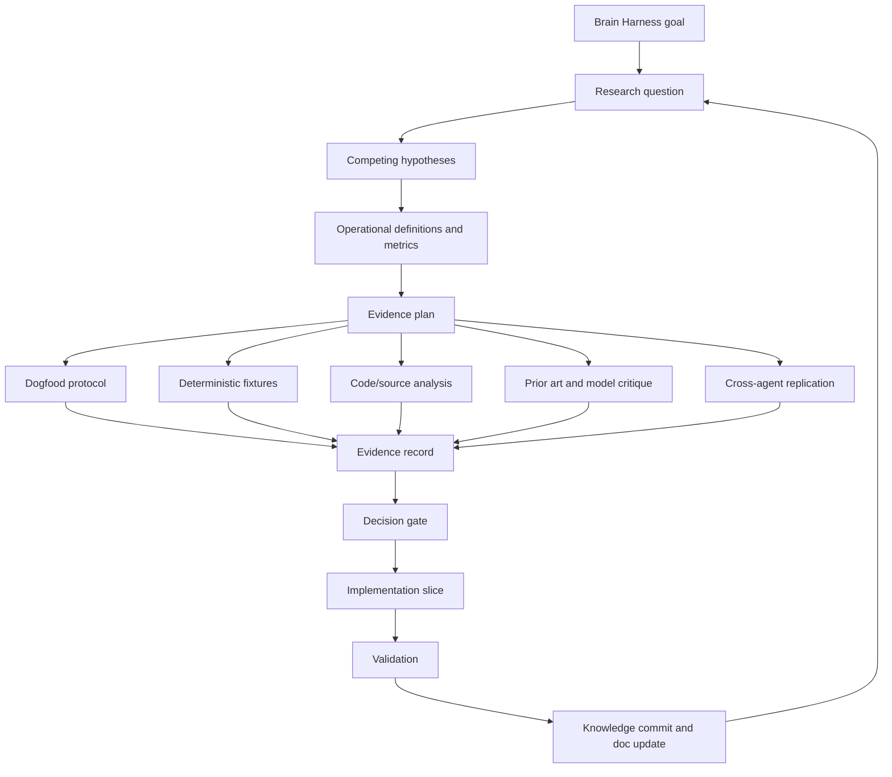

# Brain Harness Research Method

Status: Active research operating model
Date: 2026-05-07
Audience: Engram maintainers, AI-agent harness authors, future contributors
Scope: Define how Engram brain-harness claims become evidence-backed implementation decisions.

---

## 1. Purpose

Engram is being built as a brain harness for AI agents. That is a product claim, an architecture
claim, and a behavioral claim. It should not be advanced only by intuition, local anecdotes, or
model consensus.

This document defines the research operating model for Brain Harness work. It sits above:

- `docs/BRAIN_HARNESS_ARCHITECTURE.md`
- `docs/MEMORY_OS_IMPLEMENTATION_PLAN.md`
- `docs/BRAIN_HARNESS_DOGFOOD_PROTOCOL.md`
- per-run dogfood reports

The dogfood protocol is one experimental instrument inside this method. It is not the whole method.

---

## 2. Core Stance

Brain Harness development should follow these rules:

1. State the research question before changing architecture.
2. Name competing hypotheses, including the null hypothesis.
3. Use prior art, AI Council, Claude, and other model critique to expose options and failure modes,
   not to replace evidence.
4. Define the measurement before running the experiment.
5. Prefer the smallest implementation slice that tests the claim.
6. Preserve failures, confounds, and ambiguous results.
7. Treat simplicity as a first-class result: if two designs perform similarly, prefer the simpler
   design with the lower ongoing cognitive and operational burden.
8. Update Engram memory and docs when the claim, confidence, or gate changes.

The method is compatible with the existing design stance: make deep modules, keep interfaces
simple, and avoid broad machinery until the evidence says the simpler path is insufficient.

---

## 3. Research Stack



The loop is intentionally cyclic. Engram should become more capable by repeatedly tightening the
relationship between claims, evidence, implementation, and memory.

---

## 4. Terms

| Term | Meaning |
|---|---|
| Research question | The precise uncertainty being investigated. |
| Claim | A statement Engram may rely on if evidence supports it. |
| Hypothesis | A possible answer to the research question. |
| Null hypothesis | The possibility that the proposed Brain Harness change does not improve behavior. |
| Construct | The behavioral property being measured, such as continuity, preference adherence, or bad-memory containment. |
| Operational definition | The concrete observable used as a proxy for a construct. |
| Instrument | A method for gathering evidence, such as dogfood, fixtures, telemetry, or code analysis. |
| Arm | A treatment or baseline in a comparison, such as `no_memory` or `memoryitem_orient`. |
| Oracle | The rule or measurement that decides whether a hypothesis improved the target. |
| Decision gate | The explicit threshold required before a product or architecture step proceeds. |
| Claim ledger | The living list of active Brain Harness claims, confidence, evidence, and falsifiers. |

---

## 5. Evidence Levels

Evidence should be named by strength. Higher levels are not always required, but the required level
should match the risk of the decision.

| Level | Evidence Type | Useful For | Not Enough For |
|---|---|---|---|
| L0 | Design intuition or taste | Generating hypotheses | Architecture commitment |
| L1 | AI Council, Claude, Gemini, or agent critique | Finding options, objections, confounds | Proof by consensus |
| L2 | Source/doc analysis | Understanding current behavior and constraints | Behavioral uplift claims |
| L3 | Deterministic unit/integration fixtures | Contract correctness and regression safety | Real agent usefulness |
| L4 | Single-session dogfood or pilot | Instrument calibration and visible failure discovery | Broad product claims |
| L5 | Controlled multi-arm dogfood | Comparative task behavior under realistic use | Cross-agent generality |
| L6 | Cross-agent or cross-project replication | Generality across harnesses and workflows | Long-term user value |
| L7 | Sustained user/field evidence | Usability, adoption, and operational fit | Replacing lower-level debugging evidence |

For high-impact decisions, such as deleting legacy paths, automatic promotion, or changing the
`orient` hot path, Engram should require L5 evidence at minimum and prefer L6.

---

## 6. Standard Research Workflow

Every non-trivial Brain Harness change should follow this sequence.

### 6.1 Define The Question

Examples:

- Does `orient` improve restart continuity without transcript context?
- Does recent current-branch Git context fix fresh-plan retrieval without bloating Brain Loop?
- Should graph traversal enter the hot path, or remain a specialist tool?
- Does review-gated promotion produce more useful active memory than direct legacy retrieval?

### 6.2 Name Competing Hypotheses

At minimum include:

- preferred hypothesis,
- null hypothesis,
- simpler alternative,
- failure hypothesis.

Example:

| Type | Hypothesis |
|---|---|
| Preferred | Recent current-branch commits give resume prompts enough fresh plan context. |
| Null | Recent commits add noise and do not improve task success. |
| Simpler alternative | Better MemoryItem capture would solve the issue without Git context. |
| Failure hypothesis | Git context masks stale MemoryItem ranking instead of fixing it. |

### 6.3 Choose Metrics

Metrics must connect retrieval to behavior. Useful metrics include:

- task success,
- repeated context questions,
- preference adherence,
- bad-memory use,
- wrong-scope memory surfaced or used,
- missing expected context,
- latency-adjusted utility,
- user or independent-agent judgment when the outcome needs judgment.

Retrieval precision is useful, but not sufficient by itself.

### 6.4 Pick The Smallest Instrument

Choose the least expensive instrument that can honestly test the claim:

| Claim Type | First Instrument |
|---|---|
| Code contract | Deterministic test or fixture |
| Retrieval ranking | Fixture plus labeled dogfood |
| Agent behavior | Controlled dogfood |
| Architecture simplification | Controlled dogfood plus read-only inventory |
| Cross-harness behavior | Cross-agent replication |
| User experience | Sustained user feedback |

### 6.5 Pre-Register Expectations

Before running a dogfood scenario or eval, write:

- expected helpful memory,
- harmful memory that must be rejected,
- measurable success outcome,
- expected failure modes,
- whether user judgment is required.

If a controlled artifact row's classification or subclaim depends on git status, staged diff, test
output, command output, or another terminal state, pre-register the exact command and scope. Preserve
the raw output in the committed artifact when it is short enough to review and materially reduces
ambiguity, with interpretation and limitations next to it. Copied terminal output is still
author-captured, not independent or cryptographic proof; if it is not preserved, keep the
terminal-dependent subclaim indirect or downgrade its evidence strength.

### 6.6 Preserve Ambiguity

If the result is contaminated, underpowered, or mixed, record that. Do not convert ambiguity into a
false pass. The next step should often be another instrument, not code.

### 6.7 Gate The Implementation

An implementation step should proceed only when:

- the question is clear,
- the chosen evidence level matches the risk,
- the result identifies one specific next change,
- the change is small enough to validate,
- the rollback path is clear.

### 6.8 Persist The Learning

After a material result:

- update the relevant document,
- commit the doc or code change,
- submit telemetry feedback if a trace exists,
- store durable memory for non-obvious decisions, constraints, or failures.

---

## 7. Dogfood Protocol Relationship

The narrow dogfood protocol is the live behavioral instrument for Brain Loop v1. It answers:

- does memory improve the agent's next decision,
- does it reduce amnesia,
- does it preserve preferences,
- does it avoid stale or wrong-scope guidance,
- does feedback produce analyzable evidence.

It does not answer, by itself:

- whether the whole architecture is correct,
- whether MemoryItem should be the only durable storage shape,
- whether legacy paths can be deleted,
- whether graph or obligation logic belongs in the hot path,
- whether the result generalizes across agents, projects, or users.

Current interpretation:

- `docs/BRAIN_HARNESS_DOGFOOD_PROTOCOL.md` is a Phase 0/Phase 1 instrument.
- `docs/BRAIN_HARNESS_DOGFOOD_RUN_2026-05-07.md` is pilot evidence.
- The 2026-05-07 pilot validated telemetry and exposed failures, but its `no_memory` arms were
  contaminated by current transcript context.
- The pilot can justify ranking/capture work and cleaner eval design. It cannot justify M6 write
  apply, deletion, automatic promotion, or broad legacy deprecation.

---

## 8. Claim Ledger

This ledger is intentionally small. It should be updated when evidence changes.

### BH-C1: MemoryItem As Canonical Agent-Facing Unit

Claim: `MemoryItem` should become the canonical agent-facing cognitive and retrieval unit.

Current evidence: architecture RFC, AI Council insight, deterministic retrieval tests, pilot
safety behavior, the first matched same-harness dogfood batch from 2026-05-08, and BAF002.

Confidence: medium.

Current update: BAF002 was cleanly isolated and both arms passed, but it showed no material
`memoryitem_orient` advantage on a narrow doc-only task. The MemoryItem-canonicality bet remains
plausible but unproven beyond durable preference recall.

Next gate: matched dogfood beyond one-turn recall shows `memoryitem_orient` beats `no_memory` and
specialist legacy retrieval on a harder code-bearing bounded follow-through task, preference
adherence, bad-memory containment, and migration-preservation checks.

### BH-C2: Orient As The Single Hot-Path Entrypoint

Claim: `orient` should remain the single frictionless hot-path entrypoint, while graph, lint,
migration, raw observations, and obligation detection stay specialist paths.

Current evidence: orient contract, MCP tests, pilot evidence that noise is visible, Council
insight to defer ontology expansion, and the 2026-05-08 matched batch where resume continuity,
decision continuity, stale-scope rejection, and durable preference recall passed without adding
graph, lint, raw observations, or obligation detection to the hot path.

Confidence: medium-high.

Falsifier: repeated controlled failures show the missing signal requires one of those specialist
paths in the hot path and cannot be solved by capture/ranking.

### BH-C3: Durable Guidance Requires Trust Metadata

Claim: durable guidance needs provenance, evidence, trust state, and review gating.

Current evidence: architecture RFC, promotion tests, migration-gate pilot, and Council insight.

Confidence: high.

Falsifier: an evidence-light path repeatedly improves behavior without stale/wrong-scope harm and
with lower review burden.

### BH-C4: Recent Git Context For Fresh Plan Retrieval

Claim: recent current-branch Git context can improve fresh-plan retrieval without widening Brain
Loop.

Current evidence: implemented orient contract and live smoke after the recent-git-context commit.

Confidence: low-medium.

Current update: the matched 2026-05-08 treatment rerun passed, but the same-harness no-memory
control also passed. This supports recent Git/current-plan context as sufficient for that narrow
resume task, not as a broad MemoryItem-dominance claim.

BAF002 update: both isolated arms passed the doc-only follow-through slice, with no material
`memoryitem_orient` advantage. This weakens the doc-only task class as a discriminating instrument
and points the next gate toward a harder code-bearing slice.

Next gate: a harder autonomous follow-through scenario where the agent must preserve the current
plan, user preference, verification habit, and no-M6/no-deletion gates through an actual bounded
code-bearing work slice.

### BH-C5: Dogfood Is An Instrument, Not The Method

Claim: the dogfood protocol is an experimental instrument, not the research method itself.

Current evidence: pilot contamination and explicit method analysis.

Confidence: high.

Update condition: revise only if the research operating model is replaced.

### BH-C6: Reviewed Preferences Improve Durable Preference Recall

Claim: reviewed project/user preferences captured as `MemoryItem` records improve durable
preference recall for agents working in this repository.

Current evidence: in the matched 2026-05-08 same-harness batch, `memoryitem_orient` passed
`follow_user_preference_001` while the no-memory control failed the target durable preference check.
The treatment recovered both target constraints: commit every meaningful Engram step, and keep
unrelated/untracked user-owned files such as root `AGENTS.md` out of commits unless explicitly
requested.

Confidence: medium-high for this repository and this preference class; low for cross-project,
cross-user, or long-horizon generality.

Limits: the batch used Codex fresh-thread transcript judgments for no-memory controls and treatment
telemetry for orient arms. It does not prove that all preferences should be accepted without
review, that stale preferences will be challenged correctly, or that MemoryItems should dominate
legacy retrieval for non-preference tasks.

Current update: BAF002 showed both arms could preserve commit hygiene and scope constraints in a
narrow doc-only work slice, so it did not repeat the earlier preference advantage as a meaningful
arm difference.

2026-05-12 update: the deterministic
`discriminative_continuity_benchmark_separates_memoryitems_from_static_instructions` fixture now
models both resume-current-plan continuity and durable preference recall against `no_memory` and
`static_instructions` baselines, while checking trace-level feedback/outcome coverage. This validates
the benchmark instrument shape; it does not replace live dogfood evidence.

2026-05-12 live update: `live_discriminative_continuity_001` produced a useful but non-dispositive
result. `memoryitem_orient` passed and `static_instructions` failed cleanly, but `no_memory` also
passed by reading allowed repository context in `engram-tests/tests/brain_harness_eval_tests.rs`.
That file contained the same target facts the live benchmark intended to hide.

2026-05-12 sealed-target update: `live_blind_continuity_002` repaired the target-visibility leak
for a narrow live run. `no_memory` and `static_instructions` both marked the current plan
underdetermined, while `memoryitem_orient` recovered the sealed current plan, evidence gate, blocked
actions, and provenance-scoring preference from Engram. Manual transcript inspection is sufficient
to close this behavioral checkpoint. The remaining attribution gap is instrumentation backlog:
telemetry underreported the current-plan MemoryItem that made the answer possible.

Current gate: move to the next product-facing Brain Harness slice while keeping attribution repair
as measurement backlog. Do not make ranking, hot-path, migration, deletion, or legacy-simplification
claims from one sealed live run.

2026-05-27 telemetry update: attribution repair closed a narrow metric-validity bug. A live
`real_session_eval(project=engram, limit=50)` report returned impossible
`memory_judgment_trace_coverage=1.78` because memory judgments on search traces were counted while
search memory results were only recorded as generic result IDs. The fix keeps old data valid by
using a distinct eligible-trace denominator and records memory-layer search results in
`returned_memory_ids` going forward. Installed binary
`5b989d898ff033505c584c27d483ea9b3b433e679cc5bbf16befb59c48d1325c` returned
`memory_judgment_trace_coverage=0.94`, and fresh search trace
`019e6911-2f5b-7e02-a6d4-1c8b3b24b17e` recorded memory IDs in both returned ID fields.

2026-05-27 live feedback update: the pre-registered
`live_feedback_coverage_2026_05_27` batch submitted feedback for all ten read-only `orient` and
`search` traces. The project-level report moved from `17/44` feedback-bearing traces
(`0.3863636255264282`) to `23/44` (`0.5227272510528564`), so the numerical confidence gate passed
at that checkpoint. A later T18 pre-feedback re-audit showed the current 50-trace sample could fail
when feedback spanned only two intents; after scoring T18 retrieval traces, the report passed
numerically again. T19 corrected the report builder so feedback is selected from sampled trace IDs
instead of an independent newest-feedback window. This is evidence-quality work only: it is
agent-assessed feedback, not a human-judged product-quality result or M6 approval. The batch found
one design-preference retrieval failure, two partial feedback/context gaps, stale old current-plan
surfacing, and old migration/export approval records that must not be treated as current M6
authorization.

2026-05-27 installed-runtime telemetry update: T21 installed binary
`0192d24d945b7acb8bdfabe129c56d61a5abf0f7ce8223c854139677a93738ab`, restarted the daemon on
port `8765` with PID `11922`, and ran a controlled live MCP smoke for scenario
`t21_installed_runtime_eval_20260527_0192d24d`. The smoke made the newest global traces
out-of-scope and submitted newer feedback to older in-scope traces. The scoped
`real_session_eval(..., limit=2)` report returned `trace_count=2`, `feedback_count=1`,
`feedback_trace_count=1`, `feedback_coverage=0.5`, `task_success_count=1`, and
`task_failure_count=0`, with project/scenario/arm filters applied. This validates the installed
T19/T20 measurement behavior for one controlled live case; it is not product-quality proof, M6
authorization, or evidence for ranking, hot-path, lifecycle, hook, adapter, schema, or migration
changes.

2026-05-27 cross-harness telemetry update: Claude Bridge still could not expose Engram MCP tools in
the project harness, so that path remains a bridge tool-exposure limitation. Native Claude Code
`2.1.152` with `mcp__engram__telemetry` allowed reproduced the T21 report through its own MCP
connection: `trace_count=2`, `feedback_count=1`, `feedback_trace_count=1`,
`feedback_coverage=0.5`, `task_success_count=1`, and `task_failure_count=0`, with newest in-scope
trace IDs `019e69e4-6244-7123-a34e-d19e8c44341a` and
`019e69e4-5582-79a1-8dc4-09411d58aca5`. Claude's final explanation incorrectly inferred an
operation-level filter; the source and controlled trace ordering show the report is simply the
newest two scoped traces under `limit=2`. Treat this as cross-harness report-surface validation plus
a model-interpretation caveat, not model proof or authorization for broader changes.

---

## 9. Decision Gates

### 9.1 Before Changing The `orient` Hot Path

Required:

- clear failure class from telemetry or fixture evidence,
- proof that the missing signal is not already available through simpler ranking/capture,
- latency impact estimate,
- MCP boundary test,
- dogfood rerun or targeted fixture showing improvement.

### 9.2 Before Entering Read-Only M6 Inventory

Required:

- at least one controlled dogfood batch or a documented reason to gather inventory as evidence,
- no unresolved bad-memory-use finding in current high-stakes scenarios,
- explicit user approval for the inventory scope.

### 9.3 Before M6 Write Apply, Deletion, Or Broad Legacy Simplification

Required:

- controlled multi-arm evidence, not only a pilot,
- reviewed migration candidates,
- dry-run apply report,
- rollback plan,
- explicit user approval.

### 9.4 Before Treating AI Council Or Claude Consensus As Direction

Required:

- record what each model argued,
- record disagreement or uncertainty,
- convert consensus into hypotheses,
- test the highest-risk assumption with code, docs, dogfood, or telemetry.

Consensus is useful for breadth. It is not a substitute for evidence.

---

## 10. Research Backlog

Near-term research questions:

1. Can `memoryitem_orient` improve bounded autonomous follow-through over no-memory when the agent
   must choose a scoped next step, verify it, commit it, and capture the next plan?
2. Does durable preference recall survive inside a real work slice, not only a direct preference
   question?
3. Which outcomes still require human judgment rather than agent self-report?
4. What is the minimum evidence to start read-only M6 inventory without increasing migration risk?
5. Does legacy search add useful evidence for migration-preservation scenarios, or does it add
   noise compared with reviewed MemoryItems?

Medium-term research questions:

1. Does `MemoryItem` orientation outperform legacy search across multiple projects?
2. Can agent feedback predict later human judgments of usefulness?
3. When should a future agent challenge a stale user preference?
4. What evidence mix best predicts bad-memory containment?
5. Which harnesses can collect lifecycle signals without increasing user friction?

---

## 11. Next Application

The next Brain Harness step should apply this method to the current active question:

```text
Does Brain Loop v1 improve bounded autonomous follow-through enough to justify keeping `orient`
as the single frictionless entrypoint while leaving graph, lint, migration, raw observations, and
obligation detection outside the normal hot path?
```

BAF002 result:

- `bounded_autonomous_followthrough_002` used isolated clean worktrees and a pre-selected
  doc-only `docs/ORIENT_CONTRACT.md` slice.
- Both arms passed, and no material `memoryitem_orient` advantage was observed.
- The task was clean but weakly discriminating because the required content was mostly specified in
  the prompt.

BAF003 result:

- `bounded_autonomous_followthrough_003` used isolated clean worktrees and a pre-selected
  code-bearing scoped telemetry-filtering slice.
- Both arms passed, and no material `memoryitem_orient` advantage was observed.
- The leaner implementation was adopted because it avoided unnecessary public API surface.
- The task was stronger than BAF002, but still mostly specified the exact target behavior in the
  prompt.

Recommended next instrument:

1. Use the new telemetry filters to score future controlled scenarios without unrelated trace
   noise.
2. Pre-register the next code-bearing scenario so the task requires preserving a non-obvious
   current plan or user preference that is not fully repeated in the prompt.
3. Use isolated clean worktrees from the same base commit, and keep the using agents from updating
   the dogfood report as their task output.
4. Require the agent to complete the specified Engram work slice, run the relevant verification,
   commit the meaningful step, and capture the next plan only if a new durable plan is created.
5. Score task success, preference adherence, repeated context questions, bad-memory use, cross-arm
   contamination, and whether the agent avoided M6, deletion, broad ranking churn, and hot-path
   expansion without explicit approval.
6. Only then choose between more dogfood, read-only M6 inventory, or a narrowly justified
   implementation change.

Current next application:

- `bounded_autonomous_followthrough_004` landed scoped `real_session_eval.applied_filters` and
  exposed a feedback-attribution gap, but it did not show a material `memoryitem_orient` advantage.
- `bounded_autonomous_followthrough_005` was confounded by current-plan supersession and should not
  be used as evidence for ranking or hot-path expansion.
- The Claude Code Hot Context ID rerun closed one narrow preference-attribution gap by making stable
  MemoryItem IDs available to feedback, but it does not prove broad cross-harness benefit.
- `bounded_autonomous_followthrough_006` is scoreable and both arms passed. The treatment patch was
  integrated because it gives stronger scoped regression coverage, but H1 is not supported because
  the no-memory arm also completed the work. The result should be used to improve measurement
  quality, not to justify ranking, hot-path, migration, deletion, or broad legacy-simplification
  changes.
- `bounded_autonomous_followthrough_007` and `bounded_autonomous_followthrough_008` provide narrow
  sealed MemoryItem recovery evidence. BAF008 is the strongest cross-harness point so far because
  the real Claude Code treatment passed and sanitized no-memory/static controls failed cleanly, but
  the result is still one code-bearing task, not broad cross-harness proof.
- Document lifecycle follow-through has passed for Codex and the generated Codex adapter; do not
  keep selecting that as the next product step unless a new harness or failure mode is being tested.
- Direct unified `search` continuation prompts now have a narrow current-plan fixture after the
  live daemon reproduced the old noisy ranking; after installing binary hash
  `f5cb5816927b4e4a5b9cb92df560de47e201c2bccdcbfa05eeb25c9d35bcfb35`, native MCP trace
  `019e68a5-ef05-7db0-8249-3722fcf78aea` returned the active current-plan memory first. This is
  validation for the prompt class only, not evidence for broad ranking churn or migration.
- Claude Bridge could not validate the same direct-search smoke: the first attempt hit Claude API
  overload, and the retry had no Engram MCP search tool available. Native Claude Code CLI later
  completed the direct-search smoke through the live MCP server; trace
  `019e68ac-678e-7683-a241-08119fc6b03c` returned current-plan memory
  `019e689c-b188-70e2-acfc-2d00f956bd24` first. Treat this as cross-harness parity for this
  prompt class only, not proof of broad ranking quality.
- A 2026-05-27 follow-up repeated the native Claude Code CLI smoke after installing binary hash
  `4f3bda71eb441d492ece4b1bb5983993be9cf47802fd10cdb3484f31f7e23f9c`.
  Lean `orient` trace `019e68fe-6150-7ab3-9df7-8339e3766c76` was compact enough to inspect inline
  and surfaced current-plan memory `019e68f9-31b1-7270-9095-4f0be5ffa94b` second, while direct
  `search` trace `019e68fe-6417-7590-8331-85ddf3dd4a86` returned that memory first. Claude Bridge
  still did not validate the smoke because the bridged project harness exposed only file-read tools,
  not Engram MCP tools; do not conflate that bridge limitation with native Claude Code MCP parity.
- A targeted follow-up fixed direct unified `search` query classification for `non-gated`
  continuation wording. Trace `019e68d4-05b7-79d3-8077-df6e2999482d` returned the active
  current-plan memory first for the non-gated next-slice prompt after installing binary hash
  `8859cacc921a243d5cd8dd3351f5f196c46d8074ecdc9933fa66e0ec490b1c7b`; migration-apply gate
  trace `019e68d4-27b7-70e2-bdfe-5c879a97f0c8` still kept migration/gate context above
  current-plan context. Treat this as narrow continuation-prompt calibration only.
- A follow-up evidence-quality slice aligned current-plan lifecycle semantics with the already
  stricter direct-search guidance predicate: `capture_current_plan` and `orient` current-plan
  post-prioritization now treat only active `decision` or `rule` MemoryItems with the
  `current-plan` tag as managed current-plan guidance. The slice fixes accidental supersession of
  non-guidance facts or limitations, but does not add lint, migration, cleanup, or ranking-weight
  changes.
- The pre-registered `live_feedback_coverage_2026_05_27` batch closed the numerical
  project-feedback coverage gate and recorded one failure: user design philosophy was not reliably
  surfaced for a direct Ousterhout/no-unrequested-features query. Treat this as a focused
  retrieval/promotion coverage gap to investigate later, not as evidence for broad ranking churn.
- The T04 follow-up showed that gap was a representation/capture issue: direct search already
  retrieves the design philosophy when it exists as an active reviewed preference `MemoryItem`.
  MemoryItem `019e6924-256b-7093-b1c5-286ec4d02461` repaired the live data state, and fixture
  coverage locks the active-preference behavior without changing ranking.
- The T06 follow-up showed the same representation/capture pattern for the lean-`orient` contract:
  direct search retrieves the response-shape and hot-path rule when it exists as an active reviewed
  `MemoryItem`. MemoryItem `019e6931-bd2d-7281-b9f6-952eaa2a20e4` repaired the live data state,
  and fixture coverage locks the active-rule behavior without changing ranking or expanding
  `orient`.
- The T07 follow-up showed the same representation/capture pattern for telemetry feedback
  expectations: direct search retrieves the feedback contract and weak-signal caveat when they exist
  as an active reviewed rule `MemoryItem`. MemoryItem
  `019e692b-635e-7d80-9f2f-8796abc95234` repaired the live data state, and fixture coverage locks
  the active-rule behavior without changing ranking.
- The T09 follow-up turns repeated stale-current-plan feedback into a more specific read-only lint
  signal: `feedback_stale_current_plan` names active `current-plan` guidance that recent feedback
  marked stale, but keeps `safe_action=none` because feedback is not proof and must not authorize
  automatic archival, deletion, or migration.
- The T10 follow-up deliberately does not add a migration-authorization classifier. Old
  migration/export approval-shaped records that recent feedback marks stale stay on the generic
  `feedback_stale_active_memory` lint path with `safe_action=none`; this is a review signal, not
  M6 authorization, invalidation, archival, deletion, or ranking behavior.
- The T11 startup feedback stabilization confirms the feedback loop is sample-window sensitive:
  scoring startup/search traces restored the current project gate to exactly `0.5` feedback coverage
  with no bad memory used. Exact T07 `review_memory` retrieval now passes, but implementation-plan
  searches can still surface stale migration-completion memory
  `019dd3fe-ec94-7122-af04-1f35b839387f`, which is visible through generic
  `feedback_stale_active_memory` lint with `safe_action=none`.
- The T12 gate-context ranking calibration fixed a narrow query-classification false positive: bare
  `gate` in a current-plan/next-step prompt is treated as milestone context, while
  `should`/`proceed`/`apply` and other action or permission terms still keep gate guidance above the
  current plan. This is deterministic fixture evidence for one prompt class, not broad ranking proof.
- The T13 installed-runtime smoke refreshed the user-level Engram binary to
  `62272400960eaaeb2fd7aa44aa13bf6f93abdbc81b5d11bc9106b0bcc82df29b` and restarted the daemon on
  port `8765`, PID `79904`. Native MCP trace `019e6969-a674-7631-8ffa-b532b8638262` confirmed the
  exact T12 current-plan/M6-gate context query now returns current-plan memory first in live data.
  The same smoke exposed a separate live gap: explicit migration-apply prompts in traces
  `019e696a-0698-7e20-940a-b0ad23a29994` and
  `019e696a-2540-7172-a473-33f13538d54d` still ranked calibration or current-plan memory above M6
  gate context. Do not treat that as authorization to run M6; treat it as a narrow ranking/capture
  follow-up.
- The T14 explicit migration-apply calibration fixed that narrow follow-up without broad ranking
  churn: after installing binary
  `fea91cc46549c138a425389394af9c4cdd9d8727eb39137f8afc179a976968eb` and restarting the daemon on
  port `8765`, PID `9969`, native MCP traces `019e698d-b766-7e71-a4da-a8c593f1b191` and
  `019e698d-b791-7d93-a0d6-542219e3eb6c` ranked the paused migration review gate first for
  explicit migration-apply prompts. Regression trace `019e698d-b7ae-7a13-b2c5-d58a9898deab`
  preserved current-plan-first behavior for the T12 current-plan/M6-gate context prompt.
- Claude Code `2.1.152` replicated the same boundary through its own Engram MCP connection:
  explicit migration-apply traces `019e6993-d4da-70a1-b5eb-9185eeb23339` and
  `019e6993-d891-7ff3-93ef-4bd8ad14d9c7` returned the paused gate first, and contextual
  current-plan/M6 trace `019e6994-8ec9-7343-9198-9298867b9ceb` returned current-plan memory first.
- A follow-up evidence-quality slice fixed explicit scope filtering for `memory(action=list)`.
  Before the fix, a project-scoped current-plan list for Engram returned older repository-scoped
  Engram guidance and a wrong-project `voice-layer` current plan. After installing binary
  `0d4581c1cffdd17af0d4d8f0911812a05a2c3ce3f9ff8766d455e043ed73a211` and restarting the daemon on
  port `8765`, PID `36805`, the same request returned only Engram project current-plan memory
  `019e6997-96d0-76a0-ac67-c7655df0958f`. Treat this as scoped sampling hygiene, not a ranking,
  `orient`, migration, schema, hook, adapter, or lifecycle-cleanup change. Native Claude Code
  `2.1.152` then reproduced the scoped list result through its own Engram MCP connection after the
  T16 current-plan capture, returning only `019e69af-011f-7450-9f8c-1ff067f0f183` for
  `project / engram`.
- A read-only harness readiness re-audit corrected stale cross-harness status documentation:
  explicit `harness(action=doctor)` calls for `claude_code`, `codex`, `gemini_cli`, and `cursor`
  all returned `ready=false`. Claude Code has required generated adapter files installed, but
  required `SessionStart` and `SessionEnd` settings registrations are missing; Codex, Gemini CLI,
  and Cursor still have required generated adapter drift. Treat this as configuration drift
  evidence, not approval to write adapters or hooks.
- A post-T17 read-only evidence audit corrected the telemetry confidence claim: before scoring T18
  retrieval traces, `real_session_eval(project=engram, limit=50)` reported
  `confidence_gate.passed=false` because the sample had feedback across only two intents. After
  scoring T18 retrieval traces, the current report passes numerically again. The result is still
  sample-window-sensitive agent feedback and does not authorize migration or lifecycle writes.
  `lint(action=apply_safe, write=false)` found no safe actions. The stale repository-scoped
  current-plan memory `019e5e0a-86b4-73e3-aa9b-ca350e83e915` has repeated stale-feedback hits, but
  archival or scope correction remains a lifecycle write that requires explicit approval.
- T19 corrected one concrete source of that sensitivity: real-session eval now anchors feedback to
  sampled trace IDs, so newer feedback on older traces cannot inflate coverage for a smaller recent
  trace sample. This did not change confidence formulas, public request parameters, ranking,
  `orient`, M6 migration, lifecycle state, hooks, adapters, or schema/storage/index behavior.
- T20 corrected scoped real-session eval sampling: project, scenario, and arm filters are applied
  before the trace limit, then feedback is fetched for that scoped trace sample. This prevents newer
  out-of-scope traces from starving scoped confidence reports. It did not change public request
  parameters, output fields, confidence formulas, ranking, `orient`, M6 migration, lifecycle state,
  document-index behavior, hooks, adapters, schema/storage, or `list_feedback_scoped` behavior.
- T21 validated T19/T20 in the installed daemon: binary
  `0192d24d945b7acb8bdfabe129c56d61a5abf0f7ce8223c854139677a93738ab` on daemon PID `11922`
  returned the expected controlled scoped report for
  `t21_installed_runtime_eval_20260527_0192d24d`. Treat this as installed-runtime measurement
  evidence only, not authorization for M6, lifecycle cleanup, ranking changes, hooks, adapters,
  schema/storage changes, public MCP changes, or `orient` payload expansion.
- T22 adds native Claude Code replication for the same read-only telemetry surface. The report
  fields matched Codex; the bridge path still lacks Engram MCP tools, and Claude's explanatory
  operation-filter claim was rejected after source/result review. Treat the agreement on fields as
  useful cross-harness evidence, not proof by model interpretation.
- T23 through T25 re-audited the completion matrix and the rolling feedback window. Current-plan
  retrieval stayed validated for the observed continuation prompts, but broad startup searches still
  surfaced stale repository-scoped current-plan guidance and historical migration memories below
  current evidence. Treat the confidence gate as a rolling operational signal, not durable approval.
- T26 and T27 narrowed obligation false positives from safety-gate wording and untracked root
  instruction files, then validated the behavior in the installed daemon. Treat this as obligation
  signal-quality evidence only, not a reason to change ranking, lifecycle state, migration, hooks,
  adapters, schema/storage, public MCP request shape, telemetry formulas, or `orient`.
- T28 replicated the obligation request shape through Claude Code. The parity is useful, but the
  smoke also showed synthetic prompts can create startup obligations, so future harness smokes must
  run `obligations(action=doctor)` and resolve or skip synthetic artifacts.
- T29 confirmed the remaining completion gate shape: current-plan retrieval and obligations were
  clean for the observed surface, while cross-harness readiness remained false and the latest
  telemetry sample had no external session labels. M6 migration and harness adapter/hook repair stay
  explicit approval gates.
- T30/T31 synchronized the architecture and research-method docs with the T29 gate evidence, then
  reconfirmed the same live-state shape. This was documentation and status calibration only: stale
  historical guidance stayed review noise, the rolling feedback window stayed sample-sensitive, all
  supported harnesses remained not ready, and no M6 or harness-write gate changed.
- T32 changed only lint report ordering before truncation so stale current-plan and wrong-scope
  feedback signals are visible under small limits. The evidence level is a deterministic fixture
  plus installed-runtime smoke; it improves review visibility but has `safe_action=none` and does
  not authorize lifecycle cleanup.
- T33 replicated the T32 lint ordering through Claude Code's Engram MCP path. Treat it as
  cross-harness evidence for one read-only `lint` report shape, with the caveat that synthetic
  validation prompts can create obligations that must be closed.
- T34 startup evidence keeps the current-plan continuation surface usable, but after scoring the
  T34 startup traces the live `real_session_eval(project=engram, limit=50)` confidence gate still
  fails because feedback spans only two intents despite `feedback_coverage=0.9399999976158142` and
  `bad_memory_used_count=0`. This strengthens the rule that migration confidence needs explicit
  evidence and user approval, not a favorable or unfavorable single rolling sample alone.
- T35 pre-registered fixed read-only checks before running them to avoid intent-shopping. The M6
  `verify_decision` check passed, the `review_memory` stale-plan check was noisy but usable, and
  the lean `prepare_handoff` `orient` check failed because explicit M6/harness-write gates were
  absent and stale repository-scoped current-plan guidance appeared without a caveat. The rolling
  confidence gate passed numerically afterward (`feedback_trace_count=48`,
  `feedback_coverage=0.9599999785423279`, `bad_memory_used_count=0`, `task_failure_count=1`
  after startup feedback scoring), but the fixed-case failure is stronger evidence than the
  aggregate pass.
- T38 repaired the `prepare_handoff` failure as a narrow hot-path slice after explicit approval:
  strict handoff current-plan presentation keeps one latest applicable current plan across matching
  scopes and pins it in Brain Loop while preserving existing gate selection, lean shape, and
  lifecycle state.
- T39 installed-runtime validation showed that source fixtures were not enough: the installed T38
  binary removed stale current-plan guidance, but live handoff prompts still omitted gate context
  until `approval gate` was treated as exact gate vocabulary and the M6/harness-write gate rules
  were captured as active MemoryItems. Codex trace `019e7ce5-4d19-7060-aa12-ab0f6d9b5695` and
  native Claude Code trace `019e7ce5-b4e4-7830-94a4-48f87ebf56b2` now agree on the handoff IDs.
  This remains prompt-class validation and capture repair, not approval for migration, lifecycle
  cleanup, payload expansion, or harness writes.
- T43 repaired the live mixed current-plan/M6 direct-search prompt class after a failed baseline:
  installed Codex trace `019e7d1c-b20a-7c52-b8af-e6d82439988c` returned current-plan memory first
  and active M6 gate memory second for the exact mixed query, while explicit M6 and pure
  continuation controls preserved their boundaries. Treat this as search-only prompt-class
  evidence, not broad ranking proof or `orient` expansion.
- T44 replicated the T43 direct-search prompt class in Claude Code. Trace
  `019e7d21-cec2-7c60-b570-40bb6b79574e` matched the Codex mixed-query order, trace
  `019e7d21-d4c6-7eb0-80a7-244042f513b0` kept explicit M6 gate context above current-plan
  guidance, and trace `019e7d21-da4e-7e72-9e40-35153ba73628` kept the active M6 gate out of the
  pure continuation top eight. Treat this as cross-harness evidence for the exact prompt class only.
- T45 prepared a pending approval packet for one bounded inventory-only M6 scoping run. It did not
  run inventory, review export, apply, deletion, lifecycle mutation, schema/storage/index changes,
  public MCP changes, ranking or `orient` changes, or harness/hook changes. Missing, conditional,
  or ambiguous user approval remains default-deny.
- T46 refreshed harness readiness evidence using only read-only doctor/status checks. Generic,
  Claude Code, Codex, Gemini CLI, and Cursor all returned `ready=false`; generic policy is missing,
  Claude Code lacks required `SessionStart` and `SessionEnd` settings registrations, and
  Codex/Gemini/Cursor generated adapters remain drifted. Treat this as current configuration
  evidence, not approval for adapter installation, settings edits, hook registration, migration, or
  lifecycle mutation.
- T47 prepared a pending harness repair approval packet from read-only dry-runs, source inspection,
  AI Council critique, and Claude Bridge critique. Treat it as a default-deny approval request only,
  not as authorization to write adapters, edit settings, adopt user-owned files, rewrite hooks, run
  M6, mutate lifecycle state, change schema/storage/index state, change public MCP behavior, change
  ranking, or expand `orient`.
- T48 prepared a pending stale current-plan lifecycle approval packet from read-only `orient`,
  `search`, scoped current-plan list, `memory(action="get")`, source inspection, AI Council
  critique, and Claude Bridge critique. Treat it as a default-deny approval request only, not as
  authorization to archive the target memory, mutate any other memory, run M6, write harness
  adapters/settings/hooks, change schema/storage/index state, change public MCP behavior, change
  ranking, or expand `orient`.
- T49 audited pending-approval retrieval as a read-only slice. Explicit approval-gate direct
  `search` prompts recovered the active M6, harness-write, and T48 lifecycle gates prominently,
  while lean `orient` exposed the queue indirectly through the latest current-plan memory rather
  than surfacing M6 and harness-write gate memories individually. Treat this as a partial result,
  not as approval for M6, lifecycle writes, harness writes, ranking changes, or `orient` expansion.
- T50 replicated the post-T49 pending-approval continuation shape in Claude Code using only
  read-only Engram `orient`, `search`, and `obligations` tools. Claude Code surfaced the T49
  current plan, harness-write gate, and M6 gate in lean `orient`, and direct `search` returned M6
  then harness-write for the explicit approval-gates query. Treat this as narrow cross-harness
  evidence only, not as approval for M6, lifecycle writes, harness writes, ranking changes, or
  `orient` expansion.
- T51 documented that the T48 stale current-plan archive packet drifted after T49/T50
  current-plan supersession. Fresh read-only get/list/lint/orient evidence showed T50 is now the
  active project current plan, the stale repository-scoped target remains active, and lint reports
  139 stale-feedback records with `safe_action=none`. Treat T48 as no longer executable as written
  and T51 as a drift report only, not as approval for archival, scope correction, M6, harness
  writes, ranking changes, or `orient` expansion.
- T52 refreshed the stale current-plan evidence and recorded a resolution request instead of an
  archive-only approval packet. Fresh read-only evidence showed T51 is now the active project
  current plan, the stale target remains the only active repository-scoped current-plan item, and
  lint reports 142 stale-feedback records with `safe_action=none`. AI Council and Claude Bridge
  critique treated the archive-versus-replacement scope gap as material. Treat T52 as a user
  decision request only, not approval to archive, create replacement memory, scope-correct, run M6,
  write harness adapters/settings/hooks, change schema/storage/index state, change public MCP
  behavior, change ranking, or expand `orient`.
- T53 validated the post-T52 continuation shape in Claude Code using only read-only Engram
  `orient`, `search`, and `obligations` tools. Claude Code surfaced T52 current-plan memory first
  in both lean `orient` and direct `search`; the stale repository-scoped target remained visible as
  pending-decision evidence only. Treat this as narrow cross-harness evidence, not approval for
  lifecycle writes, replacement memory, M6, harness writes, ranking changes, or `orient` expansion.
- T54 audited the post-T53 rolling telemetry window using the existing
  `real_session_eval(project=engram, limit=50)` report. The numerical gate still passed with
  `bad_memory_used_count=0`, but coverage was `31/50`, one task failure remained, stale-memory
  feedback was active, and external-session labeling was partial. Treat this as evidence-quality
  calibration only, not product completion or approval for migration, lifecycle writes, harness
  writes, ranking changes, schema/storage/index changes, public MCP changes, or `orient`
  expansion.
- T55 validated the post-T54 continuation shape in Claude Code using only read-only Engram
  `orient`, `search`, and `obligations` tools. The Claude Bridge project harness did not expose
  Engram MCP tools and was unmeasured; the personal-harness rerun surfaced T54 first in lean
  `orient` and direct `search`. Treat this as narrow cross-harness evidence only, not approval for
  migration, lifecycle writes, harness writes, ranking changes, schema/storage/index changes,
  public MCP changes, or `orient` expansion.
- T56 audited the post-T55 feedback window using the existing
  `real_session_eval(project=engram, limit=50)` report. Feedback coverage and external-session
  joinability improved, but one task failure remained and stale-memory judgments increased. Treat
  this as evidence-quality calibration only, not product completion or approval for migration,
  lifecycle writes, harness writes, ranking changes, schema/storage/index changes, public MCP
  changes, or `orient` expansion.
- T57 validated the post-T56 continuation shape in Claude Code and documented a broader-search
  visibility caveat. T56 surfaced first in Claude lean `orient` and exact continuation `search`;
  the broader implementation-plan query kept T56 visible at rank 2 behind historical non-gated
  calibration in both Codex and Claude Code. Treat this as targeted validation only, not approval
  for broad ranking changes, migration, lifecycle writes, harness writes, schema/storage/index
  changes, public MCP changes, or `orient` expansion.
- T58 ran the explicitly approved inventory-only M6 scope and produced bounded evidence: 115
  sources scanned, 11 candidates returned, no truncation, and no writes. Treat this as inventory
  evidence only, not review-export, apply, deletion, lifecycle, schema/storage/index, public MCP,
  ranking, `orient`, or harness approval.
- T59 prepares a pending review-export approval packet using the T58 `exclude_reviewed_path`, a
  fixed review path, path-existence preflight, and count-drift stop conditions. It does not run
  review export or authorize candidate decisions. M6 write apply, deletion, and broad legacy
  simplification remain separately gated even if review export is later approved.
- T60 validated the T59/default-deny retrieval boundary across Codex and Claude Code with caveats.
  Both harnesses surfaced T59 and neither claimed `migration_review_export` was approved, but
  continuation `search` still ranked older research/calibration records above T59. The intended
  no-write condition failed because Claude Bridge `write=false` still triggered existing Claude
  Code session-end rolling handoff MemoryItem writes. Treat future Claude Bridge no-write claims as
  unproven unless handoff behavior is controlled or explicitly accepted.
- T61 repaired the observed continuation false-positive without broad ranking churn: `what should
  happen next` no longer triggers approval-gate mode, while explicit modal action prompts such as
  `should we run migration_review_export` still preserve gate-first behavior. Treat this as one
  prompt-class direct-search repair, not migration approval or broad ranking evidence. The Claude
  Bridge critique retry repeated the T60 handoff-write caveat, so no-write parity remains unproven.
- T62 installed the T61 commit into the live runtime and validated the same prompt class in Codex
  and Claude Code: exact continuation `search` and lean `orient` returned T61 first, while explicit
  `should we run migration_review_export` prompts kept migration gate evidence first. The Claude
  parity probe again wrote duplicate session-end handoffs despite `write=false`, so no-write parity
  remains unproven and handoff cleanup/hook changes remain gated.
- T63 fixed scoped feedback drill-down sampling so `telemetry(action="list_feedback",
  project/scenario/arm, limit=N)` applies scope before limiting feedback, matching scoped
  `real_session_eval` behavior. The slice added a deterministic regression and installed-runtime
  smoke evidence; it is telemetry evidence-loop hygiene only, not product-completion evidence or
  approval for M6, lifecycle, ranking, `orient`, schema/storage/index, public MCP, or harness
  changes.
- T64 audited post-T63 continuity and T59 packet visibility. Codex lean `orient`, broad current-plan
  search, and exact continuation search returned T63 current-plan memory first. Explicit
  `migration_review_export` probes preserved default-deny gate context but did not surface the T59
  approval packet itself in top memory results; older migration/export records remained visible.
  Claude Bridge recommended documenting the gap instead of creating a second T59 gate MemoryItem.
  Treat the T59 document as authoritative and keep review export unapproved until explicit user
  approval.
- T65 prepared a pending bounded document-index visibility approval packet after read-only document
  searches failed to surface the authoritative T59 file for exact title/path probes. AI Council and
  Claude Bridge both preferred an approval packet over ranking changes or a parallel MemoryItem.
  Treat the packet as a request only: do not index the docs, run M6 review export/apply, create a
  T59 MemoryItem, mutate lifecycle state, change schema/storage or document-index behavior, change
  public MCP behavior, change ranking, expand `orient`, or write harness adapters/hooks without
  explicit approval.
- T66 completed a source-only preflight for the pending T65 packet. The existing MCP document
  handler can index a single file path and should be the preferred approved execution surface;
  directory paths remain out of scope because they call directory indexing and the default pipeline
  is recursive. T66 did not run index, plan, M6, lifecycle, schema/storage, public MCP, ranking,
  `orient`, or harness writes.
- T67 executed the approved T65 exact-file index scope through MCP `docs(action="index", path=...)`
  for only the T58, T59, and T64 evidence docs. T59 now appears rank 1 for exact title and
  filename-stem document searches and appears in explicit review-export document probes, but
  absolute-path semantic search remains weak. Treat this as partial visibility repair only: it does
  not approve M6 review export/apply, create a T59 MemoryItem, mutate lifecycle state, change
  schema/storage or index behavior, change public MCP behavior, change ranking, expand `orient`, or
  write harness adapters/hooks.
- T68 executed the approved T59 review-export-only call and stopped on count drift. The review
  workspace was written, but the inventory returned 12 candidates instead of the expected 11 because
  one `skip` candidate appeared. This is evidence, not migration completion: no review apply,
  candidate decision, lifecycle mutation, schema/storage/index behavior change, public MCP change,
  ranking change, `orient` change, or harness write followed.
- T69 turns the post-T68 ambiguity into an approval packet. AI Council and Claude Bridge agreed
  that the ambiguous `i approve` reply is not scoped authorization for further M6 action. The next
  recommended step is exact read-only inspection of only `index.md` and
  `candidates/0012-skip-plan.md` from the written T68 export snapshot, but only after the user
  replies with a phrase naming T69 and both files.
- T70 records a separate document-visibility gap without crossing the T69 inspection gate. Read-only
  document searches did not surface T68/T69 and still surfaced stale T59 indexed content. Source
  inspection shows exact-file `docs(action="index")` can refresh those files by reusing the source
  identity and replacing chunks for that source. Treat T70 as an approval packet only: do not index
  the files, inspect the review-export snapshot, run apply, decide candidates, mutate lifecycle
  state, change schema/storage/index behavior, change public MCP behavior, change ranking, expand
  `orient`, or write harness adapters/hooks without explicit approval.
- T71 refreshes harness readiness evidence only. Read-only status checks still report
  `ready=false` for generic, Claude Code, Codex, Gemini CLI, and Cursor, so T47 remains the pending
  harness-write gate. Do not install adapters, edit settings, register hooks, run migration,
  mutate lifecycle state, change schema/storage/index behavior, change public MCP behavior, change
  ranking, expand `orient`, or change document-index behavior without explicit approval.
- T72 refreshes the rolling telemetry evidence after T71 feedback/current-plan capture. The
  `real_session_eval(project=engram, limit=50)` window passes numerically with zero task failures
  and zero bad-memory-used records, but the evidence loop remains partial because coverage is
  `32/50`, sampled intents are narrow, stale/wrong-scope judgments remain, and only `11/50` traces
  have external-session labels. Treat this as evidence-quality calibration only, not product
  completion or approval for M6, lifecycle, harness, ranking, schema/storage/index, public MCP,
  document-index, or `orient` changes.
- T73 refreshes the stale repository-scoped current-plan evidence after T72. Read-only `orient`,
  `search`, `memory(get/list)`, and `lint` evidence show T72 current-plan memory still ranks first
  for the tested continuation prompt, while target
  `019e5e0a-86b4-73e3-aa9b-ca350e83e915` remains active, remains the only active
  repository-scoped current-plan item for `/Users/yuval.meiri/projects/engram`, and now has 228
  stale-feedback records with `safe_action=none`. Treat this as T52 evidence refresh only, not
  approval for archive, replacement, scope correction, lifecycle writes, M6, harness, ranking,
  schema/storage/index, public MCP, document-index, or `orient` changes.
- T74 validates the post-T73 retrieval shape across Codex and Claude Code. Both harnesses returned
  T73 current-plan memory first for the tested continuation/search path, while the stale
  repository-scoped target remained lower-ranked noise. Claude Bridge produced synthetic
  design/source-reading obligations, which Codex resolved or skipped after the run. Treat this as
  cross-harness evidence only, not approval for lifecycle writes, M6, harness, ranking,
  schema/storage/index, public MCP, document-index, or `orient` changes.
- T75 refreshes rolling telemetry after T74 feedback/current-plan capture. The sampled project
  report has zero task failures, zero bad-memory-used records, zero wrong-scope judgments, and
  improved external-session labeling (`36/50`), but the confidence gate fails because feedback
  covers only one intent. Treat this as evidence-quality calibration only, not product completion
  or approval for M6, lifecycle, harness, ranking, schema/storage/index, public MCP,
  document-index, or `orient` changes.
- T76 pre-registered an organic non-plan feedback audit, then stopped before scoring when
  `telemetry(action="list_traces", intent=...)` proved unable to filter by intent. The approved
  implementation slice fixed only the existing `intent` filter behavior for `list_traces` and
  added focused MCP coverage. Post-commit live validation installed the fixed binary, restarted the
  daemon, and confirmed intent-filtered trace lists for `follow_user_preference` and
  `verify_decision`; because validation opened trace bodies, those traces must not be reused as
  blind organic scoring evidence. T76 does not submit new non-plan feedback or treat any future
  rolling confidence-gate pass as completion. It does not authorize migration, lifecycle writes,
  harness writes, ranking changes, schema/storage/index changes, document-index actions,
  `orient` expansion, or new public MCP request parameters.
- T77 reran that audit with a frozen cutoff and contamination list. The two fixed-window
  intent-filtered trace listings found 14 older-unseen `follow_user_preference` traces and 16
  older-unseen `verify_decision` traces that were retrieval-only assessable, but zero traces with
  enough downstream outcome context to score task success or memory judgment honestly. Under the
  pre-registered floor, T77 submitted no feedback and did not run a final confidence report. Treat
  this as evidence that future non-plan scoring needs richer outcome links or controlled
  non-synthetic tasks, not as authorization for gated work.
- T78 tested the controlled non-synthetic path. It pre-registered four genuine current-work tasks
  before execution, then ran exactly those `verify_decision` and `follow_user_preference` retrieval
  calls. All four were task-outcome assessable from trace plus transcript/repo state and received
  feedback. The single diagnostic `real_session_eval` passed numerically, but this validates only
  the prospective controlled-task evidence pattern, not broad organic confidence or any gated
  operation.
- T79 attempted to replicate the T78 observable-task pattern through Claude Bridge after committing
  a pre-registration packet. The run used `harness="project"`, `write=false`, no Bash allowlist, and
  only `mcp__engram__orient` plus `mcp__engram__search`, but Claude Bridge reported both allowed
  tools as unavailable. The slice produced zero Engram trace IDs and is classified as
  `HARNESS_INCONCLUSIVE`; no feedback or final confidence report was submitted. Treat this as a
  harness/tool-exposure caveat, not as evidence against `orient` or `search`.
- T80 turns the T77/T78/T79 outcome-link gap into a read-only decision packet. Source inspection
  shows `AgentFeedback` has task outcome fields, but no judgment source or evidence pointer, while
  `brain_harness_eval.rs` already requires non-using-agent judgment for controlled outcomes. T80
  therefore keeps real-session telemetry as weak retrieval/process evidence, defines outcome
  assessability classes, and defers schema/API work until a proxy audit or pilot proves structured
  provenance would be populated and useful.
- T81 runs that first proxy audit over the latest 20 project feedback rows. All 20 rows had notes
  and positive task outcome fields, but zero had non-empty `missing_context`, only the four T78
  rows carried an explicit `ASSESSABLE_TASK_OUTCOME` label, and none had a structured transcript,
  commit, test, user-review, or controlled-outcome artifact pointer. This supports the T80
  distinction: current feedback notes are useful for retrieval/process explanation, but not enough
  to justify schema/API outcome-evidence work by themselves.
- T82 pilots the controlled-outcome artifact path as a doc-only immutable snapshot. It links the
  four T78 assessable traces plus one weak T79 startup feedback row to durable refs, evidence
  strength, T80 classes, confounds, and pending reviewer agreement. The artifact shape is useful,
  especially for refusing to over-link positive self-report, but it still has no independent
  reviewer and does not authorize schema/API/storage, public MCP, harness, ranking, lifecycle,
  migration, document-index, or `orient` changes.
- T83 pre-registers and runs one read-only Claude Bridge second-reader review of the T82 artifact.
  Claude agrees with all five T82 classes and explicitly keeps T82-5 as
  `SELF_REPORTED_OUTCOME`. The review strengthens the artifact-format evidence but flags one
  artifact-quality gap: T82-4's staging-discipline subclaim relies on the authored T78 summary
  rather than raw preserved git-status output. Future controlled rows should preserve raw terminal
  evidence when a subclaim depends on it.
- T84 turns that caveat into a research-method rule rather than a standalone terminal-output
  demonstration. AI Council agreed raw output can improve auditability only when scoped and
  limitations are explicit; Claude Bridge noted a standalone `git status` capture now would not
  retroactively strengthen T82-4. Future controlled rows should apply the raw-output rule only when
  terminal state genuinely matters.
- T85 applies that discipline to a narrow Claude Bridge project-harness capability check. One
  pre-registered `write=false`, no-Bash run allowed only `mcp__engram__orient` and
  `mcp__engram__search`; Claude Bridge again reported `No such tool available` for both tools and
  produced no Engram trace IDs. This closes the exact T79/T85 project-harness recheck line until
  bridge or harness configuration changes, without making claims about Engram retrieval behavior.
- T86 checks continuity state directly: after `orient` and doc reads, compare the active rolling
  handoff against the current plan and approval gates. If the handoff is stale or too thin, update
  only the rolling handoff with current context and exact gates. Treat handoff repair as continuity
  maintenance only, not approval for migration, indexing, lifecycle, schema/storage, public MCP,
  ranking, harness, or `orient` changes.
- T87 adds source-precedence evidence to resume work. When multiple resume sources exist, verify
  `orient`, direct Engram search, `handoff(get)`, git state, and any local markdown handoff before
  trusting continuity. If a local note is stale, record that in Engram continuity records rather
  than editing external notes or changing the `orient` hot path.
- T88 prepares a docs-only lifecycle approval packet for one immediately superseded rolling
  handoff, `019e82f3-53bc-7a83-9e39-cfdb29b06c44`, after read-only evidence showed the current
  handoff supersedes it and direct search still returns both at equal score. Treat T88 as an exact
  future-approval request only, not approval for archive, broad handoff cleanup, ranking, `orient`,
  document indexing, migration, schema/storage, public MCP, or harness work.
- T89 fixes a narrow `orient` to `changes_since` ergonomics gap: a commit-id-only
  `changes_since` call failed correctly but tersely. The runtime error and orient contract now
  explain that agents must pass `memory_cursor.timestamp` and may include
  `memory_cursor.commit_id` as additional context. This preserves cursor semantics and does not
  change public request parameters, ranking, `orient`, migration, lifecycle state, document index
  state, schema/storage/index behavior, or harness hooks/adapters.
- T90 applies the same cursor ergonomics to the CLI path. `engram memory changes-since` help and
  invalid timestamp errors now name `memory_cursor.timestamp`, while keeping the same
  `--timestamp` and `--commit-id` semantics. This is CLI continuity guidance only, not a public MCP,
  ranking, `orient`, migration, lifecycle, document-index, schema/storage/index, or harness change.
- T91 applies the T86 continuity rule after T90: compare `orient`, direct search, `changes_since`,
  `handoff(get)`, docs, git state, and source before trusting resume state. If only the rolling
  handoff is stale, one handoff refresh is acceptable continuity maintenance, but it must not be
  treated as archive approval, migration approval, document-index approval, ranking evidence,
  `orient` expansion, public MCP change, schema/storage/index change, or harness work.
- T92 applies that same evidence-quality discipline to lint report ordering. A private lint
  priority change is acceptable when live evidence shows actionable cleanup signals are hidden by
  generic feedback noise, but it must preserve current-plan stale-feedback priority and must not be
  treated as lifecycle cleanup approval.
- T93 records the installed-runtime validation requirement for T92-style report-ordering changes:
  source tests are necessary but not sufficient when the live MCP daemon may be running an older
  binary. Refreshing the local binary and daemon is acceptable validation work, but the resulting
  report must still be treated as read-only evidence and must not authorize `apply_safe`, archive,
  migration, document indexing, ranking, `orient`, public MCP, schema/storage/index, or harness
  changes.
- T94 applies the T91 continuity rule after T93: compare `orient`, direct search, `changes_since`,
  `handoff(get)`, docs, git state, and source before trusting resume state. If only the rolling
  handoff is stale, one handoff refresh is acceptable continuity maintenance, but it must not be
  treated as archive approval, migration approval, document-index approval, ranking evidence,
  `orient` expansion, public MCP change, schema/storage/index change, or harness work.
- T95 applies the T88 lifecycle-packet pattern to the newly superseded T91 handoff after T94.
  Preparing an exact archive approval packet is acceptable evidence-quality work, but it must freeze
  one target ID, avoid broad handoff cleanup, and require exact ID-scoped approval before any
  lifecycle write.
- T96 applies the T91/T94 continuity rule after T95: compare `orient`, direct search,
  `changes_since`, `handoff(get)`, docs, git state, and source before trusting resume state. If
  only the rolling handoff is stale, one handoff refresh is acceptable continuity maintenance, but
  it must not be treated as archive approval, migration approval, document-index approval, ranking
  evidence, `orient` expansion, public MCP change, schema/storage/index change, or harness work.
- T97 applies the T88/T95 lifecycle-packet pattern to the newly superseded T94 handoff after T96.
  Preparing an exact archive approval packet is acceptable evidence-quality work, but it must freeze
  one target ID, avoid broad handoff cleanup, and require exact ID-scoped approval before any
  lifecycle write.
- T98 applies the T91/T94/T96 continuity rule after T97: compare `orient`, direct search,
  `changes_since`, `handoff(get)`, docs, git state, and source before trusting resume state. If
  only the rolling handoff is stale, one handoff refresh is acceptable continuity maintenance, but
  it must not be treated as archive approval, migration approval, document-index approval, ranking
  evidence, `orient` expansion, public MCP change, schema/storage/index change, or harness work.
- T99 applies the T88/T95/T97 lifecycle-packet pattern to the T96 handoff newly superseded by T98.
  Preparing an exact archive approval packet is acceptable evidence-quality work, but it must freeze
  one target ID, avoid `lint(action="apply_safe")` and broad handoff cleanup, and require exact
  ID-scoped approval before any lifecycle write.
- The next executable M6 step requires an explicit user decision on the T68 count drift and then a
  separate approval gate for any apply/deletion/lifecycle operation. Until then, non-gated work
  should improve targeted validation, evidence quality, cross-harness replication, or another
  concrete capture/lifecycle gap surfaced by evidence.
