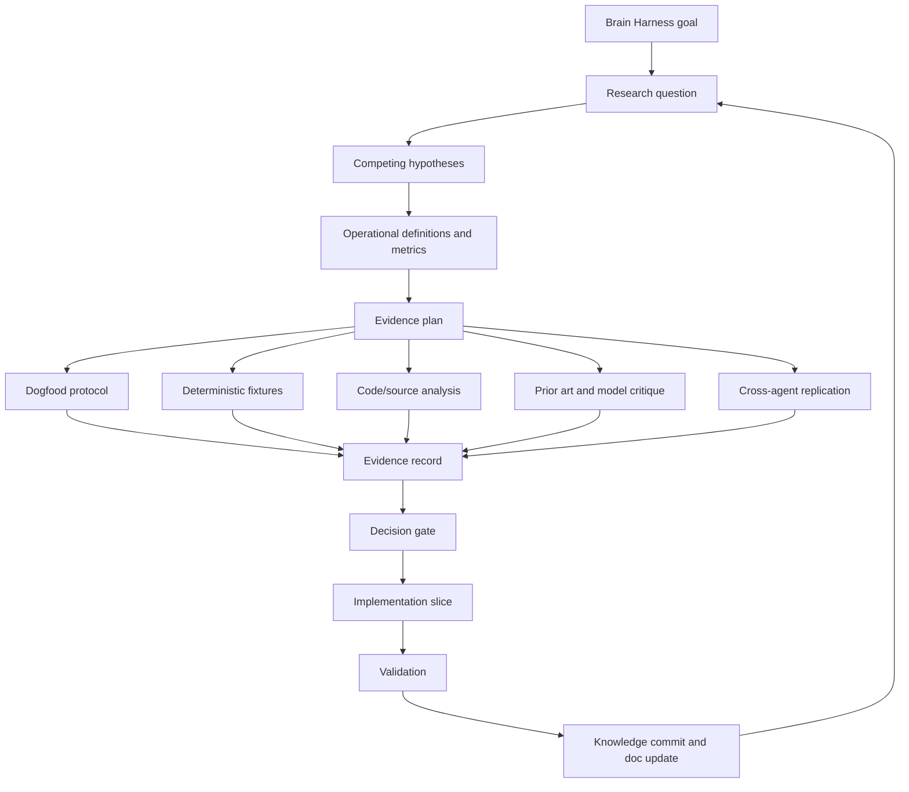

# Brain Harness Research Method

Status: Active research operating model
Date: 2026-05-07
Audience: Engram maintainers, AI-agent harness authors, future contributors
Scope: Define how Engram brain-harness claims become evidence-backed implementation decisions.

---

## 1. Purpose

Engram is being built as a brain harness for AI agents. That is a product claim, an architecture
claim, and a behavioral claim. It should not be advanced only by intuition, local anecdotes, or
model consensus.

This document defines the research operating model for Brain Harness work. It sits above:

- `docs/BRAIN_HARNESS_ARCHITECTURE.md`
- `docs/MEMORY_OS_IMPLEMENTATION_PLAN.md`
- `docs/BRAIN_HARNESS_DOGFOOD_PROTOCOL.md`
- per-run dogfood reports

The dogfood protocol is one experimental instrument inside this method. It is not the whole method.

---

## 2. Core Stance

Brain Harness development should follow these rules:

1. State the research question before changing architecture.
2. Name competing hypotheses, including the null hypothesis.
3. Use prior art, AI Council, Claude, and other model critique to expose options and failure modes,
   not to replace evidence.
4. Define the measurement before running the experiment.
5. Prefer the smallest implementation slice that tests the claim.
6. Preserve failures, confounds, and ambiguous results.
7. Treat simplicity as a first-class result: if two designs perform similarly, prefer the simpler
   design with the lower ongoing cognitive and operational burden.
8. Update Engram memory and docs when the claim, confidence, or gate changes.

The method is compatible with the existing design stance: make deep modules, keep interfaces
simple, and avoid broad machinery until the evidence says the simpler path is insufficient.

---

## 3. Research Stack



The loop is intentionally cyclic. Engram should become more capable by repeatedly tightening the
relationship between claims, evidence, implementation, and memory.

---

## 4. Terms

| Term | Meaning |
|---|---|
| Research question | The precise uncertainty being investigated. |
| Claim | A statement Engram may rely on if evidence supports it. |
| Hypothesis | A possible answer to the research question. |
| Null hypothesis | The possibility that the proposed Brain Harness change does not improve behavior. |
| Construct | The behavioral property being measured, such as continuity, preference adherence, or bad-memory containment. |
| Operational definition | The concrete observable used as a proxy for a construct. |
| Instrument | A method for gathering evidence, such as dogfood, fixtures, telemetry, or code analysis. |
| Arm | A treatment or baseline in a comparison, such as `no_memory` or `memoryitem_orient`. |
| Oracle | The rule or measurement that decides whether a hypothesis improved the target. |
| Decision gate | The explicit threshold required before a product or architecture step proceeds. |
| Claim ledger | The living list of active Brain Harness claims, confidence, evidence, and falsifiers. |

---

## 5. Evidence Levels

Evidence should be named by strength. Higher levels are not always required, but the required level
should match the risk of the decision.

| Level | Evidence Type | Useful For | Not Enough For |
|---|---|---|---|
| L0 | Design intuition or taste | Generating hypotheses | Architecture commitment |
| L1 | AI Council, Claude, Gemini, or agent critique | Finding options, objections, confounds | Proof by consensus |
| L2 | Source/doc analysis | Understanding current behavior and constraints | Behavioral uplift claims |
| L3 | Deterministic unit/integration fixtures | Contract correctness and regression safety | Real agent usefulness |
| L4 | Single-session dogfood or pilot | Instrument calibration and visible failure discovery | Broad product claims |
| L5 | Controlled multi-arm dogfood | Comparative task behavior under realistic use | Cross-agent generality |
| L6 | Cross-agent or cross-project replication | Generality across harnesses and workflows | Long-term user value |
| L7 | Sustained user/field evidence | Usability, adoption, and operational fit | Replacing lower-level debugging evidence |

For high-impact decisions, such as deleting legacy paths, automatic promotion, or changing the
`orient` hot path, Engram should require L5 evidence at minimum and prefer L6.

---

## 6. Standard Research Workflow

Every non-trivial Brain Harness change should follow this sequence.

### 6.1 Define The Question

Examples:

- Does `orient` improve restart continuity without transcript context?
- Does recent current-branch Git context fix fresh-plan retrieval without bloating Brain Loop?
- Should graph traversal enter the hot path, or remain a specialist tool?
- Does review-gated promotion produce more useful active memory than direct legacy retrieval?

### 6.2 Name Competing Hypotheses

At minimum include:

- preferred hypothesis,
- null hypothesis,
- simpler alternative,
- failure hypothesis.

Example:

| Type | Hypothesis |
|---|---|
| Preferred | Recent current-branch commits give resume prompts enough fresh plan context. |
| Null | Recent commits add noise and do not improve task success. |
| Simpler alternative | Better MemoryItem capture would solve the issue without Git context. |
| Failure hypothesis | Git context masks stale MemoryItem ranking instead of fixing it. |

### 6.3 Choose Metrics

Metrics must connect retrieval to behavior. Useful metrics include:

- task success,
- repeated context questions,
- preference adherence,
- bad-memory use,
- wrong-scope memory surfaced or used,
- missing expected context,
- latency-adjusted utility,
- user or independent-agent judgment when the outcome needs judgment.

Retrieval precision is useful, but not sufficient by itself.

### 6.4 Pick The Smallest Instrument

Choose the least expensive instrument that can honestly test the claim:

| Claim Type | First Instrument |
|---|---|
| Code contract | Deterministic test or fixture |
| Retrieval ranking | Fixture plus labeled dogfood |
| Agent behavior | Controlled dogfood |
| Architecture simplification | Controlled dogfood plus read-only inventory |
| Cross-harness behavior | Cross-agent replication |
| User experience | Sustained user feedback |

### 6.5 Pre-Register Expectations

Before running a dogfood scenario or eval, write:

- expected helpful memory,
- harmful memory that must be rejected,
- measurable success outcome,
- expected failure modes,
- whether user judgment is required.

### 6.6 Preserve Ambiguity

If the result is contaminated, underpowered, or mixed, record that. Do not convert ambiguity into a
false pass. The next step should often be another instrument, not code.

### 6.7 Gate The Implementation

An implementation step should proceed only when:

- the question is clear,
- the chosen evidence level matches the risk,
- the result identifies one specific next change,
- the change is small enough to validate,
- the rollback path is clear.

### 6.8 Persist The Learning

After a material result:

- update the relevant document,
- commit the doc or code change,
- submit telemetry feedback if a trace exists,
- store durable memory for non-obvious decisions, constraints, or failures.

---

## 7. Dogfood Protocol Relationship

The narrow dogfood protocol is the live behavioral instrument for Brain Loop v1. It answers:

- does memory improve the agent's next decision,
- does it reduce amnesia,
- does it preserve preferences,
- does it avoid stale or wrong-scope guidance,
- does feedback produce analyzable evidence.

It does not answer, by itself:

- whether the whole architecture is correct,
- whether MemoryItem should be the only durable storage shape,
- whether legacy paths can be deleted,
- whether graph or obligation logic belongs in the hot path,
- whether the result generalizes across agents, projects, or users.

Current interpretation:

- `docs/BRAIN_HARNESS_DOGFOOD_PROTOCOL.md` is a Phase 0/Phase 1 instrument.
- `docs/BRAIN_HARNESS_DOGFOOD_RUN_2026-05-07.md` is pilot evidence.
- The 2026-05-07 pilot validated telemetry and exposed failures, but its `no_memory` arms were
  contaminated by current transcript context.
- The pilot can justify ranking/capture work and cleaner eval design. It cannot justify M6 write
  apply, deletion, automatic promotion, or broad legacy deprecation.

---

## 8. Claim Ledger

This ledger is intentionally small. It should be updated when evidence changes.

### BH-C1: MemoryItem As Canonical Agent-Facing Unit

Claim: `MemoryItem` should become the canonical agent-facing cognitive and retrieval unit.

Current evidence: architecture RFC, AI Council insight, deterministic retrieval tests, pilot
safety behavior, and the first matched same-harness dogfood batch from 2026-05-08.

Confidence: medium.

Next gate: matched dogfood beyond one-turn recall shows `memoryitem_orient` beats `no_memory` and
specialist legacy retrieval on bounded autonomous follow-through, preference adherence,
bad-memory containment, and migration-preservation checks.

### BH-C2: Orient As The Single Hot-Path Entrypoint

Claim: `orient` should remain the single frictionless hot-path entrypoint, while graph, lint,
migration, raw observations, and obligation detection stay specialist paths.

Current evidence: orient contract, MCP tests, pilot evidence that noise is visible, Council
insight to defer ontology expansion, and the 2026-05-08 matched batch where resume continuity,
decision continuity, stale-scope rejection, and durable preference recall passed without adding
graph, lint, raw observations, or obligation detection to the hot path.

Confidence: medium-high.

Falsifier: repeated controlled failures show the missing signal requires one of those specialist
paths in the hot path and cannot be solved by capture/ranking.

### BH-C3: Durable Guidance Requires Trust Metadata

Claim: durable guidance needs provenance, evidence, trust state, and review gating.

Current evidence: architecture RFC, promotion tests, migration-gate pilot, and Council insight.

Confidence: high.

Falsifier: an evidence-light path repeatedly improves behavior without stale/wrong-scope harm and
with lower review burden.

### BH-C4: Recent Git Context For Fresh Plan Retrieval

Claim: recent current-branch Git context can improve fresh-plan retrieval without widening Brain
Loop.

Current evidence: implemented orient contract and live smoke after the recent-git-context commit.

Confidence: low-medium.

Current update: the matched 2026-05-08 treatment rerun passed, but the same-harness no-memory
control also passed. This supports recent Git/current-plan context as sufficient for that narrow
resume task, not as a broad MemoryItem-dominance claim.

Next gate: a harder autonomous follow-through scenario where the agent must preserve the current
plan, user preference, verification habit, and no-M6/no-deletion gates through an actual bounded
work slice.

### BH-C5: Dogfood Is An Instrument, Not The Method

Claim: the dogfood protocol is an experimental instrument, not the research method itself.

Current evidence: pilot contamination and explicit method analysis.

Confidence: high.

Update condition: revise only if the research operating model is replaced.

### BH-C6: Reviewed Preferences Improve Durable Preference Recall

Claim: reviewed project/user preferences captured as `MemoryItem` records improve durable
preference recall for agents working in this repository.

Current evidence: in the matched 2026-05-08 same-harness batch, `memoryitem_orient` passed
`follow_user_preference_001` while the no-memory control failed the target durable preference check.
The treatment recovered both target constraints: commit every meaningful Engram step, and keep
unrelated/untracked user-owned files such as root `AGENTS.md` out of commits unless explicitly
requested.

Confidence: medium-high for this repository and this preference class; low for cross-project,
cross-user, or long-horizon generality.

Limits: the batch used Codex fresh-thread transcript judgments for no-memory controls and treatment
telemetry for orient arms. It does not prove that all preferences should be accepted without
review, that stale preferences will be challenged correctly, or that MemoryItems should dominate
legacy retrieval for non-preference tasks.

Next gate: repeat the preference advantage inside `bounded_autonomous_followthrough_001`, where the
preference must constrain a real verified and committed work slice rather than a direct question
about the preference itself.

---

## 9. Decision Gates

### 9.1 Before Changing The `orient` Hot Path

Required:

- clear failure class from telemetry or fixture evidence,
- proof that the missing signal is not already available through simpler ranking/capture,
- latency impact estimate,
- MCP boundary test,
- dogfood rerun or targeted fixture showing improvement.

### 9.2 Before Entering Read-Only M6 Inventory

Required:

- at least one controlled dogfood batch or a documented reason to gather inventory as evidence,
- no unresolved bad-memory-use finding in current high-stakes scenarios,
- explicit user approval for the inventory scope.

### 9.3 Before M6 Write Apply, Deletion, Or Broad Legacy Simplification

Required:

- controlled multi-arm evidence, not only a pilot,
- reviewed migration candidates,
- dry-run apply report,
- rollback plan,
- explicit user approval.

### 9.4 Before Treating AI Council Or Claude Consensus As Direction

Required:

- record what each model argued,
- record disagreement or uncertainty,
- convert consensus into hypotheses,
- test the highest-risk assumption with code, docs, dogfood, or telemetry.

Consensus is useful for breadth. It is not a substitute for evidence.

---

## 10. Research Backlog

Near-term research questions:

1. Can `memoryitem_orient` improve bounded autonomous follow-through over no-memory when the agent
   must choose a scoped next step, verify it, commit it, and capture the next plan?
2. Does durable preference recall survive inside a real work slice, not only a direct preference
   question?
3. Which outcomes still require human judgment rather than agent self-report?
4. What is the minimum evidence to start read-only M6 inventory without increasing migration risk?
5. Does legacy search add useful evidence for migration-preservation scenarios, or does it add
   noise compared with reviewed MemoryItems?

Medium-term research questions:

1. Does `MemoryItem` orientation outperform legacy search across multiple projects?
2. Can agent feedback predict later human judgments of usefulness?
3. When should a future agent challenge a stale user preference?
4. What evidence mix best predicts bad-memory containment?
5. Which harnesses can collect lifecycle signals without increasing user friction?

---

## 11. Next Application

The next Brain Harness step should apply this method to the current active question:

```text
Does Brain Loop v1 improve bounded autonomous follow-through enough to justify keeping `orient`
as the single frictionless entrypoint while leaving graph, lint, migration, raw observations, and
obligation detection outside the normal hot path?
```

Recommended instrument:

1. Pre-register `bounded_autonomous_followthrough_001` in the dogfood run report.
2. Run matched same-harness `no_memory` and `memoryitem_orient` arms without tuning memory between
   arms.
3. Require the agent to choose a small current Engram work slice, implement or document it, run the
   relevant verification, commit the meaningful step, and capture the next plan.
4. Score task success, preference adherence, repeated context questions, bad-memory use, and
   whether the agent avoided M6, deletion, broad ranking churn, and hot-path expansion without
   explicit approval.
5. Only then choose between more dogfood, read-only M6 inventory, or a narrowly justified
   implementation change.
